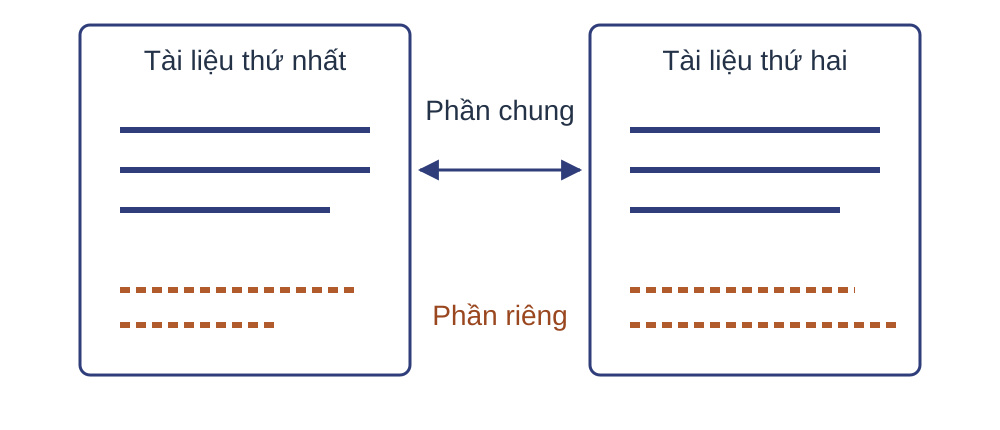
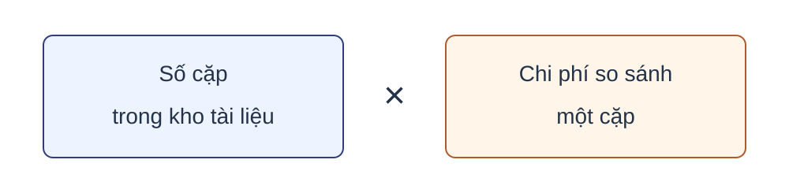
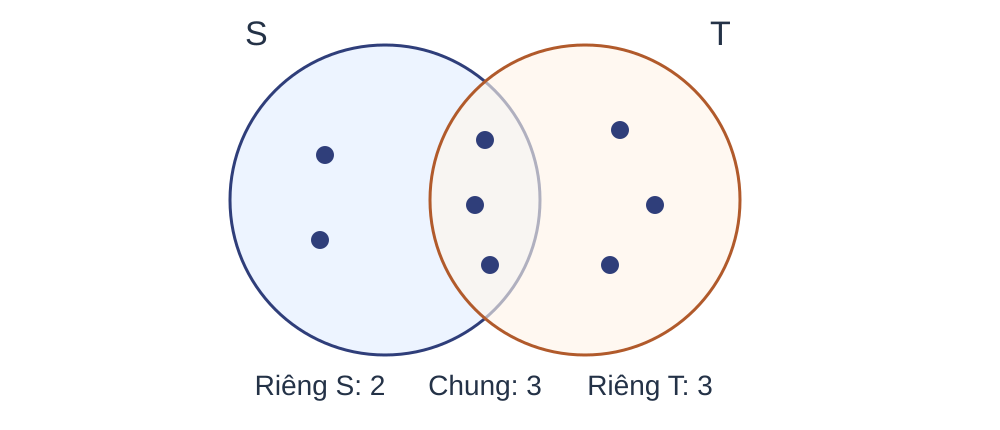
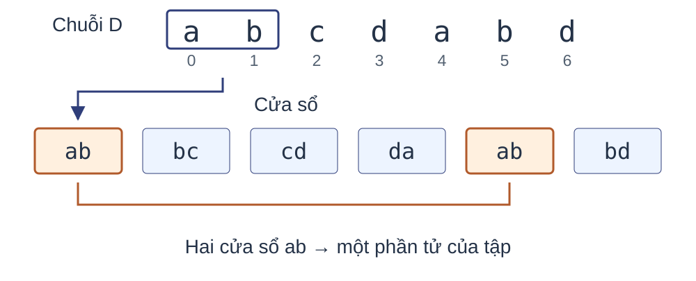
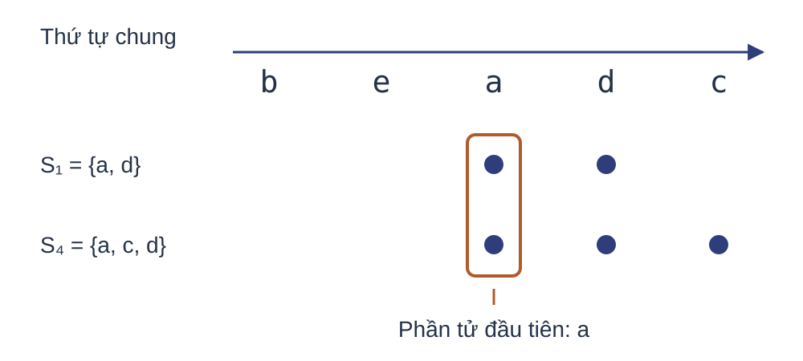
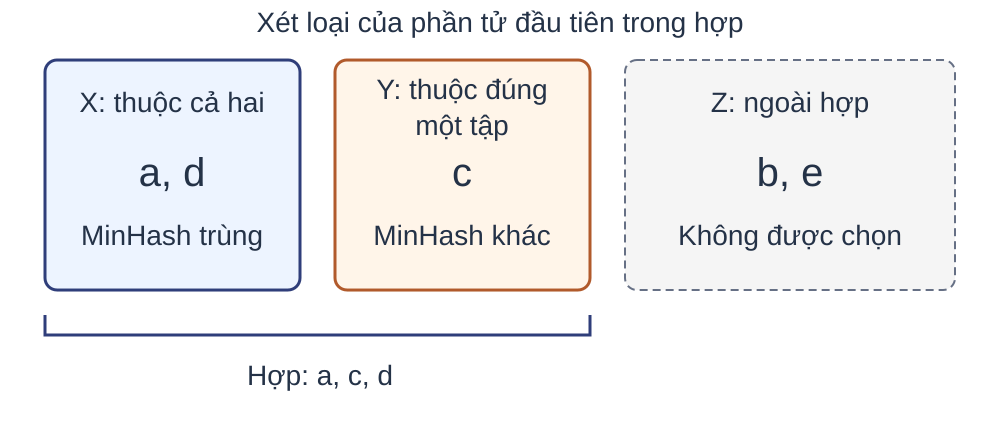
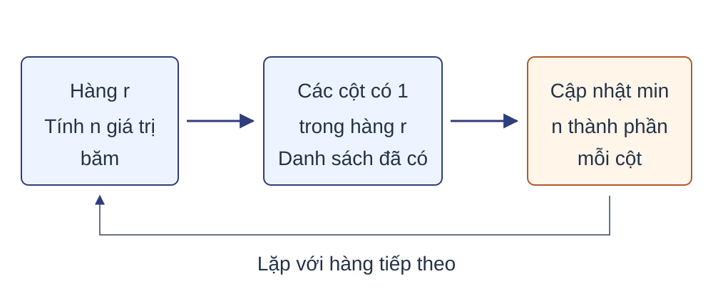
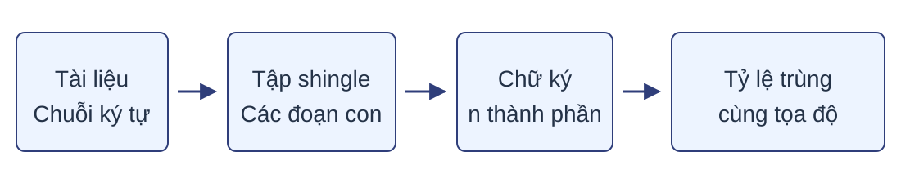

# Storyboard Bài 05 — Biểu diễn tương đồng: Shingling và MinHash

Bản viết mới ngày 28-09-2026. Phạm vi hiện tại: 48 trang giảng/120 phút (trang 17 gộp vào 19, trang 21 gộp vào 20 ngày 01/10/2026; số thứ tự phiếu giữ theo bản 28-09), 7 trang cho 5 bài nguồn/60 phút; 7 phần lớn. Cửa kiểm kế hoạch đã PASS và được điều phối viên chấp nhận; đặc tả này đã được triển khai thành bản nháp để rà độc lập, chưa phải xác nhận bản render cuối. Mỗi `data-slide-id` dưới đây chỉ dùng trong HTML và tài liệu quy trình, không hiển thị trong nội dung hay ghi chú diễn giả.

## Quy ước bố cục, dữ liệu và nội dung

Nền kỹ thuật là `lecture-template.html`; giao diện dùng `.reveal.course-deck.lecture-minhash` và thành phần chung đối chiếu Lecture 02. Không sao chép khối style của template: quy tắc mới của kho yêu cầu kiểu dùng lại nằm trong `lecture-style.css`. Dùng `title-slide`, `lecture-title`, `course-name`, `term-name`, `agenda-slide`, `motivation-slide`, `example-slide`, `ex-grid2`, `ex-table`, `ex-card`, `ex-equation`, `pre.ex-code`, `ex-source`, `cost-slide`. Các vùng bất đối xứng chỉ cần lớp bố cục giới hạn bằng `.lecture-minhash`; không ghi đè cỡ chữ tương ứng giữa các deck.

Tỷ lệ vùng dưới đây tính trên thân trang sau tiêu đề, trước nguồn/chân trang. Giữ khung 1280 × 720, thư viện cục bộ và font scale chung; các trang trạng thái tĩnh, không dùng `fragment`. Nội dung “Bố cục”, “Mục đích”, “Kiểm tra” là chỉ dẫn nội bộ. Chỉ “Nội dung công khai” và phần học thuật của “Ghi chú diễn giả” đi vào học liệu. Thời lượng bài tập được giữ trong notes theo yêu cầu recitation, không hiện trên mặt; dữ liệu quy trình, mã và tiêu chí nội bộ không chép vào notes.

Nguồn `B` là `sources/textbooks/mmds-3e-ch03-finding-similar-items.pdf`; trang in=trang PDF+71. Mã MM/ST03/ST04/CM/UM và phiếu VD 1–VD 9, HT1–HT9 được định nghĩa đầy đủ trong `outline.md`. Không gọi một phép suy ra là trích nguyên văn nguồn. Mọi ma trận là bảng HTML, công thức là KaTeX, giả mã là khối mã có `data-trim`; SVG chỉ dùng cho quan hệ hình học/quy trình/cửa sổ.

Các tỷ lệ trạng thái và vị trí nhãn giữ nguyên qua 23–24,28–30,37–40,53–54 và 56–57. Màu đi kèm nhãn, viền hoặc kiểu nét. Đáp án kiểm tra không hiển thị trước trên mặt. Các đoạn số viết bằng lời trong notes phải chuyển sang công thức thích hợp khi dựng để tránh chuỗi ký hiệu khó đọc.

## Hành trình khái niệm và kiểm soát thời lượng

| Phần | Chức năng, đầu vào → đầu ra và mục tiêu | Slide | Phút | Kiểm tra |
|---|---|---|---:|---|
|1. Tài liệu gần trùng và độ tương đồng Jaccard|Kho gần trùng, tập hợp → đặc tả Jaccard; MT1|01–09|18|09|
|2. Shingling văn bản|Chuỗi, tập và băm → tập shingle có quy ước; MT2|10–16, 18|21|18|
|3. MinHash theo hoán vị|Tập đã xác định → một phép thử bảo toàn xác suất; MT3|19–20, 22–27|23|27|
|4. Chữ ký MinHash|Một phép thử → ước lượng từ nhiều tọa độ; MT4|28–34|17|34|
|5. Tính chữ ký bằng hàm băm|Chữ ký lý tưởng → quét hàng, đúng, chi phí; MT5|35–46|31|46|
|6. Tổng kết|Các kết quả → xử lý hai giới hạn mở bài, sáu nhiệm vụ tự kiểm|47–50|10|49–50|
|7. Bài tập vận dụng|Toàn bộ tuyến chính → sản phẩm năm bài sách|51–57|60|56–57|

Phần giảng cộng 120 phút. Phần bài tập: 8+10+(7+8)+12+(8+7)=60 phút; trang tách chỉ phân bổ thời lượng của cùng bài. Mục tiêu nêu ở 03; tình huống 04–05 được dùng lại ở 19, 33, 44,47–48. Mỗi phiếu có dự toán; đối với trang không kiểm tra, thời gian gồm đọc dữ kiện, thực hiện phép suy luận và đối chiếu kết quả; không quy đổi số chữ thành số phút.

## Chu trình các cụm

- **Jaccard:** 04–05 nêu tình huống/giới hạn;06 trực giác và ví dụ;07 đặc tả;08 ứng dụng;09 kiểm tra. Không thêm thuật toán giao–hợp riêng vì các phép tập là tiên quyết. Dữ kiện 3 và 8 đi xuyên 06–09.
- **Shingling:** 10 nêu nhu cầu và trực giác;11 chạy tay;12 hình thức hóa;13 giả mã, bất biến và đếm cửa sổ;14–17 điều kiện/ứng dụng/dung lượng;18 kiểm tra. Dữ kiện `abcdabd`, k=2 truyền từ cửa sổ tới đặc tả và lời giải. Chi phí trực tiếp có mô hình tạo/băm chuỗi dài k, không tự giả định rolling hash.
- **MinHash:** 19 đặt bộ nhớ;20–21 nối tập với ma trận;22 trực giác;23 chạy tay;24 định nghĩa;25–26 chứng minh;27 kiểm tra. Cặp S1, S4 và thứ tự beadc được giữ. Chi phí dựng hoán vị chuyển 35 vì gắn triển khai; không bỏ nhu cầu tính toán.
- **Chữ ký:** 28 chạy ví dụ hai thứ tự;29–30 hình thức hóa;31–32 lập luận kỳ vọng/phương sai;33 chi phí;34 kiểm tra. Ví dụ đưa lên từ VD 3.8 để tránh ký hiệu tổng quát xuất hiện trước cơ chế, đã được điều phối viên duyệt. Thuật toán tạo chữ ký thuộc cụm kế, không là bước bị bỏ.
- **Quét chữ ký:** 35 tình huống/trực giác;36 đặc tả;37–40 dữ kiện và vết chạy;41 giả mã;42 đúng;43–44 chi phí;45 giới hạn;46 kiểm tra. Đặc tả trước vết chạy chi tiết vì phép chọn và min đã có trực giác; việc đổi định danh sang giá trị băm được nói rõ trước khi chạy.

## Ánh xạ tài liệu tự học

`n05-01`→04–05,47–48; `n05-02`→06–09; `n05-03`→10–16, 18; `n05-04`→19–20; `n05-05`→22–24; `n05-06`→25–27; `n05-07`→28–31,33–34; `n05-08`→32, 34; `n05-09`→35–41; `n05-10`→42–44, 46; `n05-11`→45–48; `n05-12` và `n05-13` là đọc thêm riêng trong ghi chú, không có slide bắt buộc; `n05-14`→49–57.

Bản đồ vai trò, đầu vào/đầu ra, thành phần áp dụng và mục không áp dụng của từng chủ đề được khóa ở mục 8 của `outline.md`. Ghi chú theo vai trò→định nghĩa→ví dụ→trực quan→mệnh đề/thuật toán/chứng minh→ứng dụng/lỗi/kiểm tra; không dùng thứ tự “ví dụ trước định nghĩa” của slide để làm sai chu trình tài liệu tự học. Chữ ký, ma trận, bài tập và hai phép băm dùng chung hệ ký hiệu ở outline.

## Phiếu từng trang

### 01. Biểu diễn tương đồng: Shingling và MinHash

- **Mã:** `lec05-s01-01`; **phần:** 1; **note-topic-id:** `n05-01`.
- **Mục đích và vai trò:** Định vị bài trong học phần; nhận diện chủ đề. **Mục tiêu:** MT1, MT5.
- **Câu chốt:** Bài 05 nghiên cứu biểu diễn tập và chữ ký để đo tương đồng văn bản.
- **Kiến thức đầu vào, kết nối vào–ra:** Nhận kiến thức băm/tập hợp; trang 02 xác định các phần sẽ xây dựng.
- **Dữ kiện và vai trò số:** Không có dữ kiện số học; số bài/học kỳ là siêu dữ liệu.; giữ quy ước, nhãn, đơn vị và kết quả của phiếu tương ứng trong outline. Kết quả tính trên trang được nêu ở nội dung/notes dưới đây.
- **Bố cục đã chọn:** `title-slide`: tên bài giữa phía trên chiếm 50% thân; `course-name` và `term-name` lần lượt bên dưới, tổng 30%; khoảng trắng 20%. Không thêm hình.
- **Trọng tâm và thứ tự đọc:** Tên chủ đề → tên học phần → học kỳ.
- **Lý do phù hợp sinh viên năm 2:** Sinh viên năm 2 xác định phạm vi trước khi gặp ký hiệu; tên môn/học kỳ là thông tin phụ, không tranh trọng tâm với tên thuật toán.
- **Giới hạn và xử lý tràn:** Giữ dữ kiện và kết luận trên mặt trang; diễn giải đầy đủ nằm trong ghi chú. Nếu vượt khung, chuyển câu giải thích phụ sang ghi chú, không giảm cỡ chữ chung.
- **Nguồn:** `sources/source.md`, Bài 05 theo thứ tự đề xuất.
- **Thời lượng:** 0,5 phút.

**Nội dung công khai dự kiến**

Biểu diễn tương đồng: Shingling và MinHash

Giải thuật nền tảng của Khoa học dữ liệu

Bài 05 · Học kỳ 1 · Năm học 2026–2027

**Ghi chú diễn giả học thuật**

Bài 05 mở mạch tương đồng và hàng xóm gần. Phạm vi gồm Jaccard, shingling và MinHash theo Chương 3, mục 3.1–3.3 của Mining of Massive Datasets (MMDS). Kết quả là một biểu diễn để ước lượng tương đồng giữa hai tài liệu; lựa chọn cặp ứng viên thuộc bài kế tiếp.

**Kiểm tra, đáp án và tiêu chí nội bộ**

Không có câu hỏi riêng; trang tạo dữ kiện cho kiểm tra cuối phần.

### 02. Nội dung

- **Mã:** `lec05-s01-02`; **phần:** 1; **note-topic-id:** `n05-01`.
- **Mục đích và vai trò:** Định hướng; nhận diện quan hệ các phần. **Mục tiêu:** MT1, MT5.
- **Câu chốt:** Biểu diễn tập, phép thử MinHash và thuật toán tính chữ ký tạo thành một tuyến học tập.
- **Kiến thức đầu vào, kết nối vào–ra:** Nhận tên bài; trang 03 nêu sản phẩm kiểm tra tương ứng.
- **Dữ kiện và vai trò số:** Không có dữ kiện số học; số bài/học kỳ là siêu dữ liệu.; giữ quy ước, nhãn, đơn vị và kết quả của phiếu tương ứng trong outline. Kết quả tính trên trang được nêu ở nội dung/notes dưới đây.
- **Bố cục đã chọn:** `agenda-slide`: danh sách bảy phần toàn chiều rộng, chiếm 80% thân; mỗi mục một dòng, thứ tự dọc. Không dùng thẻ hoặc hình phụ.
- **Trọng tâm và thứ tự đọc:** Đọc từ trên xuống theo thứ tự bảy section.
- **Lý do phù hợp sinh viên năm 2:** Sinh viên mới học chuỗi khái niệm cần thấy thứ tự trước–sau; tên phần trùng chính xác với cấu trúc deck tránh phải giải mã nhãn khác nhau.
- **Giới hạn và xử lý tràn:** Dùng tên phần ngắn đã chốt. Nếu một mục xuống dòng, rút chữ mô tả; giữ cỡ chữ và chiều cao dòng của `agenda-slide`, không chia hai cột làm sai thứ tự.
- **Nguồn:** B §§3.1–3.3; `sources/source.md`.
- **Thời lượng:** 1 phút.

**Nội dung công khai dự kiến**

Tài liệu gần trùng và độ tương đồng Jaccard; Shingling văn bản; MinHash theo hoán vị; Chữ ký MinHash; Tính chữ ký bằng hàm băm; Tổng kết; Bài tập vận dụng.

**Ghi chú diễn giả học thuật**

Jaccard là đại lượng cần đo giữa hai tập. Shingling chuyển mỗi văn bản thành một tập để áp dụng đại lượng ấy. MinHash nối Jaccard với xác suất hai tập chọn cùng một phần tử; nhiều MinHash ghép thành chữ ký ngắn. Phần thứ năm tính chữ ký bằng hàm băm thay cho hoán vị thật của các phần tử. Phần bài tập dùng năm bài của sách.

**Kiểm tra, đáp án và tiêu chí nội bộ**

Không có câu hỏi riêng; trang tạo dữ kiện cho kiểm tra cuối phần.

### 03. Mục tiêu và kiến thức đầu vào

- **Mã:** `lec05-s01-03`; **phần:** 1; **note-topic-id:** `n05-01`.
- **Mục đích và vai trò:** Đặc tả năng lực; phân biệt đầu vào học tập và đầu ra. **Mục tiêu:** MT1, MT5.
- **Câu chốt:** Các phép tính tập hợp, băm và xác suất là nền để tạo và đánh giá chữ ký.
- **Kiến thức đầu vào, kết nối vào–ra:** Nhận bản đồ phần; trang 04 đặt các năng lực vào bài toán gần trùng.
- **Dữ kiện và vai trò số:** Không có dữ kiện số học; số bài/học kỳ là siêu dữ liệu.; giữ quy ước, nhãn, đơn vị và kết quả của phiếu tương ứng trong outline. Kết quả tính trên trang được nêu ở nội dung/notes dưới đây.
- **Bố cục đã chọn:** `example-slide ex-grid2`: cột trái 50% có ba sản phẩm; cột phải 50% có nhóm tiên quyết trong `ex-card`; không thêm bảng ký hiệu.
- **Trọng tâm và thứ tự đọc:** Đầu ra bên trái → điều kiện kiến thức bên phải.
- **Lý do phù hợp sinh viên năm 2:** Hai nhóm tách nhiệm vụ phải học khỏi kiến thức đã có; sinh viên năm 2 không phải đọc toàn bộ hệ ký hiệu trước khi có đối tượng.
- **Giới hạn và xử lý tràn:** Giữ dữ kiện và kết luận trên mặt trang; diễn giải đầy đủ nằm trong ghi chú. Nếu vượt khung, chuyển câu giải thích phụ sang ghi chú, không giảm cỡ chữ chung.
- **Nguồn:** `sources/source.md`, mục tiêu/tiên quyết Bài 05.
- **Thời lượng:** 1,5 phút.

**Nội dung công khai dự kiến**

Kết quả: tạo tập shingle và tính Jaccard; chứng minh xác suất trùng MinHash bằng Jaccard; ước lượng Jaccard từ chữ ký; tính chữ ký và đếm chi phí. Kiến thức đầu vào: tập hợp, chuỗi, băm, vector và xác suất cơ bản.

**Ghi chú diễn giả học thuật**

Phép giao và hợp được dùng để định nghĩa Jaccard. Thứ tự và phần tử nhỏ nhất được dùng trong MinHash. Kỳ vọng và phương sai của biến chỉ báo được nhắc lại khi đánh giá chữ ký. Thuật toán cuối bài chỉ cần vòng lặp, ma trận và phép lấy cực tiểu.

**Kiểm tra, đáp án và tiêu chí nội bộ**

Không có câu hỏi riêng; trang tạo dữ kiện cho kiểm tra cuối phần.

### 04. Bài toán tài liệu gần trùng

- **Mã:** `lec05-s01-04`; **phần:** 1; **note-topic-id:** `n05-01`.
- **Mục đích và vai trò:** Tình huống dữ liệu; đặc tả loại tương đồng. **Mục tiêu:** MT1, MT5.
- **Câu chốt:** Tài liệu gần trùng chia sẻ phần lớn văn bản nhưng khác ở một số đoạn, nên phép so từng ký tự không đo được mức giống nhau.
- **Kiến thức đầu vào, kết nối vào–ra:** Nhận mục tiêu so sánh; trang 05 lượng hóa số cặp phải xét.
- **Dữ kiện và vai trò số:** VD 1; giữ quy ước, nhãn, đơn vị và kết quả của phiếu tương ứng trong outline. Kết quả tính trên trang được nêu ở nội dung/notes dưới đây.
- **Bố cục đã chọn:** `motivation-slide motivation-grid`: hình khái niệm hai tài liệu với vùng chung có cùng nhãn chiếm 48% bên trái; đặc tả đầu vào/đầu ra và khác biệt chiếm 52% bên phải; chú thích dưới hình.
- **Trọng tâm và thứ tự đọc:** Hai tài liệu → vùng chung/riêng → đầu ra cần đo.
- **Lý do phù hợp sinh viên năm 2:** Hình chỉ dùng vùng ký hiệu, không bịa một văn bản dữ liệu mới. Sinh viên thấy quan hệ chung–riêng trước công thức tập hợp và hiểu loại tương đồng đang xét.
- **Giới hạn và xử lý tràn:** Giữ dữ kiện và kết luận trên mặt trang; diễn giải đầy đủ nằm trong ghi chú. Nếu vượt khung, chuyển câu giải thích phụ sang ghi chú, không giảm cỡ chữ chung.
- **Nguồn:** B mở Chương 3, tr. 73–74; §3.1.2 tr. 74–76; MM15.
- **Thời lượng:** 2 phút.

**Nội dung công khai dự kiến**



Đầu vào: kho văn bản lớn như trang Web hoặc bản tin.

Đầu ra: độ tương đồng văn bản của từng cặp tài liệu.

Trang phản chiếu, bản tin đăng lại và bài đạo văn giữ phần lớn văn bản gốc nhưng khác ở một số đoạn.

So sánh từng ký tự chỉ phát hiện hai tài liệu trùng hoàn toàn.

**Ghi chú diễn giả học thuật**

Mục 3.1.2 của sách nêu ba tình huống: trang phản chiếu khác thông tin máy chủ và liên kết; bản tin được nhiều báo đăng lại, có cắt đoạn hoặc thêm nội dung; bài đạo văn đổi vài từ hoặc thứ tự câu. Phép so từng ký tự dừng ở vị trí khác đầu tiên và chỉ cho biết hai tài liệu có trùng hoàn toàn hay không, không cho biết lượng văn bản chung. Bài toán cần một đại lượng đo phần văn bản chung ở mức ký tự. Đại lượng ấy không đo mức giống nhau về ý nghĩa; tương đồng ngữ nghĩa cần kỹ thuật khác.

Nguồn: Mining of Massive Datasets (MMDS), ấn bản 3, Chương 3, tr. 73–76.

**Kiểm tra, đáp án và tiêu chí nội bộ**

Không có câu hỏi riêng; trang tạo dữ kiện cho kiểm tra cuối phần.

### 05. Chi phí so sánh mọi cặp

- **Mã:** `lec05-s01-05`; **phần:** 1; **note-topic-id:** `n05-01`.
- **Mục đích và vai trò:** Vấn đề và phép đếm; tách số cặp khỏi chi phí một cặp. **Mục tiêu:** MT1, MT5.
- **Câu chốt:** Tổng công việc bằng số cặp nhân chi phí một cặp; bài này giảm thừa số thứ hai, số cặp vẫn tăng bậc hai.
- **Kiến thức đầu vào, kết nối vào–ra:** Nhận kho gần trùng; trang 06 xây một đại lượng có thể tính cho mỗi cặp.
- **Dữ kiện và vai trò số:** VD 1; giữ quy ước, nhãn, đơn vị và kết quả của phiếu tương ứng trong outline. Kết quả tính trên trang được nêu ở nội dung/notes dưới đây.
- **Bố cục đã chọn:** `cost-slide`: định nghĩa $C$ và cặp không thứ tự ở trên; hai công thức đếm cặp ở giữa; hình phân tích tổng công việc bên dưới. Giữ cùng luận điểm mở bài.
- **Trọng tâm và thứ tự đọc:** Công thức tổng quát → dữ kiện một triệu → hai nguồn chi phí.
- **Lý do phù hợp sinh viên năm 2:** Phép chia 2 nối với kiến thức tổ hợp đã có; tách hai thừa số ngăn suy luận rằng chữ ký nhỏ tự giảm số cặp.
- **Giới hạn và xử lý tràn:** Giữ dữ kiện và kết luận trên mặt trang; diễn giải đầy đủ nằm trong ghi chú. Nếu vượt khung, chuyển câu giải thích phụ sang ghi chú, không giảm cỡ chữ chung.
- **Nguồn:** B tr. 73; phép đếm trực tiếp từ số tài liệu của nguồn.
- **Thời lượng:** 2 phút.

**Nội dung công khai dự kiến**

Kho gồm $C$ tài liệu; xét các cặp không thứ tự.

$$\binom C2=\frac{C(C-1)}2$$

$$C=10^6\quad\Longrightarrow\quad499\,999\,500\,000\text{ cặp}$$



Bài này giảm chi phí một cặp; số cặp chỉ giảm khi có bước chọn cặp ứng viên.

**Ghi chú diễn giả học thuật**

Mỗi tài liệu ghép với $C-1$ tài liệu khác; tích $C(C-1)$ đếm mỗi cặp hai lần nên chia 2. Sách nêu một triệu mục cho khoảng nửa nghìn tỷ cặp; phép tính chính xác cho $499\,999\,500\,000$. Tổng công việc là tích của số cặp và chi phí so sánh một cặp. Biểu diễn ngắn của bài này giảm thừa số thứ hai. Thừa số thứ nhất giữ bậc hai theo $C$ cho tới khi có bước chọn cặp ứng viên ở Bài 06.

Nguồn: MMDS 3e, tr. 73; phép đếm từ quy mô một triệu tài liệu.

**Kiểm tra, đáp án và tiêu chí nội bộ**

Không có câu hỏi riêng; trang tạo dữ kiện cho kiểm tra cuối phần.

### 06. Giao và hợp của hai tập

- **Mã:** `lec05-s01-06`; **phần:** 1; **note-topic-id:** `n05-02`.
- **Mục đích và vai trò:** Nối tài liệu với tập phần tử; trực giác và ví dụ đếm giao, hợp trước định nghĩa. **Mục tiêu:** MT1.
- **Câu chốt:** Khi tài liệu là tập phần tử, phần văn bản chung là giao; lượng chung cần được so với kích thước hợp.
- **Kiến thức đầu vào, kết nối vào–ra:** Nhận nhu cầu đại lượng mỗi cặp; trang 07 gọi tên và hình thức hóa tỷ lệ này.
- **Dữ kiện và vai trò số:** VD 2; giữ quy ước, nhãn, đơn vị và kết quả của phiếu tương ứng trong outline. Kết quả tính trên trang được nêu ở nội dung/notes dưới đây.
- **Bố cục đã chọn:** `example-slide`: câu nối tài liệu → tập ở đầu trang; `ex-grid2` với SVG Hình 3.1 bên trái, hai phép đếm và câu chốt bên phải.
- **Trọng tâm và thứ tự đọc:** Câu nối → ba vùng của hình → giao 3, hợp 8 → nhu cầu chia cho hợp.
- **Lý do phù hợp sinh viên năm 2:** Sinh viên năm 2 đã biết tập hợp nhưng có thể đếm lặp phần giao; các chấm có vị trí cố định giúp kiểm lại mẫu số trước khi đọc tỷ số.
- **Giới hạn và xử lý tràn:** Giữ dữ kiện và kết luận trên mặt trang; diễn giải đầy đủ nằm trong ghi chú. Nếu vượt khung, chuyển câu giải thích phụ sang ghi chú, không giảm cỡ chữ chung.
- **Nguồn:** B Ví dụ 3.1, Hình 3.1, §3.1.1 tr. 74–75.
- **Thời lượng:** 2 phút.

**Nội dung công khai dự kiến**

Khi mỗi tài liệu được biểu diễn bằng một tập phần tử, phần văn bản chung trở thành phần tử chung.



$$|S\cap T|=3$$

$$|S\cup T|=2+3+3=8$$

Jaccard đặt lượng chung trong quy mô của hợp.

**Ghi chú diễn giả học thuật**

Hình vẽ lại Hình 3.1: hai phần tử chỉ thuộc $S$, ba phần tử thuộc cả hai tập, ba phần tử chỉ thuộc $T$. Hợp đếm mỗi phần tử một lần, nên $|S\cup T|=2+3+3=8$; tổng $|S|+|T|=5+6=11$ đếm ba phần tử giao hai lần. Kích thước giao một mình chưa đủ, vì ba phần tử chung trong hai tập nhỏ khác với ba phần tử chung trong hai tập rất lớn. Chia cho kích thước hợp đặt lượng chung trong quy mô của cặp. Cách chọn phần tử cho văn bản được xây dựng ở phần shingling. Diện tích vùng tròn không biểu diễn số lượng.

Nguồn: Vẽ lại theo MMDS 3e, Hình 3.1, tr. 75.

**Kiểm tra, đáp án và tiêu chí nội bộ**

Không có câu hỏi riêng; trang tạo dữ kiện cho kiểm tra cuối phần.

### 07. Độ tương đồng Jaccard

- **Mã:** `lec05-s01-07`; **phần:** 1; **note-topic-id:** `n05-02`.
- **Mục đích và vai trò:** Hình thức hóa; áp dụng định nghĩa có điều kiện. **Mục tiêu:** MT1.
- **Câu chốt:** Jaccard là tỷ số kích thước giao trên kích thước hợp; giá trị 0 ứng với hai tập rời, giá trị 1 ứng với hai tập bằng nhau.
- **Kiến thức đầu vào, kết nối vào–ra:** Nhận hai số đếm; trang 08 phân biệt các ý nghĩa của phần tử tùy ứng dụng.
- **Dữ kiện và vai trò số:** VD 2; giữ quy ước, nhãn, đơn vị và kết quả của phiếu tương ứng trong outline. Kết quả tính trên trang được nêu ở nội dung/notes dưới đây.
- **Bố cục đã chọn:** `example-slide`: công thức `ex-equation` chiếm nửa trên; hình VD 2 thu gọn có nhãn 3/8 chiếm 40% trái dưới, hai trường hợp biên chiếm 60% phải dưới.
- **Trọng tâm và thứ tự đọc:** Điều kiện → công thức → thế 3/8 → miền giá trị.
- **Lý do phù hợp sinh viên năm 2:** Ví dụ vừa đếm đặt cạnh ký hiệu để nối mỗi số với vai trò tử/mẫu; điều kiện hợp khác rỗng xuất hiện trước phép chia, không giấu ở notes.
- **Giới hạn và xử lý tràn:** Giữ dữ kiện và kết luận trên mặt trang; diễn giải đầy đủ nằm trong ghi chú. Nếu vượt khung, chuyển câu giải thích phụ sang ghi chú, không giảm cỡ chữ chung.
- **Nguồn:** B §3.1.1 tr. 74–75; điều kiện biên làm tường minh định nghĩa.
- **Thời lượng:** 3 phút.

**Nội dung công khai dự kiến**

Hai tập hữu hạn $S,T$ với $S\cup T\ne\varnothing$.

$$
\mathrm{SIM}(S,T)=\frac{|S\cap T|}{|S\cup T|}
$$


$$
\mathrm{SIM}(S,T)=\frac38
$$

$0\le\mathrm{SIM}(S,T)\le1$: bằng 0 khi hai tập rời nhau, bằng 1 khi $S=T$.

**Ghi chú diễn giả học thuật**

Giao là tập con của hợp nên tỷ số không vượt 1. Hai tập rời có tử số bằng 0; khi $S=T\ne\varnothing$, tử và mẫu bằng nhau. Khi cả hai tập rỗng, biểu thức là $0/0$, nên định nghĩa đòi hợp khác rỗng. Các phát biểu MinHash phía sau dùng hai tập không rỗng.

Nguồn: MMDS 3e, §3.1.1, tr. 74; Hình 3.1, tr. 75.

**Kiểm tra, đáp án và tiêu chí nội bộ**

Không có câu hỏi riêng; trang tạo dữ kiện cho kiểm tra cuối phần.

### 08. Ứng dụng của độ tương đồng Jaccard

- **Mã:** `lec05-s01-08`; **phần:** 1; **note-topic-id:** `n05-02`.
- **Mục đích và vai trò:** Ứng dụng; nhận ra ý nghĩa giá trị Jaccard phụ thuộc cách chọn phần tử. **Mục tiêu:** MT1.
- **Câu chốt:** Jaccard áp dụng cho mọi dữ liệu biểu diễn được bằng tập; ý nghĩa của một giá trị phụ thuộc cách chọn phần tử và ứng dụng.
- **Kiến thức đầu vào, kết nối vào–ra:** Nhận công thức; trang 09 kiểm tra đại lượng và nhu cầu chọn biểu diễn văn bản.
- **Dữ kiện và vai trò số:** VD 2; giữ quy ước, nhãn, đơn vị và kết quả của phiếu tương ứng trong outline. Kết quả tính trên trang được nêu ở nội dung/notes dưới đây.
- **Bố cục đã chọn:** `example-slide ex-grid2`: hai thẻ cùng cấu trúc (đối tượng → phần tử của tập → ngưỡng theo nguồn); câu chốt toàn chiều rộng bên dưới.
- **Trọng tâm và thứ tự đọc:** Thẻ văn bản (90%) → thẻ khách hàng (20%) → kết luận về cách chọn phần tử.
- **Lý do phù hợp sinh viên năm 2:** Đối chiếu cùng tiêu chí giúp sinh viên thấy công thức dùng lại được nhưng không tự quyết định nghĩa tương đồng; không đưa cơ chế lọc cộng tác ngoài phạm vi.
- **Giới hạn và xử lý tràn:** Giữ dữ kiện và kết luận trên mặt trang; diễn giải đầy đủ nằm trong ghi chú. Nếu vượt khung, chuyển câu giải thích phụ sang ghi chú, không giảm cỡ chữ chung.
- **Nguồn:** B §§3.1.2–3.1.3 tr. 74–77.
- **Thời lượng:** 2 phút.

**Nội dung công khai dự kiến**

Văn bản: tài liệu là tập các đoạn văn bản; hai trang phản chiếu được dự kiến có Jaccard trên 90%.

Khách hàng: khách hàng là tập mặt hàng đã mua; Jaccard 20% đã có thể cho thấy hai khách hàng có sở thích gần nhau.

Ý nghĩa của một giá trị Jaccard phụ thuộc cách chọn phần tử và ứng dụng.

**Ghi chú diễn giả học thuật**

Mục 3.1.3 dùng Jaccard trong lọc cộng tác: một khách hàng là tập mặt hàng đã mua, một mặt hàng là tập người đã mua nó. Sách dự đoán hai trang phản chiếu có Jaccard trên 90%, trong khi hai khách hàng hiếm khi đạt mức này; Jaccard 20% đã có thể đủ bất thường để xem hai người có sở thích tương tự. Vì vậy một ngưỡng tương đồng không chuyển nguyên từ ứng dụng này sang ứng dụng khác. Với văn bản, phần tử phải giữ dấu vết các đoạn chung; phần shingling xác định các phần tử ấy. Tuyến chính chỉ xét tập hợp, mỗi phần tử xuất hiện một lần; biến thể đa tập của sách thuộc phần đọc thêm của tài liệu tự học.

Nguồn: MMDS 3e, §§3.1.2–3.1.3, tr. 74–76.

**Kiểm tra, đáp án và tiêu chí nội bộ**

Không có câu hỏi riêng; trang tạo dữ kiện cho kiểm tra cuối phần.

### 09. Câu hỏi về độ tương đồng Jaccard

- **Mã:** `lec05-s01-09`; **phần:** 1; **note-topic-id:** `n05-02`.
- **Mục đích và vai trò:** Kiểm tra MT1; tính và xác định khoảng trống biểu diễn. **Mục tiêu:** MT1.
- **Câu chốt:** Jaccard đổi khi hợp đổi dù giao giữ nguyên; mẫu số là hợp, không phải tổng kích thước; văn bản cần quy tắc tạo tập.
- **Kiến thức đầu vào, kết nối vào–ra:** Nhận định nghĩa/ứng dụng; câu trả lời tạo nhu cầu cửa sổ shingle ở 10.
- **Dữ kiện và vai trò số:** VD 2; giữ quy ước, nhãn, đơn vị và kết quả của phiếu tương ứng trong outline. Kết quả tính trên trang được nêu ở nội dung/notes dưới đây.
- **Bố cục đã chọn:** `example-slide ex-grid2`: SVG Hình 3.1 bên trái; nhãn “Câu hỏi:” và ba câu bên phải.
- **Trọng tâm và thứ tự đọc:** Tính lại khi hợp đổi → chẩn đoán lỗi mẫu số $5+6$ → nhu cầu quy tắc tạo tập cho văn bản.
- **Lý do phù hợp sinh viên năm 2:** Sinh viên sử dụng hình đã quen nên phép kiểm đo đúng Jaccard và nhu cầu biểu diễn, không đưa thêm công thức chưa học.
- **Giới hạn và xử lý tràn:** Giữ dữ kiện và kết luận trên mặt trang; diễn giải đầy đủ nằm trong ghi chú. Nếu vượt khung, chuyển câu giải thích phụ sang ghi chú, không giảm cỡ chữ chung.
- **Nguồn:** B VD 3.1 tr. 74–75; mở §3.2 tr. 78.
- **Thời lượng:** 4 phút.

**Nội dung công khai dự kiến**


Câu hỏi:

1. Thêm vào $T$ hai phần tử mới, không thuộc $S$. Tính lại $\mathrm{SIM}(S,T)$.
2. Một lời giải lấy mẫu số $5+6$ và cho $3/11$. Chỉ ra đại lượng bị đếm sai.
3. Hai văn bản cùng dài 1000 ký tự. Giải thích vì sao dữ kiện này chưa xác định được Jaccard của chúng.

**Ghi chú diễn giả học thuật**

Câu 1: giao vẫn có 3 phần tử, hợp có 10, nên $\mathrm{SIM}=3/10$; giá trị giảm vì mẫu số tăng còn tử số giữ nguyên. Câu 2: $5+6$ là $|S|+|T|$, đếm ba phần tử giao hai lần; mẫu số đúng là $|S\cup T|=8$. Câu 3: độ dài chuỗi không cho biết phần tử nào thuộc giao hay hợp; cần quy tắc chuyển mỗi chuỗi thành một tập phần tử. Bài này dùng các đoạn con liên tiếp có độ dài cố định.

Nguồn: Dữ kiện: MMDS 3e, Hình 3.1, tr. 75.

**Kiểm tra, đáp án và tiêu chí nội bộ**

Đáp án: $3/10$; $5+6$ đếm giao hai lần, mẫu đúng là 8; độ dài không xác định giao, hợp nên cần quy tắc tạo tập phần tử. Chấm đủ ba ý. Câu 1 và 2 không có đáp án trên các trang trước (s01-07 chỉ hiện $3/8$). Dự toán 2 phút làm, 1 phút trình bày, 1 phút đối chiếu; đã nằm trong 4 phút.

### 10. Biểu diễn văn bản bằng tập shingle

- **Mã:** `lec05-s02-01`; **phần:** 2; **note-topic-id:** `n05-03`.
- **Mục đích và vai trò:** Tình huống, nhu cầu và trực giác; chọn đoạn con cục bộ. **Mục tiêu:** MT2.
- **Câu chốt:** Tập các đoạn con k ký tự giữ lại phần văn bản chung: một thay đổi cục bộ chỉ ảnh hưởng nhiều nhất k cửa sổ.
- **Kiến thức đầu vào, kết nối vào–ra:** Nhận nhu cầu tạo tập từ 09; trang 11 chạy tay trên dữ liệu sách.
- **Dữ kiện và vai trò số:** VD 3; giữ quy ước, nhãn, đơn vị và kết quả của phiếu tương ứng trong outline. Kết quả tính trên trang được nêu ở nội dung/notes dưới đây.
- **Bố cục đã chọn:** `example-slide`: thẻ định nghĩa `ex-card` ở trên; hai gạch đầu dòng trực giác bên dưới. Hình cửa sổ chỉ dùng ở trang 11 để tránh hai trang cùng trọng tâm.
- **Trọng tâm và thứ tự đọc:** Định nghĩa (cửa sổ, $k$-shingle, tập) → một thay đổi ảnh hưởng nhiều nhất $k$ cửa sổ → câu giữ nguyên tạo shingle chung.
- **Lý do phù hợp sinh viên năm 2:** Sinh viên đã biết chuỗi; thao tác cửa sổ quen thuộc chuẩn bị cho miền chỉ số ở 12 mà chưa đòi đọc ký hiệu tổng quát.
- **Giới hạn và xử lý tràn:** Giữ dữ kiện và kết luận trên mặt trang; diễn giải đầy đủ nằm trong ghi chú. Nếu vượt khung, chuyển câu giải thích phụ sang ghi chú, không giảm cỡ chữ chung.
- **Nguồn:** B mở §3.2 và §3.2.1 tr. 78; số cửa sổ bị ảnh hưởng suy từ định nghĩa.
- **Thời lượng:** 2 phút.

**Nội dung công khai dự kiến**

Định nghĩa: một $k$-shingle là một đoạn gồm $k$ ký tự liên tiếp của tài liệu, đọc qua một cửa sổ dài $k$. Tài liệu được biểu diễn bằng tập các $k$-shingle xuất hiện trong nó.

- Thay một ký tự chỉ làm đổi các cửa sổ chứa ký tự đó, nhiều nhất $k$ cửa sổ.
- Câu hoặc cụm từ giữ nguyên ở hai phiên bản tạo shingle chung, kể cả khi thứ tự câu thay đổi.

**Ghi chú diễn giả học thuật**

Mở đầu §3.2, sách nêu rằng hai tài liệu chung những câu hoặc cụm từ ngắn sẽ có nhiều phần tử chung trong tập shingle, kể cả khi các câu ấy xuất hiện theo thứ tự khác. Thay ký tự ở vị trí $i$ chỉ đổi những cửa sổ bắt đầu từ $i-k+1$ đến $i$, tức nhiều nhất $k$ cửa sổ; mọi cửa sổ nằm trọn trong phần giữ nguyên vẫn chung cho hai phiên bản. Shingle giữ thứ tự ký tự bên trong mỗi đoạn con, còn tập shingle không giữ toàn bộ thứ tự tài liệu hay số lần xuất hiện.

Nguồn: MMDS 3e, mở §3.2 và §3.2.1, tr. 78; số cửa sổ bị ảnh hưởng suy từ định nghĩa.

**Kiểm tra, đáp án và tiêu chí nội bộ**

Không có câu hỏi riêng; trang tạo dữ kiện cho kiểm tra cuối phần.

### 11. Tập 2-shingle của một chuỗi

- **Mã:** `lec05-s02-02`; **phần:** 2; **note-topic-id:** `n05-03`.
- **Mục đích và vai trò:** Ví dụ chạy tay; phân biệt cửa sổ và tập. **Mục tiêu:** MT2.
- **Câu chốt:** Các cửa sổ trùng nhau chỉ tạo một phần tử trong tập shingle.
- **Kiến thức đầu vào, kết nối vào–ra:** Nhận thao tác cửa sổ; trang 12 khái quát cùng cơ chế bằng chỉ số.
- **Dữ kiện và vai trò số:** VD 3; giữ quy ước, nhãn, đơn vị và kết quả của phiếu tương ứng trong outline. Kết quả tính trên trang được nêu ở nội dung/notes dưới đây.
- **Bố cục đã chọn:** `example-slide`: SVG dải 7 ký tự/cửa sổ chiếm 45% trên; hàng 6 cửa sổ chiếm 25% giữa; tập 5 phần tử chiếm 20% cuối. Hai `ab` có cùng nhãn và nét nối tới một phần tử.
- **Trọng tâm và thứ tự đọc:** Chuỗi → sáu vị trí → hợp nhất hai `ab` → tập kết quả.
- **Lý do phù hợp sinh viên năm 2:** Giữ sự lặp có chủ ý của nguồn làm hiện rõ khác biệt giữa số lần và số phần tử; vị trí cửa sổ dùng nhãn riêng, không lẫn với độ dài k.
- **Giới hạn và xử lý tràn:** Giữ dữ kiện và kết luận trên mặt trang; diễn giải đầy đủ nằm trong ghi chú. Nếu vượt khung, chuyển câu giải thích phụ sang ghi chú, không giảm cỡ chữ chung.
- **Nguồn:** B Ví dụ 3.3, §3.2.1 tr. 78.
- **Thời lượng:** 3 phút.

**Nội dung công khai dự kiến**

$$D=\texttt{abcdabd},\qquad k=2$$



$$S_2(D)=\{\texttt{ab},\texttt{bc},\texttt{cd},\texttt{da},\texttt{bd}\}$$

**Ghi chú diễn giả học thuật**

Chuỗi có bảy ký tự và sáu vị trí bắt đầu cho cửa sổ hai ký tự. Cửa sổ đầu và cửa sổ thứ năm cùng là `ab`, nên phép chèn vào tập ở lần thứ năm không tăng kích thước tập. Kết quả có năm phần tử phân biệt. Thứ tự liệt kê trong tập không biểu thị thứ tự xuất hiện.

**Kiểm tra, đáp án và tiêu chí nội bộ**

Không có câu hỏi riêng; trang tạo dữ kiện cho kiểm tra cuối phần.

### 12. Định nghĩa tập shingle

- **Mã:** `lec05-s02-03`; **phần:** 2; **note-topic-id:** `n05-03`.
- **Mục đích và vai trò:** Hình thức hóa; xác định miền chỉ số và biên. **Mục tiêu:** MT2.
- **Câu chốt:** Tập shingle gồm mọi đoạn con dài k tại các vị trí bắt đầu hợp lệ.
- **Kiến thức đầu vào, kết nối vào–ra:** Nhận ví dụ 11; trang 13 chuyển đặc tả thành vòng lặp.
- **Dữ kiện và vai trò số:** VD 3; giữ quy ước, nhãn, đơn vị và kết quả của phiếu tương ứng trong outline. Kết quả tính trên trang được nêu ở nội dung/notes dưới đây.
- **Bố cục đã chọn:** `example-slide`: miền dữ liệu một dòng trên; công thức $S_k(D)$ ở giữa; dòng quy ước nửa mở; thẻ trường hợp $\ell<k$ ở dưới.
- **Trọng tâm và thứ tự đọc:** Kiểu dữ liệu → công thức → quy ước nửa mở → biên rỗng.
- **Lý do phù hợp sinh viên năm 2:** Giải thích rõ ký hiệu lát cắt giúp sinh viên không suy nhầm đoạn có k+1 ký tự; dữ kiện cũ kiểm lại giới hạn trên của chỉ số.
- **Giới hạn và xử lý tràn:** Giữ dữ kiện và kết luận trên mặt trang; diễn giải đầy đủ nằm trong ghi chú. Nếu vượt khung, chuyển câu giải thích phụ sang ghi chú, không giảm cỡ chữ chung.
- **Nguồn:** B §3.2.1 tr. 78; làm tường minh chỉ số và biên từ định nghĩa.
- **Thời lượng:** 2 phút.

**Nội dung công khai dự kiến**

$D$ là chuỗi dài $\ell$, $k\ge1$. Dùng chỉ số bắt đầu từ 0: $$S_k(D)=\{D[i:i+k]:0\le i\le\ell-k\}.$$ Đoạn $D[i:i+k]$ chứa các vị trí $i,\ldots, i+k-1$. Nếu $\ell<k$, tập kết quả rỗng.

**Ghi chú diễn giả học thuật**

Có $\ell-k+1$ vị trí hợp lệ khi $k\le\ell$. Với dữ liệu trước, $\ell=7, k=2$, miền chỉ số là 0 đến 5. Một phần tử của tập là chuỗi con, không phải chỉ số vị trí. Nếu tài liệu ngắn hơn k, không có vị trí bắt đầu hợp lệ; trường hợp này cần được tách trước khi dùng định lý MinHash cho tập không rỗng.

**Kiểm tra, đáp án và tiêu chí nội bộ**

Không có câu hỏi riêng; trang tạo dữ kiện cho kiểm tra cuối phần.

### 13. Thuật toán tạo tập shingle

- **Mã:** `lec05-s02-04`; **phần:** 2; **note-topic-id:** `n05-03`.
- **Mục đích và vai trò:** Thuật toán và đúng; đọc vòng lặp và bất biến. **Mục tiêu:** MT2.
- **Câu chốt:** Một lượt qua các vị trí bắt đầu, chèn từng cửa sổ vào tập băm, cho đúng $S_k(D)$ với $O(1+wk)$ thời gian kỳ vọng.
- **Kiến thức đầu vào, kết nối vào–ra:** Nhận đặc tả; trang 14 dùng giới hạn số mẫu để bàn chọn k.
- **Dữ kiện và vai trò số:** VD 3; giữ quy ước, nhãn, đơn vị và kết quả của phiếu tương ứng trong outline. Kết quả tính trên trang được nêu ở nội dung/notes dưới đây.
- **Bố cục đã chọn:** `ex-grid2` cân đôi: giả mã trái, bất biến và số cửa sổ phải; mô hình tạo/băm/chèn khóa và tổng $O(1+wk)$ kỳ vọng đặt ngay dưới.
- **Trọng tâm và thứ tự đọc:** Khởi tạo → vòng lặp → chèn → trả kết quả; đối chiếu bất biến bên phải.
- **Lý do phù hợp sinh viên năm 2:** Sinh viên đã biết vòng lặp và tập; đặt bất biến cạnh thao tác chèn cho thấy đúng không phụ thuộc việc cửa sổ lặp. Chi phí sao chép k ký tự nằm trong notes để không tranh trọng tâm thuật toán.
- **Giới hạn và xử lý tràn:** Giữ dữ kiện và kết luận trên mặt trang; diễn giải đầy đủ nằm trong ghi chú. Nếu vượt khung, chuyển câu giải thích phụ sang ghi chú, không giảm cỡ chữ chung.
- **Nguồn:** Thuật toán hóa B §3.2.1 tr. 78; chi phí suy từ giả mã theo mô hình đã nêu.
- **Thời lượng:** 3 phút.

**Nội dung công khai dự kiến**

```text
S ← ∅
for i = 0, …, ℓ − k:
    chèn D[i:i+k] vào S
return S
```

Đầu vào: chuỗi $D$ dài $\ell$, số nguyên $k\ge1$. Đầu ra: $S_k(D)$.

Bất biến sau $t$ lần lặp:

$$S=\{D[j:j+k]:0\le j<t\}$$

Vòng lặp chạy $w=\max(0,\ell-k+1)$ lần; nếu $\ell<k$, kết quả là $\varnothing$.

Tạo, băm và chèn khóa dài $k$: $O(k)$ kỳ vọng mỗi cửa sổ. Tổng: $O(1+wk)$ kỳ vọng; lưu chuỗi: $O(k|S|)$.

**Ghi chú diễn giả học thuật**

Khi $t=0$, hai vế của bất biến đều rỗng. Mỗi lần lặp thêm đúng cửa sổ bắt đầu tại $t$; phép chèn vào tập giữ một bản của chuỗi trùng, nên bất biến được giữ. Sau $w$ lần lặp, vế phải trùng với định nghĩa $S_k(D)$; khi $\ell<k$, miền lặp rỗng nên kết quả là $\varnothing$. Tạo và băm một đoạn $k$ ký tự tốn $O(k)$; với tập băm có thao tác chèn kỳ vọng tỷ lệ với độ dài khóa, tổng là $O(1+wk)$ kỳ vọng. Bộ nhớ lưu các chuỗi phân biệt là $O(k|S|)$, chưa kể đầu vào. Hệ số $k$ không bỏ được khi $k$ là tham số thay đổi.

Nguồn: Suy ra từ MMDS 3e, §3.2.1, với mô hình chèn vào tập băm.

**Kiểm tra, đáp án và tiêu chí nội bộ**

Không có câu hỏi riêng; trang tạo dữ kiện cho kiểm tra cuối phần.

### 14. Chọn độ dài shingle

- **Mã:** `lec05-s02-05`; **phần:** 2; **note-topic-id:** `n05-03`.
- **Mục đích và vai trò:** Ứng dụng và điều kiện; giải thích tác dụng của k. **Mục tiêu:** MT2.
- **Câu chốt:** Chọn $k$ đủ lớn để một shingle cho trước ít xuất hiện trong một tài liệu cho trước; 5 và 9 là quy tắc kinh nghiệm.
- **Kiến thức đầu vào, kết nối vào–ra:** Nhận số cửa sổ và k; trang 15 xác định một quy ước ký tự có thể làm đổi tập.
- **Dữ kiện và vai trò số:** VD 3; giữ quy ước, nhãn, đơn vị và kết quả của phiếu tương ứng trong outline. Kết quả tính trên trang được nêu ở nội dung/notes dưới đây.
- **Bố cục đã chọn:** `example-slide`: thẻ tiêu chí chọn $k$ ở trên; dòng trường hợp $k=1$; dòng $27^5$; bảng gợi ý 5/9; dòng “quy tắc kinh nghiệm”.
- **Trọng tâm và thứ tự đọc:** Tiêu chí → cực đoan $k=1$ → phép kiểm $27^5$ cho thư điện tử → gợi ý của nguồn.
- **Lý do phù hợp sinh viên năm 2:** Sinh viên dùng quy tắc nhân đã biết để hiểu k tác động tới khả năng phân biệt; nhãn “quy tắc kinh nghiệm” ngăn nhầm phép đếm với bảo đảm thống kê.
- **Giới hạn và xử lý tràn:** Giữ dữ kiện và kết luận trên mặt trang; diễn giải đầy đủ nằm trong ghi chú. Nếu vượt khung, chuyển câu giải thích phụ sang ghi chú, không giảm cỡ chữ chung.
- **Nguồn:** B §3.2.2 tr. 79.
- **Thời lượng:** 3 phút.

**Nội dung công khai dự kiến**

Chọn $k$ đủ lớn để một shingle cho trước ít có khả năng xuất hiện trong một tài liệu cho trước.

Với $k=1$, hầu hết trang Web chứa hầu hết ký tự thông dụng, nên gần như mọi cặp có Jaccard cao.

Với 27 ký tự, có $27^5=14\,348\,907$ chuỗi dài 5, lớn hơn nhiều độ dài một thư điện tử.

| Kiểu tài liệu | Gợi ý của nguồn |
|---|---|
| Thư điện tử | $k=5$ |
| Tài liệu dài | $k=9$ |

Các giá trị trên là quy tắc kinh nghiệm, không phải ngưỡng có chứng minh.

**Ghi chú diễn giả học thuật**

Nếu $k$ quá nhỏ, phần lớn chuỗi $k$ ký tự xuất hiện trong phần lớn tài liệu, nên hai tài liệu không chung câu nào vẫn có Jaccard cao. Với 26 chữ cái và một ký tự trắng, có $27^5$ chuỗi dài 5, lớn hơn nhiều độ dài một thư điện tử thông thường. Ký tự không phân bố đều: chữ thông dụng và dấu cách chiếm ưu thế, nên sách đề nghị ước lượng số shingle thực tế bằng $20^k$ thay cho $27^k$. Giá trị 5 và 9 là quy tắc kinh nghiệm theo kiểu và độ dài tài liệu.

Nguồn: MMDS 3e, §3.2.2, tr. 79.

**Kiểm tra, đáp án và tiêu chí nội bộ**

Không có câu hỏi riêng; trang tạo dữ kiện cho kiểm tra cuối phần.

### 15. Xử lý khoảng trắng

- **Mã:** `lec05-s02-06`; **phần:** 2; **note-topic-id:** `n05-03`.
- **Mục đích và vai trò:** Ví dụ tiền xử lý; xác định tác động của khoảng trắng. **Mục tiêu:** MT2.
- **Câu chốt:** Quy tắc xử lý khoảng trắng thay đổi tập shingle; sách đề nghị thay mỗi dãy ký tự trắng bằng một dấu cách và áp dụng thống nhất.
- **Kiến thức đầu vào, kết nối vào–ra:** Nhận tác dụng k; trang 16 đổi cách lưu mỗi shingle, giữ nguyên độ dài shingle.
- **Dữ kiện và vai trò số:** VD 4; giữ quy ước, nhãn, đơn vị và kết quả của phiếu tương ứng trong outline. Kết quả tính trên trang được nêu ở nội dung/notes dưới đây.
- **Bố cục đã chọn:** `example-slide`: dòng quy tắc khoảng trắng; bảng ba cột chuỗi / độ dài / cửa sổ cho hai chuỗi; câu chốt về việc xóa khoảng trắng.
- **Trọng tâm và thứ tự đọc:** Quy tắc → hai chuỗi và cửa sổ của chúng → hệ quả khi xóa khoảng trắng.
- **Lý do phù hợp sinh viên năm 2:** Cùng k và cùng trục đọc làm thay đổi tiền xử lý trở thành yếu tố duy nhất; sinh viên không bị lẫn thay ngôn ngữ dữ liệu với thay quy tắc shingle.
- **Giới hạn và xử lý tràn:** Giữ dữ kiện và kết luận trên mặt trang; diễn giải đầy đủ nằm trong ghi chú. Nếu vượt khung, chuyển câu giải thích phụ sang ghi chú, không giảm cỡ chữ chung.
- **Nguồn:** B Ví dụ 3.4, §3.2.1 tr. 78.
- **Thời lượng:** 2 phút.

**Nội dung công khai dự kiến**

Thay mỗi dãy ký tự trắng liên tiếp bằng một dấu cách; dấu cách là một ký tự. Giữ $k=9$.

| Chuỗi | Độ dài | Các cửa sổ |
|---|---:|---|
| `touch down` | 10 | `touch dow`, `ouch down` |
| `touchdown` | 9 | `touchdown` |

Nếu xóa hết khoảng trắng, cả hai chuỗi cùng tạo shingle `touchdown`.

**Ghi chú diễn giả học thuật**

Ví dụ 3.4 so hai câu “The plane was ready for touch down” và “The quarterback scored a touchdown”. Khi giữ dấu cách, câu đầu có `touch dow`, `ouch down`, câu sau có `touchdown`, nên hai tập không chung các shingle này. Khi xóa khoảng trắng, hai câu có shingle chung dù nội dung khác nhau. Thay một dãy ký tự trắng bằng một dấu cách vẫn phân biệt shingle phủ hai từ với shingle nằm trong một từ, đồng thời bỏ khác biệt về số dấu cách, tab hay xuống dòng. Quy tắc phải áp dụng giống nhau cho toàn bộ kho trước khi tạo shingle.

Nguồn: MMDS 3e, Ví dụ 3.4, tr. 78.

**Kiểm tra, đáp án và tiêu chí nội bộ**

Không có câu hỏi riêng; trang tạo dữ kiện cho kiểm tra cuối phần.

### 16. Băm shingle

- **Mã:** `lec05-s02-07`; **phần:** 2; **note-topic-id:** `n05-03`.
- **Mục đích và vai trò:** Biểu diễn phần tử và giới hạn; so sánh mã của 9-shingle với 4-shingle cùng dung lượng. **Mục tiêu:** MT2. **Mục tiêu:** MT2.
- **Câu chốt:** Băm 9-shingle thành mã 4 byte giảm dung lượng mỗi phần tử mà vẫn phân biệt tài liệu tốt hơn 4-shingle; va chạm có thể làm lệch Jaccard.
- **Kiến thức đầu vào, kết nối vào–ra:** Nhận tập shingle và tiêu chí chọn $k$; trang 18 kiểm tra; trang 19 chỉ ra mã ngắn vẫn có nhiều phần tử.
- **Dữ kiện và vai trò số:** VD 3; mô hình mã 32 bit của §3.2.3; giữ quy ước, nhãn, đơn vị và kết quả của phiếu tương ứng trong outline. Kết quả tính trên trang được nêu ở nội dung/notes dưới đây.
- **Bố cục đã chọn:** `example-slide`: câu băm vào $2^{32}$ thùng; bảng ba cột (phần tử / dung lượng / số giá trị có khả năng xuất hiện); câu chốt; dòng va chạm.
- **Trọng tâm và thứ tự đọc:** Phép băm → bảng so sánh hai biểu diễn 4 byte → kết luận → va chạm.
- **Lý do phù hợp sinh viên năm 2:** Sinh viên đã biết băm; ghi đơn vị trực tiếp ngăn nhầm 4 byte thành 4-shingle. Hai kiểu dữ liệu chuẩn bị sự phân biệt với băm hàng ở 35.
- **Giới hạn và xử lý tràn:** Giữ dữ kiện và kết luận trên mặt trang; diễn giải đầy đủ nằm trong ghi chú. Nếu vượt khung, chuyển câu giải thích phụ sang ghi chú, không giảm cỡ chữ chung.
- **Nguồn:** B §3.2.3 tr. 79–80.
- **Thời lượng:** 3 phút.

**Nội dung công khai dự kiến**

Băm mỗi 9-shingle vào $2^{32}$ thùng; số thùng, dài 4 byte, thay cho chuỗi trong tập.

| Phần tử của tập | Dung lượng | Số giá trị có khả năng xuất hiện |
|---|---|---|
| 4-shingle | 4 byte | khoảng $20^4=160\,000$ |
| Mã của 9-shingle | 4 byte | gần như mọi giá trị trong $2^{32}$ mã |

Cùng 4 byte, mã của 9-shingle phân biệt tài liệu tốt hơn 4-shingle.

Va chạm: hai shingle khác nhau có thể nhận cùng mã, nên Jaccard của tập mã có thể khác Jaccard của tập chuỗi.

**Ghi chú diễn giả học thuật**

Theo §3.2.3, thay vì dùng chuỗi con làm phần tử, chọn một hàm băm ánh xạ chuỗi dài $k$ vào các thùng và dùng số thùng làm phần tử. Với 9-shingle và $2^{32}$ thùng, mỗi phần tử chiếm 4 byte thay vì 9 và được xử lý bằng phép toán trên một từ máy; độ dài shingle vẫn là $k=9$. Nếu dùng trực tiếp 4-shingle, mỗi phần tử cũng chiếm 4 byte, nhưng với khoảng 20 ký tự thông dụng chỉ có cỡ $20^4$ chuỗi có khả năng xuất hiện, nên tài liệu không liên quan dễ chung phần tử. Số 9-shingle có khả năng xuất hiện vượt xa $2^{32}$; sau khi băm, gần như mọi mã 4 byte đều có thể gặp. Va chạm gộp hai shingle khác nhau thành một mã. MinHash ở các phần sau làm việc trên tập mã đã chọn và không khôi phục sai lệch do va chạm.

Nguồn: MMDS 3e, §3.2.3, tr. 79–80.

**Kiểm tra, đáp án và tiêu chí nội bộ**

Không có câu hỏi riêng; trang tạo dữ kiện cho kiểm tra cuối phần.

### 17. (Đã gộp vào trang 19)

- **Mã:** `lec05-s02-08` (đã xóa khỏi deck ngày 01/10/2026); **phần:** 2; **note-topic-id:** `n05-03`.
- **Quyết định:** gộp. Luận điểm “băm rút ngắn từng phần tử nhưng không giới hạn số phần tử” trùng với trang 19; bảng `abcdabd` 6/5/5 lặp số liệu của trang 11 và 13. Cận $|S_k(D)|\le w$ và câu về băm chuyển sang trang 19. Thời lượng 1 phút chuyển sang trang 19.

### 18. Câu hỏi về shingling

- **Mã:** `lec05-s02-09`; **phần:** 2; **note-topic-id:** `n05-03`.
- **Mục đích và vai trò:** Kiểm tra MT2: tạo tập shingle, đo ảnh hưởng của một thay đổi cục bộ, ước lượng kích thước tập mã. **Mục tiêu:** MT2. **Mục tiêu:** MT2.
- **Câu chốt:** Tính tập shingle với $k$ mới, đo Jaccard của hai chuỗi khác một ký tự, và phân biệt 4-shingle với mã của 9-shingle.
- **Kiến thức đầu vào, kết nối vào–ra:** Nhận các định nghĩa và quy ước 10–16; câu 3 chuẩn bị con số của trang 19.
- **Dữ kiện và vai trò số:** VD 3; mô hình mã 32 bit của §3.2.3; giữ quy ước, nhãn, đơn vị và kết quả của phiếu tương ứng trong outline. Kết quả tính trên trang được nêu ở nội dung/notes dưới đây.
- **Bố cục đã chọn:** `example-slide`: nhãn “Câu hỏi:” và ba nhiệm vụ toàn chiều rộng; không hiện kết quả.
- **Trọng tâm và thứ tự đọc:** Tập $S_3$ → Jaccard của hai chuỗi khác một ký tự → kích thước tập mã của tài liệu 50.000 ký tự.
- **Lý do phù hợp sinh viên năm 2:** Hai bộ dữ kiện có nhãn riêng nên sinh viên không suy rằng ví dụ k=2 bị đổi thành k=9; yêu cầu giải thích buộc xác định vai trò của mỗi số.
- **Giới hạn và xử lý tràn:** Giữ dữ kiện và kết luận trên mặt trang; diễn giải đầy đủ nằm trong ghi chú. Nếu vượt khung, chuyển câu giải thích phụ sang ghi chú, không giảm cỡ chữ chung.
- **Nguồn:** B VD 3.3, §3.2.3 tr. 78–80.
- **Thời lượng:** 3 phút.

**Nội dung công khai dự kiến**

Câu hỏi:

1. Với `abcdabd` và $k=3$, liệt kê các cửa sổ và tập $S_3(D)$.
2. Chuỗi `abcdabc` chỉ khác `abcdabd` ở ký tự cuối. Với $k=2$, tính Jaccard của hai tập shingle.
3. Một tài liệu dài 50.000 ký tự, $k=9$, mỗi mã 4 byte. Giả sử mọi cửa sổ cho mã khác nhau; tính số phần tử và dung lượng tập mã.

**Ghi chú diễn giả học thuật**

Câu 1: có $\ell-k+1=5$ cửa sổ `abc`, `bcd`, `cda`, `dab`, `abd`; cả năm khác nhau nên $|S_3(D)|=5$. Câu 2: `abcdabc` có các cửa sổ `ab`, `bc`, `cd`, `da`, `ab`, `bc`, nên tập là $\{\texttt{ab},\texttt{bc},\texttt{cd},\texttt{da}\}$. Giao với $S_2(D)$ có 4 phần tử, hợp có 5 (thêm `bd`), nên Jaccard bằng $4/5$. Ký tự cuối chỉ thuộc một cửa sổ, nên thay nó chỉ đổi một cửa sổ. Câu 3: có $w=50\,000-9+1=49\,992$ cửa sổ, nên tập có $49\,992$ mã và chiếm $199\,968$ byte, cỡ bốn lần dung lượng tài liệu. Kết quả này là cận trên; cửa sổ lặp hoặc va chạm làm tập nhỏ hơn.

Nguồn: Dữ kiện: MMDS 3e, Ví dụ 3.3, §3.2.3 và mở §3.3; chuỗi `abcdabc` là biến thể của Ví dụ 3.3, đổi ký tự cuối.

**Kiểm tra, đáp án và tiêu chí nội bộ**

Đáp án: năm cửa sổ `abc, bcd, cda, dab, abd`, $|S_3(D)|=5$; Jaccard $4/5$; $49\,992$ mã, $199\,968$ byte (cận trên). Không câu nào có đáp án trên mặt các trang trước. Chuỗi `abcdabc` là dữ kiện do người soạn tạo, ghi rõ ở dòng nguồn.

### 19. Kích thước tập shingle

- **Mã:** `lec05-s03-01`; **phần:** 3; **note-topic-id:** `n05-04`.
- **Mục đích và vai trò:** Tình huống và vấn đề MinHash; nhận diện dung lượng biểu diễn. **Mục tiêu:** MT3.
- **Câu chốt:** Băm giới hạn độ dài mỗi phần tử nhưng tập shingle vẫn có tới $w$ phần tử, cỡ bốn lần dung lượng tài liệu; cần chữ ký có độ dài cố định.
- **Kiến thức đầu vào, kết nối vào–ra:** Nhận mã 4 byte từ trang 16 và số cửa sổ $w$ từ trang 13; trang 20 tạo biểu diễn chung cho nhiều tập.
- **Dữ kiện và vai trò số:** VD 5; giữ quy ước, nhãn, đơn vị và kết quả của phiếu tương ứng trong outline. Kết quả tính trên trang được nêu ở nội dung/notes dưới đây.
- **Bố cục đã chọn:** `example-slide`: cận $|S_k(D)|\le w$ ở đầu; một câu về băm; bảng dung lượng của nguồn; câu nhu cầu cuối trang.
- **Trọng tâm và thứ tự đọc:** Cận số phần tử → băm không giới hạn số phần tử → ví dụ 50.000/200.000 byte → nhu cầu chữ ký.
- **Lý do phù hợp sinh viên năm 2:** Sinh viên thấy shingling có thể làm dữ liệu lớn hơn, nên nhu cầu MinHash được đặt trên đúng đại lượng; tránh hình nhỏ dần ngầm hứa nén ở bước này.
- **Giới hạn và xử lý tràn:** Giữ dữ kiện và kết luận trên mặt trang; diễn giải đầy đủ nằm trong ghi chú. Nếu vượt khung, chuyển câu giải thích phụ sang ghi chú, không giảm cỡ chữ chung.
- **Nguồn:** B mở §3.3 tr. 81; cận số phần tử từ §3.2.1.
- **Thời lượng:** 3 phút (gồm 1 phút của trang 17 đã gộp).

**Nội dung công khai dự kiến**

$$|S_k(D)|\le w=\max(0,\ell-k+1)$$

Băm làm mỗi phần tử còn 4 byte, nhưng số phần tử vẫn có thể gần bằng số ký tự của tài liệu.

| Biểu diễn trong ví dụ nguồn | Dung lượng |
|---|---|
| Tài liệu | 50.000 byte |
| Tập mã shingle, mỗi mã 4 byte | Khoảng 200.000 byte |

Cần thay mỗi tập bằng một chữ ký ngắn mà vẫn ước lượng được Jaccard.

**Ghi chú diễn giả học thuật**

Phần 2 cho mỗi tài liệu một tập mã 4 byte; giới hạn còn lại là số phần tử của tập. Mỗi cửa sổ tạo nhiều nhất một phần tử, nên tập shingle có không quá $w$ phần tử, và va chạm khi băm chỉ có thể làm số mã ít đi. Băm giải quyết độ dài của từng phần tử, không giới hạn số phần tử. Mở đầu §3.3, sách nêu rằng ngay cả khi băm thành 4 byte, tập shingle vẫn chiếm khoảng bốn lần dung lượng tài liệu; tài liệu 50.000 byte cho tập mã khoảng 200.000 byte, chưa tính chi phí cấu trúc lưu trữ. Với hàng triệu tài liệu, các tập này có thể không vừa bộ nhớ chính. Chữ ký cần có độ dài chọn trước, không phụ thuộc độ dài tài liệu, và cho phép ước lượng Jaccard chỉ từ hai chữ ký.

Nguồn: MMDS 3e, mở §3.3, tr. 81; cận số phần tử từ §3.2.1.

**Kiểm tra, đáp án và tiêu chí nội bộ**

Không có câu hỏi riêng; trang tạo dữ kiện cho kiểm tra cuối phần.

### 20. Ma trận đặc trưng

- **Mã:** `lec05-s03-02`; **phần:** 3; **note-topic-id:** `n05-04`.
- **Mục đích và vai trò:** Cầu nối biểu diễn; đọc đúng hàng và cột; nhận ra tính thưa. **Mục tiêu:** MT3. **Mục tiêu:** MT3.
- **Câu chốt:** Ma trận đặc trưng đặt các tập thành cột trên cùng các hàng phần tử; ma trận thực tế thưa và chỉ lưu vị trí các ô 1.
- **Kiến thức đầu vào, kết nối vào–ra:** Nhận nhu cầu chữ ký từ 19; trang 22 chọn đại diện cho mỗi cột theo thứ tự các hàng.
- **Dữ kiện và vai trò số:** VD 5; giữ quy ước, nhãn, đơn vị và kết quả của phiếu tương ứng trong outline. Kết quả tính trên trang được nêu ở nội dung/notes dưới đây.
- **Bố cục đã chọn:** `example-slide`: câu dẫn ở đầu; bảng ma trận 5 × 4 chiếm 55% trái; chú giải $U,R,C$, câu định nghĩa ô 1, câu chốt và dòng về tính thưa bên phải.
- **Trọng tâm và thứ tự đọc:** Câu dẫn → nhãn hàng/cột → hàng a → quy tắc ô 1 → tính thưa.
- **Lý do phù hợp sinh viên năm 2:** Bảng số chính xác phù hợp thao tác đọc quan hệ; giữ hàng a–e và cột S1–S4 ở vị trí cố định cho mọi vết tiếp theo giúp sinh viên không đổi vai hàng/cột.
- **Giới hạn và xử lý tràn:** Giữ dữ kiện và kết luận trên mặt trang; diễn giải đầy đủ nằm trong ghi chú. Nếu vượt khung, chuyển câu giải thích phụ sang ghi chú, không giảm cỡ chữ chung.
- **Nguồn:** B §3.3.1, VD 3.6, Hình 3.2 tr. 81–82.
- **Thời lượng:** 2 phút.

**Nội dung công khai dự kiến**

Đặt các tập thành cột của một ma trận để mọi tập được xét trên cùng các hàng phần tử.

| Phần tử / $r$ | $S_1$ | $S_2$ | $S_3$ | $S_4$ |
|---|---:|---:|---:|---:|
| a / 0 | 1 | 0 | 0 | 1 |
| b / 1 | 0 | 0 | 1 | 0 |
| c / 2 | 0 | 1 | 0 | 1 |
| d / 3 | 1 | 0 | 1 | 1 |
| e / 4 | 0 | 0 | 1 | 0 |

$U=\{a,b,c,d,e\}$; $R=5$, $C=4$.

$M(r,c)=1$ khi phần tử ở hàng $r$ thuộc $S_c$; ngược lại $M(r,c)=0$.

Hàng là phần tử của $U$, cột là tập.

Ma trận thực tế hầu như luôn thưa; thay vì lưu ma trận đặc đủ $RC$ ô, chỉ ghi vị trí các ô 1.

**Ghi chú diễn giả học thuật**

Theo §3.3.1, ma trận đặc trưng là cách hình dung một họ tập: cột ứng với tập, hàng ứng với phần tử của vũ trụ. Bốn cột là $S_1=\{a,d\}$, $S_2=\{c\}$, $S_3=\{b,d,e\}$, $S_4=\{a,c,d\}$; hàng $a$ có 1 ở cột 1 và 4 vì $a$ thuộc hai tập này. Mã hàng $r=0,\ldots,4$ là tên số của $a,\ldots,e$, được dùng lại khi băm các hàng ở phần tính chữ ký. Trong dữ liệu thực, số 0 chiếm áp đảo nên dữ liệu được lưu bằng vị trí các ô 1, chẳng hạn danh sách các cột có 1 của mỗi hàng; ví dụ này có 9 ô 1 trong 20 ô. Ma trận giúp mô tả phép hoán vị các hàng ở các trang sau.

Nguồn: MMDS 3e, §3.3.1, Hình 3.2, tr. 81–82.

**Kiểm tra, đáp án và tiêu chí nội bộ**

Không có câu hỏi riêng; trang tạo dữ kiện cho kiểm tra cuối phần.

### 21. (Đã gộp vào trang 20)

- **Mã:** `lec05-s03-03` (đã xóa khỏi deck ngày 01/10/2026); **phần:** 3; **note-topic-id:** `n05-04`.
- **Quyết định:** gộp. Ý “ma trận thưa, chỉ lưu vị trí ô 1” chuyển thành một dòng của trang 20. Danh sách cột có 1 theo hàng chỉ cần khi quét hàng, nên xuất hiện ở trang 37 (cột “Các cột có 1”) và trang 43 ($L=\operatorname{nnz}(M)$); ghi chú cũ phải nhắc tới giá trị băm trước khi phép băm hàng được giới thiệu. Thời lượng chuyển sang trang 22 để giữ 23 phút của phần 3.

### 22. Ý tưởng của MinHash

- **Mã:** `lec05-s03-04`; **phần:** 3; **note-topic-id:** `n05-05`.
- **Mục đích và vai trò:** Trực giác; theo lựa chọn chung trên hai tập. **Mục tiêu:** MT3.
- **Câu chốt:** Mỗi tập giữ phần tử đứng đầu theo một thứ tự chung; hai tập chọn trùng đúng khi phần tử đầu của hợp thuộc giao.
- **Kiến thức đầu vào, kết nối vào–ra:** Nhận ma trận hàng/cột từ 20 và nhu cầu chữ ký từ 19; 23 dùng đúng thứ tự trong ví dụ sách.
- **Dữ kiện và vai trò số:** VD 5–VD 6; giữ quy ước, nhãn, đơn vị và kết quả của phiếu tương ứng trong outline. Kết quả tính trên trang được nêu ở nội dung/notes dưới đây.
- **Bố cục đã chọn:** `example-slide ex-grid2`: câu dẫn ở đầu; hình trục thứ tự với S1, S4 bên trái; ba gạch đầu dòng bên phải.
- **Trọng tâm và thứ tự đọc:** Nhu cầu một đại diện → thứ tự chung → phần tử đứng đầu → điều kiện trùng.
- **Lý do phù hợp sinh viên năm 2:** Trục chung làm rõ vì sao không chọn thứ tự độc lập cho mỗi tập; sinh viên theo một lựa chọn cụ thể trước khi đọc argmin.
- **Giới hạn và xử lý tràn:** Giữ dữ kiện và kết luận trên mặt trang; diễn giải đầy đủ nằm trong ghi chú. Nếu vượt khung, chuyển câu giải thích phụ sang ghi chú, không giảm cỡ chữ chung.
- **Nguồn:** B §§3.3.2–3.3.3 tr. 82–83; áp dụng trên S1, S4 của Hình 3.2.
- **Thời lượng:** 4 phút (gồm 2 phút của trang 21 đã gộp).

**Nội dung công khai dự kiến**

Đại diện mỗi tập bằng một phần tử, chọn theo cùng một quy tắc cho mọi tập.



- Xếp $U$ theo một thứ tự chung cho mọi tập.
- Mỗi tập không rỗng giữ phần tử đứng đầu của nó.
- Hai tập chọn cùng phần tử khi và chỉ khi phần tử đầu của hợp thuộc giao.

**Ghi chú diễn giả học thuật**

Chữ ký cần ngắn và vẫn giữ liên hệ với Jaccard. MinHash thay cả tập bằng một phần tử đại diện, chọn bằng cùng một quy tắc: xếp $U$ theo một thứ tự rồi lấy phần tử đứng đầu của tập. Với hai tập, phần tử ngoài hợp không thuộc tập nào nên không thể được chọn. Nếu phần tử đầu của hợp thuộc giao, nó cũng đứng đầu từng tập. Nếu nó chỉ thuộc một tập, tập đó chọn nó còn tập kia chọn phần tử khác. Khi thứ tự được chọn ngẫu nhiên, giao càng lớn so với hợp thì hai tập càng dễ chọn trùng; định lý xác suất trùng lượng hóa quan hệ này.

Nguồn: MMDS 3e, §3.3.2–§3.3.3, tr. 82–83.

**Kiểm tra, đáp án và tiêu chí nội bộ**

Không có câu hỏi riêng; trang tạo dữ kiện cho kiểm tra cuối phần.

### 23. Ví dụ MinHash theo một hoán vị

- **Mã:** `lec05-s03-05`; **phần:** 3; **note-topic-id:** `n05-05`.
- **Mục đích và vai trò:** Ví dụ chạy tay; phân biệt định danh và vị trí. **Mục tiêu:** MT3.
- **Câu chốt:** Thứ tự b, e, a, d, c cho các giá trị MinHash a, c, b, a.
- **Kiến thức đầu vào, kết nối vào–ra:** Nhận lựa chọn trực quan; 24 chốt kiểu trả về và giả thiết.
- **Dữ kiện và vai trò số:** VD 5–VD 6; giữ quy ước, nhãn, đơn vị và kết quả của phiếu tương ứng trong outline. Kết quả tính trên trang được nêu ở nội dung/notes dưới đây.
- **Bố cục đã chọn:** `ex-grid2 mh-matrix-split` 46/54: ma trận theo thứ tự bên trái, bảng định danh/vị trí bên phải. Bốn ô 1 đầu có viền đậm và chữ đậm; chú giải dùng viền, không chỉ màu.
- **Trọng tâm và thứ tự đọc:** Thứ tự hàng → lần lượt từng cột → định danh → vị trí để đối chiếu.
- **Lý do phù hợp sinh viên năm 2:** Sinh viên thường nhầm số hàng gốc với vị trí sau hoán vị; hai nhãn đầu ra tách rõ kiểu nhưng vẫn cho phép kiểm cùng một vết chạy.
- **Giới hạn và xử lý tràn:** Giữ dữ kiện và kết luận trên mặt trang; diễn giải đầy đủ nằm trong ghi chú. Nếu vượt khung, chuyển câu giải thích phụ sang ghi chú, không giảm cỡ chữ chung.
- **Nguồn:** B VD 3.7, Hình 3.3, §3.3.2 tr. 82–83; ST03 tr. 28 về quy ước.
- **Thời lượng:** 3 phút.

**Nội dung công khai dự kiến**

| Thứ tự hàng | $S_1$ | $S_2$ | $S_3$ | $S_4$ |
|---|---|---|---|---|
| b | 0 | 0 | 1 | 0 |
| e | 0 | 0 | 1 | 0 |
| a | 1 | 0 | 0 | 1 |
| d | 1 | 0 | 1 | 1 |
| c | 0 | 1 | 0 | 1 |

| Đại lượng | $S_1$ | $S_2$ | $S_3$ | $S_4$ |
|---|---|---|---|---|
| Định danh | a | c | b | a |
| Vị trí | 3 | 5 | 1 | 3 |

Ô viền đậm: ô 1 đầu tiên của mỗi cột. Giá trị MinHash là định danh phần tử.

**Ghi chú diễn giả học thuật**

$S_1$ không chứa b, e nên gặp a đầu tiên ở vị trí thứ ba. $S_2$ chỉ chứa c nên gặp ở vị trí thứ năm. $S_3$ chứa b nên dừng ngay tại vị trí thứ nhất. $S_4$ gặp a trước c, d nên cũng chọn a. Định danh a và vị trí 3 là hai đại lượng khác nhau; giá trị MinHash là định danh, còn vị trí chỉ cho biết phép quét dừng ở hàng nào.

Nguồn: MMDS 3e, Ví dụ 3.7, Hình 3.3, tr. 82–83; bổ sung bảng đối chiếu định danh và vị trí.

**Kiểm tra, đáp án và tiêu chí nội bộ**

Không có câu hỏi riêng; trang tạo dữ kiện cho kiểm tra cuối phần.

### 24. Định nghĩa MinHash

- **Mã:** `lec05-s03-06`; **phần:** 3; **note-topic-id:** `n05-05`.
- **Mục đích và vai trò:** Hình thức hóa; xác định miền/kiểu của hàm. **Mục tiêu:** MT3.
- **Câu chốt:** MinHash theo một hoán vị trả định danh phần tử đứng đầu tập trong hoán vị đó.
- **Kiến thức đầu vào, kết nối vào–ra:** Nhận ví dụ; trang 25 tổ chức các hàng phục vụ chứng minh.
- **Dữ kiện và vai trò số:** VD 5–VD 6; giữ quy ước, nhãn, đơn vị và kết quả của phiếu tương ứng trong outline. Kết quả tính trên trang được nêu ở nội dung/notes dưới đây.
- **Bố cục đã chọn:** Toàn chiều rộng có vùng an toàn điều khiển hai bên 28px: miền và vị trí ở trên; công thức argmin ở giữa; giải nghĩa và cặp $a/3$ ngay dưới; thẻ cuối nêu dùng chung $\pi$ và tính duy nhất của cực tiểu.
- **Trọng tâm và thứ tự đọc:** Kiểu vào → rank → argmin trả phần tử → ví dụ định danh/hạng.
- **Lý do phù hợp sinh viên năm 2:** Sinh viên năm 2 đã biết min nhưng có thể chưa dùng argmin; ví dụ a so với 3 giải thích ngay sự khác biệt của toán tử và kiểu đầu ra.
- **Giới hạn và xử lý tràn:** Giữ dữ kiện và kết luận trên mặt trang; diễn giải đầy đủ nằm trong ghi chú. Nếu vượt khung, chuyển câu giải thích phụ sang ghi chú, không giảm cỡ chữ chung.
- **Nguồn:** B §§3.3.2–3.3.3 tr. 82–83; chuẩn hóa ký hiệu đã duyệt.
- **Thời lượng:** 2 phút.

**Nội dung công khai dự kiến**

$U$ hữu hạn, $S\subseteq U$, $S\ne\varnothing$.

$\operatorname{rank}_\pi(u)$ là hạng, tức vị trí, của $u$ trong hoán vị $\pi$.

$$
h_\pi(S)=\arg\min_{u\in S}\operatorname{rank}_\pi(u)
$$

$\arg\min$ trả phần tử đạt hạng nhỏ nhất. Với thứ tự $(b,e,a,d,c)$: $h_\pi(S_1)=a$, còn $\operatorname{rank}_\pi(a)=3$.

Cùng $\pi$ được dùng cho mọi tập. Các hạng khác nhau nên phần tử đạt hạng nhỏ nhất là duy nhất.

**Ghi chú diễn giả học thuật**

Hàm $h_\pi$ nhận một tập và trả một phần tử của $U$. Điều kiện $S\ne\varnothing$ bảo đảm có phần tử để chọn; hoán vị gán các hạng khác nhau nên không có hai phần tử cùng đạt cực tiểu. MinHash là định danh phần tử, không phải hạng: trong ví dụ, $h_\pi(S_1)=a$ còn hạng của $a$ là 3. Nếu lưu hạng thay định danh, quan hệ hai giá trị bằng nhau vẫn giữ vì hạng và định danh tương ứng một-một. Định lý ở các trang sau chọn $\pi$ đều từ $R!$ hoán vị.

Nguồn: MMDS 3e, §3.3.2–§3.3.3; quy ước trả định danh tương đương về phép so bằng.

**Kiểm tra, đáp án và tiêu chí nội bộ**

Không có câu hỏi riêng; trang tạo dữ kiện cho kiểm tra cuối phần.

### 25. Ba loại hàng của một cặp cột

- **Mã:** `lec05-s03-07`; **phần:** 3; **note-topic-id:** `n05-06`.
- **Mục đích và vai trò:** Chuẩn bị chứng minh; phân loại hàng theo một cặp. **Mục tiêu:** MT3.
- **Câu chốt:** Chỉ các hàng thuộc hợp quyết định việc hai MinHash có trùng nhau.
- **Kiến thức đầu vào, kết nối vào–ra:** Nhận định nghĩa; 26 dùng tính đều để chuyển phép đếm thành xác suất.
- **Dữ kiện và vai trò số:** VD 5–VD 6; giữ quy ước, nhãn, đơn vị và kết quả của phiếu tương ứng trong outline. Kết quả tính trên trang được nêu ở nội dung/notes dưới đây.
- **Bố cục đã chọn:** `ex-grid2` cân đôi: SVG X/Y/Z trái có điều kiện nhìn thấy “Xét loại của phần tử đầu tiên trong hợp”; bảng loại hàng và số đếm phải.
- **Trọng tâm và thứ tự đọc:** Mẫu ô → hàng thực của cặp → giao/hợp → loại bỏ Z.
- **Lý do phù hợp sinh viên năm 2:** Phân loại ba trường hợp nối phép tính Jaccard quen thuộc với biến cố MinHash; tránh một công thức xác suất xuất hiện trước đối tượng cần đếm.
- **Giới hạn và xử lý tràn:** Giữ dữ kiện và kết luận trên mặt trang; diễn giải đầy đủ nằm trong ghi chú. Nếu vượt khung, chuyển câu giải thích phụ sang ghi chú, không giảm cỡ chữ chung.
- **Nguồn:** B §3.3.3 tr. 83; áp dụng Hình 3.2.
- **Thời lượng:** 3 phút.

**Nội dung công khai dự kiến**



| Loại hàng | Hai cột |
|---|---|
| $X$ | $(1,1)$ |
| $Y$ | $(1,0)$ hoặc $(0,1)$ |
| $Z$ | $(0,0)$ |

$x=|S\cap T|$, $x+y=|S\cup T|$.

$S_1,S_4$: $x=2$, $y=1$.

**Ghi chú diễn giả học thuật**

Những hàng Z không chứa phần tử của hai tập nên bỏ chúng khỏi thứ tự không làm đổi phần tử được chọn. Hàng đầu tiên khác Z thuộc X thì cả hai cột chọn cùng hàng; thuộc Y thì chỉ một cột có phần tử đó. Biến x đếm số hàng, không phải chỉ số của một hàng. Với cặp minh họa x=2, y=1.

Nguồn: MMDS 3e, §3.3.3, tr. 83.

**Kiểm tra, đáp án và tiêu chí nội bộ**

Không có câu hỏi riêng; trang tạo dữ kiện cho kiểm tra cuối phần.

### 26. Định lý xác suất trùng MinHash

- **Mã:** `lec05-s03-08`; **phần:** 3; **note-topic-id:** `n05-06`.
- **Mục đích và vai trò:** Định lý và chứng minh; chỉ ra nơi dùng hoán vị đều. **Mục tiêu:** MT3.
- **Câu chốt:** Xác suất hai MinHash trùng bằng Jaccard khi dùng chung một hoán vị đều.
- **Kiến thức đầu vào, kết nối vào–ra:** Nhận X/Y/Z; trang 27 phân biệt kết quả một hoán vị với xác suất.
- **Dữ kiện và vai trò số:** VD 5–VD 6; giữ quy ước, nhãn, đơn vị và kết quả của phiếu tương ứng trong outline. Kết quả tính trên trang được nêu ở nội dung/notes dưới đây.
- **Bố cục đã chọn:** `example-slide`: giả thiết ở trên; công thức định lý; hai bước chứng minh đánh số; dòng kết luận $\Pr[u\in S\cap T]=x/(x+y)$.
- **Trọng tâm và thứ tự đọc:** Giả thiết → kết luận → hai chiều biến cố → tỷ lệ giao/hợp.
- **Lý do phù hợp sinh viên năm 2:** Giả thiết đặt cùng công thức để sinh viên không mang kết luận sang họ băm bất kỳ; hai trường hợp làm rõ tính tương đương chứ không chỉ một chiều đủ.
- **Giới hạn và xử lý tràn:** Giữ dữ kiện và kết luận trên mặt trang; diễn giải đầy đủ nằm trong ghi chú. Nếu vượt khung, chuyển câu giải thích phụ sang ghi chú, không giảm cỡ chữ chung.
- **Nguồn:** B §3.3.3 tr. 83; MM34–35.
- **Thời lượng:** 3 phút.

**Nội dung công khai dự kiến**

$S,T\subseteq U$ không rỗng; cùng $\pi$ chọn đều trong $R!$ hoán vị.

$$\Pr[h_\pi(S)=h_\pi(T)]=\mathrm{SIM}(S,T)$$

1. Gọi $u$ là phần tử đầu của $S\cup T$. Mọi hoán vị đồng khả năng nên $u$ phân bố đều trên $S\cup T$.
2. $h_\pi(S)=h_\pi(T)$ khi và chỉ khi $u\in S\cap T$.

$$\Pr[h_\pi(S)=h_\pi(T)]=\Pr[u\in S\cap T]=\frac{x}{x+y}$$

**Ghi chú diễn giả học thuật**

Gọi u là phần tử đầu của hợp. Tính đối xứng của hoán vị đều cho mỗi phần tử của hợp cùng xác suất đứng đầu. Nếu u thuộc giao, u đứng đầu cả hai tập. Nếu u nằm trong phần riêng, chỉ một tập chọn u, còn tập kia chọn một phần tử khác. Vậy biến cố trùng tương đương u thuộc giao. Có x phần tử thuận lợi trong x+y phần tử của hợp, nên xác suất bằng x/(x+y), đúng Jaccard. Phần tử ngoài hợp không ảnh hưởng lập luận.

Nguồn: MMDS 3e, §3.3.3, tr. 83.

**Kiểm tra, đáp án và tiêu chí nội bộ**

Không có câu hỏi riêng; trang tạo dữ kiện cho kiểm tra cuối phần.

### 27. Câu hỏi về MinHash

- **Mã:** `lec05-s03-09`; **phần:** 3; **note-topic-id:** `n05-06`.
- **Mục đích và vai trò:** Kiểm tra MT3; nối phép tính, vết chạy và định lý. **Mục tiêu:** MT3.
- **Câu chốt:** Hai MinHash khác nhau khi phần tử đầu của hợp nằm ở phần riêng; xác suất trùng đổi theo Jaccard; hàng ngoài hợp không ảnh hưởng.
- **Kiến thức đầu vào, kết nối vào–ra:** Nhận định lý; 28 dùng nhiều thứ tự để tạo ước lượng.
- **Dữ kiện và vai trò số:** VD 5–VD 6; giữ quy ước, nhãn, đơn vị và kết quả của phiếu tương ứng trong outline. Kết quả tính trên trang được nêu ở nội dung/notes dưới đây.
- **Bố cục đã chọn:** `example-slide`: dòng dữ kiện $S_1,S_4,U$ ở trên; nhãn “Câu hỏi:” và ba nhiệm vụ đánh số; đáp án chỉ ở ghi chú.
- **Trọng tâm và thứ tự đọc:** Dựng thứ tự làm hai MinHash khác nhau → áp dụng định lý cho cặp mới → vai trò hàng loại Z.
- **Lý do phù hợp sinh viên năm 2:** Ba nhiệm vụ đi từ một thứ tự cụ thể tới xác suất và tới điều kiện của chứng minh; không câu nào lặp kết quả đã hiện trên mặt trang trước.
- **Giới hạn và xử lý tràn:** Giữ dữ kiện và kết luận trên mặt trang; diễn giải đầy đủ nằm trong ghi chú. Nếu vượt khung, chuyển câu giải thích phụ sang ghi chú, không giảm cỡ chữ chung.
- **Nguồn:** B Hình 3.2 và §3.3.3 tr. 81–83; $S_1'$ là biến thể của $S_1$.
- **Thời lượng:** 3 phút.

**Nội dung công khai dự kiến**

$$S_1=\{a,d\},\qquad S_4=\{a,c,d\},\qquad U=\{a,b,c,d,e\}$$

Câu hỏi:

1. Nêu một thứ tự của $U$ làm $h_\pi(S_1)\ne h_\pi(S_4)$; chỉ ra phần tử đứng đầu hợp.
2. Đặt $S_1'=S_1\cup\{e\}$. Tính $\Pr[h_\pi(S_1')=h_\pi(S_4)]$ khi $\pi$ chọn đều.
3. Giải thích vì sao vị trí của $c$ trong thứ tự không ảnh hưởng tới biến cố $h_\pi(S_1)=h_\pi(S_3)$, với $S_3=\{b,d,e\}$.

**Ghi chú diễn giả học thuật**

Câu 1: cần $c$ đứng trước cả $a$ và $d$, chẳng hạn $(c,a,b,d,e)$; khi đó $h_\pi(S_1)=a$ còn $h_\pi(S_4)=c$. Phần tử đứng đầu hợp $\{a,c,d\}$ là $c$, thuộc phần riêng của $S_4$. Câu 2: $S_1'\cap S_4=\{a,d\}$, $S_1'\cup S_4=\{a,c,d,e\}$, nên xác suất bằng $2/4=1/2$; thêm $e$ làm hợp lớn hơn mà giao giữ nguyên. Câu 3: $S_1\cup S_3=\{a,b,d,e\}$ không chứa $c$, nên với cặp này $c$ là hàng loại $Z$; phần tử ngoài hợp không thể được chọn, nên vị trí của nó không đổi phần tử đầu của hợp.

Nguồn: Dữ kiện: MMDS 3e, Hình 3.2 và §3.3.3; tập $S_1'$ là biến thể của $S_1$.

**Kiểm tra, đáp án và tiêu chí nội bộ**

Đáp án: một thứ tự có $c$ trước $a$ và $d$; xác suất $1/2$ (kiểm lại bằng liệt kê 120 hoán vị); $c$ thuộc loại $Z$ của cặp $S_1,S_3$. Không câu nào có đáp án trên mặt trang 23–26 (trang 23 chỉ có thứ tự $(b,e,a,d,c)$, trang 25 chỉ có $x=2,y=1$ của $S_1,S_4$). Tập $S_1'$ là dữ kiện biến thể, ghi ở dòng nguồn.

### 28. Chữ ký từ nhiều thứ tự

- **Mã:** `lec05-s04-01`; **phần:** 4; **note-topic-id:** `n05-07`.
- **Mục đích và vai trò:** Ví dụ trước hình thức hóa; đếm tọa độ trùng. **Mục tiêu:** MT4.
- **Câu chốt:** Một phép thử chỉ cho trùng hoặc không; hai phép chọn phần tử tạo chữ ký hai thành phần và một tỷ lệ trùng để so với Jaccard.
- **Kiến thức đầu vào, kết nối vào–ra:** Nhận một phép thử ở 27; trang 29 đặt tên vector và ma trận vừa có.
- **Dữ kiện và vai trò số:** VD 7; giữ quy ước, nhãn, đơn vị và kết quả của phiếu tương ứng trong outline. Kết quả tính trên trang được nêu ở nội dung/notes dưới đây.
- **Bố cục đã chọn:** Bốn tập ở trên; bảng hai thứ tự cố định và bốn cột chữ ký; vector cụ thể $(a,d)^{\mathsf T}$ cùng tỷ lệ và Jaccard ở dưới. Ký hiệu tổng quát $\sigma$ dành cho trang 29.
- **Trọng tâm và thứ tự đọc:** Bốn tập đầu vào → thứ tự cố định thứ nhất và bốn phần tử được chọn → hàng thứ hai → so hai cột S1 và S4.
- **Lý do phù hợp sinh viên năm 2:** Sinh viên đã biết một MinHash nên chỉ thêm một tọa độ; bảng cụ thể trước vector tổng quát giảm số đối tượng trừu tượng mới và cho thấy ngay sai khác ước lượng.
- **Giới hạn và xử lý tràn:** Giữ cả bốn tập, hai thứ tự cố định và hai hàng định danh ngay trên mặt trang; không thay dữ kiện bằng liên kết hoặc số hình nguồn. Các bước suy ra thứ tự từ giá trị băm nằm trong ghi chú. Nếu thiếu chỗ, rút chú thích diễn giải, không bỏ dữ kiện hoặc giảm cỡ chữ chung.
- **Nguồn:** B §3.3.4 tr. 83–84; hai thứ tự suy từ VD 3.8 tr. 85–86; đưa ví dụ lên trước đã được điều phối viên duyệt.
- **Thời lượng:** 2 phút.

**Nội dung công khai dự kiến**

Một MinHash chỉ cho kết quả trùng hoặc không trùng; lặp với nhiều thứ tự rồi đếm tỷ lệ trùng.

$S_1=\{a,d\}$, $S_2=\{c\}$, $S_3=\{b,d,e\}$, $S_4=\{a,c,d\}$.

| Hai thứ tự cố định | $S_1$ | $S_2$ | $S_3$ | $S_4$ |
|---|---|---|---|---|
| $\pi_1=(e,a,b,c,d)$ | a | c | e | a |
| $\pi_2=(d,a,c,e,b)$ | d | c | d | d |

Chữ ký của $S_1$ và $S_4$: $(a,d)^{\mathsf T}$.

Tỷ lệ trùng: $2/2=1$; Jaccard thật: $\mathrm{SIM}(S_1,S_4)=2/3$.

Hai thứ tự được chọn cố định để minh họa phép tính.

**Ghi chú diễn giả học thuật**

Hai thứ tự này được suy trực tiếp bằng cách sắp hàng theo hai hàm băm của Ví dụ 3.8. Ở đây chỉ dùng thứ tự và định danh phần tử; giá trị băm sẽ được tính ở phần sau. Chữ ký của $S_1$, $S_2$, $S_3$, $S_4$ lần lượt là (a, d), (c, c), (e, d), (a, d). Cặp 1–4 trùng cả hai tọa độ dù hai tập khác nhau. Hai thứ tự cố định minh họa phép tính, không cung cấp bằng chứng về phân phối chọn đều.

Nguồn: MMDS 3e, Hình 3.2 và hai thứ tự suy từ Ví dụ 3.8, tr. 85–86.

**Kiểm tra, đáp án và tiêu chí nội bộ**

Không có câu hỏi riêng; trang tạo dữ kiện cho kiểm tra cuối phần.

### 29. Định nghĩa chữ ký MinHash

- **Mã:** `lec05-s04-02`; **phần:** 4; **note-topic-id:** `n05-07`.
- **Mục đích và vai trò:** Hình thức hóa; đọc kiểu và kích thước chữ ký. **Mục tiêu:** MT4.
- **Câu chốt:** Mỗi tập có vector n thành phần; C tập tạo ma trận chữ ký n×C.
- **Kiến thức đầu vào, kết nối vào–ra:** Nhận ví dụ 28; trang 30 biến việc so tọa độ thành công thức ước lượng.
- **Dữ kiện và vai trò số:** VD 7; giữ quy ước, nhãn, đơn vị và kết quả của phiếu tương ứng trong outline. Kết quả tính trên trang được nêu ở nội dung/notes dưới đây.
- **Bố cục đã chọn:** Vector tổng quát phía trên; bảng vai trò hàng/cột của ma trận đặc trưng và chữ ký phía dưới. Không lặp ma trận ví dụ; dữ kiện hai chữ ký được khôi phục tại 30.
- **Trọng tâm và thứ tự đọc:** Vector một tập → C cột → đổi ý nghĩa hàng → ví dụ n=2.
- **Lý do phù hợp sinh viên năm 2:** Cùng cột S1–S4 giữ định danh tập ổn định; nhãn loại hàng giúp sinh viên tránh coi chữ ký là chọn một số hàng của ma trận nhị phân.
- **Giới hạn và xử lý tràn:** Giữ dữ kiện và kết luận trên mặt trang; diễn giải đầy đủ nằm trong ghi chú. Nếu vượt khung, chuyển câu giải thích phụ sang ghi chú, không giảm cỡ chữ chung.
- **Nguồn:** B §3.3.4 tr. 83–84.
- **Thời lượng:** 2 phút.

**Nội dung công khai dự kiến**

Chọn $\pi_1,\ldots,\pi_n$ và dùng cùng bộ thứ tự cho mọi tập.

$$
\sigma(S)=\bigl(h_{\pi_1}(S),\ldots,h_{\pi_n}(S)\bigr)^{\mathsf T}
$$

| Ma trận | Hàng | Cột |
|---|---|---|
| Đặc trưng | $R$ phần tử | $C$ tập |
| Chữ ký | $n$ phép thử | $C$ tập |

Mô hình lý tưởng: các hoán vị đều và độc lập.

**Ghi chú diễn giả học thuật**

Ở ma trận đặc trưng, hàng biểu diễn phần tử của U; ở ma trận chữ ký, hàng biểu diễn một phép chọn MinHash. Số cột vẫn là C vì mỗi cột vẫn ứng với một tập. Ví dụ trước có $n=2$, $C=4$; ma trận gốc có $R=5$. Sách gợi ý $n$ khoảng 100 đến vài trăm, trong khi $R$ là số shingle khác nhau của cả kho. Số hàng giảm chưa tự chứng minh giảm byte vì kiểu giá trị của hai ma trận có thể khác nhau.

Nguồn: MMDS 3e, §3.3.4, tr. 83–84.

**Kiểm tra, đáp án và tiêu chí nội bộ**

Không có câu hỏi riêng; trang tạo dữ kiện cho kiểm tra cuối phần.

### 30. Ước lượng Jaccard từ chữ ký

- **Mã:** `lec05-s04-03`; **phần:** 4; **note-topic-id:** `n05-07`.
- **Mục đích và vai trò:** Định nghĩa ước lượng; so sánh đúng tọa độ. **Mục tiêu:** MT4.
- **Câu chốt:** Ước lượng là tỷ lệ tọa độ trùng theo cùng chỉ số; với $n$ nhỏ nó có thể lệch Jaccard về cả hai phía.
- **Kiến thức đầu vào, kết nối vào–ra:** Nhận cấu trúc vector; 31 xét kỳ vọng của cùng tổng chỉ báo.
- **Dữ kiện và vai trò số:** VD 7; giữ quy ước, nhãn, đơn vị và kết quả của phiếu tương ứng trong outline. Kết quả tính trên trang được nêu ở nội dung/notes dưới đây.
- **Bố cục đã chọn:** `example-slide`: công thức ước lượng ở đầu; dòng định nghĩa chỉ báo; bảng hai tọa độ của $\sigma(S_2),\sigma(S_4)$ với cột chỉ báo $c\ne a$, $c\ne d$; dòng kết quả $0\ne1/3$.
- **Trọng tâm và thứ tự đọc:** Công thức → cùng chỉ số → hai chỉ báo 0 → so với Jaccard $1/3$ và với cặp $S_1,S_4$ ở trang trước.
- **Lý do phù hợp sinh viên năm 2:** Bảng căn theo cùng tọa độ làm rõ phép so sánh; sinh viên có thể chuyển trực tiếp phép đếm 2/2 sang ký hiệu chỉ báo.
- **Giới hạn và xử lý tràn:** Giữ dữ kiện và kết luận trên mặt trang; diễn giải đầy đủ nằm trong ghi chú. Nếu vượt khung, chuyển câu giải thích phụ sang ghi chú, không giảm cỡ chữ chung.
- **Nguồn:** B §3.3.4 tr. 83–84; áp dụng VD 7 đã duyệt.
- **Thời lượng:** 3 phút.

**Nội dung công khai dự kiến**

$$\widehat{\mathrm{SIM}}(S,T)=\frac1n\sum_{i=1}^n\mathbf1\{h_{\pi_i}(S)=h_{\pi_i}(T)\}$$

$\mathbf1\{E\}=1$ khi $E$ đúng, bằng $0$ khi sai; so cùng chỉ số $i$.

| Tọa độ | $\sigma(S_2)$ | $\sigma(S_4)$ | Chỉ báo |
|---|---|---|---|
| 1 | c | a | $c\ne a\Rightarrow0$ |
| 2 | c | d | $c\ne d\Rightarrow0$ |

$$\widehat{\mathrm{SIM}}(S_2,S_4)=\frac{0+0}{2}=0\ne\frac13=\mathrm{SIM}(S_2,S_4)$$

**Ghi chú diễn giả học thuật**

Với hai thứ tự của trang trước, $\sigma(S_2)=(c,c)^{\mathsf T}$ và $\sigma(S_4)=(a,d)^{\mathsf T}$; không tọa độ nào trùng nên ước lượng bằng 0, trong khi $S_2\cap S_4=\{c\}$ và $S_2\cup S_4=\{a,c,d\}$ cho Jaccard $1/3$. Cặp $S_1,S_4$ ở trang trước cho ước lượng 1 so với $2/3$: với $n$ nhỏ, ước lượng có thể lệch về cả hai phía. Chữ ký là vector có thứ tự, nên tọa độ $i$ chỉ so với tọa độ $i$ được tạo bởi cùng hoán vị. Lấy Jaccard giữa hai tập giá trị chữ ký sẽ bỏ vị trí và không còn đếm các biến cố của định lý. Dấu mũ phân biệt ước lượng từ $n$ phép thử với $\mathrm{SIM}$ của hai tập gốc.

Nguồn: MMDS 3e, §3.3.4, tr. 84.

**Kiểm tra, đáp án và tiêu chí nội bộ**

Không có câu hỏi riêng; trang tạo dữ kiện cho kiểm tra cuối phần.

### 31. Kỳ vọng của ước lượng

- **Mã:** `lec05-s04-04`; **phần:** 4; **note-topic-id:** `n05-07`.
- **Mục đích và vai trò:** Suy luận xác suất; phân biệt số đếm và tỷ lệ. **Mục tiêu:** MT4.
- **Câu chốt:** Ước lượng không chệch: số lần trùng có kỳ vọng $ns$, tỷ lệ trùng có kỳ vọng $s$; bước này không cần độc lập.
- **Kiến thức đầu vào, kết nối vào–ra:** Nhận tổng chỉ báo; 32 thêm giả thiết độc lập để tính độ phân tán.
- **Dữ kiện và vai trò số:** VD 7; giữ quy ước, nhãn, đơn vị và kết quả của phiếu tương ứng trong outline. Kết quả tính trên trang được nêu ở nội dung/notes dưới đây.
- **Bố cục đã chọn:** `example-slide`: dòng định nghĩa $s$, $X_i$; dòng căn cứ từ định lý và $\mathbb E[X_i]=s$; hai thẻ “số tọa độ trùng / tỷ lệ tọa độ trùng”; câu chốt về tính không chệch.
- **Trọng tâm và thứ tự đọc:** Chỉ báo → cộng n kỳ vọng → chia n.
- **Lý do phù hợp sinh viên năm 2:** Tách nhãn số đếm và tỷ lệ ngăn lỗi đơn vị của nguồn; sinh viên dùng tuyến tính kỳ vọng đã học mà không phải chấp nhận một công thức mới thiếu phép suy ra.
- **Giới hạn và xử lý tràn:** Giữ dữ kiện và kết luận trên mặt trang; diễn giải đầy đủ nằm trong ghi chú. Nếu vượt khung, chuyển câu giải thích phụ sang ghi chú, không giảm cỡ chữ chung.
- **Nguồn:** B §§3.3.3–3.3.4 tr. 83–84; sửa lỗi đơn vị tr. 84 đã duyệt.
- **Thời lượng:** 3 phút.

**Nội dung công khai dự kiến**

Đặt $s=\mathrm{SIM}(S,T)$ và $X_i=\mathbf1\{h_{\pi_i}(S)=h_{\pi_i}(T)\}$.

Khi mỗi $\pi_i$ được chọn đều, định lý MinHash cho:

$$\mathbb E[X_i]=\Pr[X_i=1]=s$$

Số tọa độ trùng: $\mathbb E\!\left[\sum_{i=1}^nX_i\right]=ns$. Tỷ lệ tọa độ trùng: $\mathbb E[\widehat{\mathrm{SIM}}]=s$.

Ước lượng không chệch; tính tuyến tính của kỳ vọng không cần các hoán vị độc lập.

**Ghi chú diễn giả học thuật**

Mỗi chỉ báo nhận 1 với xác suất $s$ theo định lý MinHash, nên kỳ vọng của nó là $s$. Tuyến tính kỳ vọng cho tổng $ns$; chia $n$ được tỷ lệ kỳ vọng $s$. Kỳ vọng không khẳng định tổng quan sát ở mọi lần bằng $ns$ và có thể không nguyên. Đây là hiệu chỉnh đơn vị của câu trên trang 84 sách: số hàng trùng và tỷ lệ hàng trùng là hai đại lượng khác nhau.

Nguồn: MMDS 3e, §3.3.4; tính tuyến tính của kỳ vọng. Phân biệt số đếm và tỷ lệ.

**Kiểm tra, đáp án và tiêu chí nội bộ**

Không có câu hỏi riêng; trang tạo dữ kiện cho kiểm tra cuối phần.

### 32. Phương sai của ước lượng

- **Mã:** `lec05-s04-05`; **phần:** 4; **note-topic-id:** `n05-08`.
- **Mục đích và vai trò:** Hệ quả và điều kiện; giải thích tác dụng độ dài chữ ký. **Mục tiêu:** MT4.
- **Câu chốt:** Nếu các hoán vị độc lập, $\operatorname{Var}(\widehat{\mathrm{SIM}})=s(1-s)/n$; độ lệch chuẩn giảm theo $1/\sqrt n$.
- **Kiến thức đầu vào, kết nối vào–ra:** Nhận kỳ vọng đúng; 33 xét chi phí phải trả khi tăng n.
- **Dữ kiện và vai trò số:** VD 7; giữ quy ước, nhãn, đơn vị và kết quả của phiếu tương ứng trong outline. Kết quả tính trên trang được nêu ở nội dung/notes dưới đây.
- **Bố cục đã chọn:** `example-slide`: dòng giả thiết độc lập ở đầu; chuỗi biến đổi phương sai ba dòng ở giữa; câu chốt về độ lệch chuẩn và dòng cảnh báo về sai số quan sát ở cuối.
- **Trọng tâm và thứ tự đọc:** Độc lập → phương sai tổng → chia n² → tác dụng n.
- **Lý do phù hợp sinh viên năm 2:** Sinh viên cần thấy vị trí dùng độc lập khác với tuyến tính kỳ vọng ở 31; giữ cùng ký hiệu X_i làm cầu nối thay vì thêm một định lý sai số ngoài phạm vi.
- **Giới hạn và xử lý tràn:** Giữ dữ kiện và kết luận trên mặt trang; diễn giải đầy đủ nằm trong ghi chú. Nếu vượt khung, chuyển câu giải thích phụ sang ghi chú, không giảm cỡ chữ chung.
- **Nguồn:** Hệ quả từ B §§3.3.3–3.3.4 tr. 83–84, bổ sung được điều phối viên duyệt.
- **Thời lượng:** 3 phút.

**Nội dung công khai dự kiến**

Thêm giả thiết các hoán vị độc lập: $X_i$ là các biến Bernoulli độc lập với $\operatorname{Var}(X_i)=s(1-s)$.

$$
\begin{aligned}\operatorname{Var}(\widehat{\mathrm{SIM}})&=\frac1{n^2}\operatorname{Var}\!\left(\sum_{i=1}^nX_i\right)\\&\overset{\text{độc lập}}=\frac1{n^2}\sum_{i=1}^n\operatorname{Var}(X_i)\\&=\frac{ns(1-s)}{n^2}=\frac{s(1-s)}n.\end{aligned}
$$

Độ lệch chuẩn $\sqrt{s(1-s)/n}$: giảm một nửa cần tăng $n$ gấp bốn.

Không bảo đảm mỗi lần tăng độ dài chữ ký đều làm sai số quan sát giảm.

**Ghi chú diễn giả học thuật**

$X_i$ là biến Bernoulli với tham số $s$, có phương sai $s(1-s)$. Do độc lập, phương sai của tổng bằng tổng các phương sai. Hệ số $1/n$ của trung bình được bình phương khi đưa ra ngoài phương sai, nên kết quả là $ns(1-s)/n^2$. Nếu các phép thử phụ thuộc, phải xét các hiệp phương sai và công thức này không tự áp dụng. Đây là hệ quả suy ra từ định lý và kiến thức xác suất, không phải phát biểu trích nguyên văn sách.

Nguồn: Suy ra từ mô hình §3.3.4 bằng phương sai của biến chỉ báo độc lập.

**Kiểm tra, đáp án và tiêu chí nội bộ**

Không có câu hỏi riêng; trang tạo dữ kiện cho kiểm tra cuối phần.

### 33. Chi phí so sánh chữ ký

- **Mã:** `lec05-s04-06`; **phần:** 4; **note-topic-id:** `n05-07`.
- **Mục đích và vai trò:** Chi phí; nối độ dài chữ ký với công việc. **Mục tiêu:** MT4.
- **Câu chốt:** Một cặp chữ ký cần $n$ phép so bằng, không phụ thuộc độ dài tài liệu; số cặp vẫn tăng bậc hai.
- **Kiến thức đầu vào, kết nối vào–ra:** Nhận tác dụng thống kê n; 34 kiểm cả kỳ vọng và điều kiện tăng n.
- **Dữ kiện và vai trò số:** VD 7; giữ quy ước, nhãn, đơn vị và kết quả của phiếu tương ứng trong outline. Kết quả tính trên trang được nêu ở nội dung/notes dưới đây.
- **Bố cục đã chọn:** Mô hình từ máy và chi phí so bằng $O(1)$ trước hai thẻ: chi phí một cặp ở trái, mọi cặp ở phải. Câu chốt giữ giới hạn bậc hai.
- **Trọng tâm và thứ tự đọc:** Mô hình → một cặp → nhân số cặp → tác dụng n.
- **Lý do phù hợp sinh viên năm 2:** Hai hàng dùng cùng đơn vị phép so sánh giúp sinh viên phân biệt đánh đổi chất lượng với quy mô kho, thu hồi đúng câu hỏi chi phí ở 05.
- **Giới hạn và xử lý tràn:** Giữ dữ kiện và kết luận trên mặt trang; diễn giải đầy đủ nằm trong ghi chú. Nếu vượt khung, chuyển câu giải thích phụ sang ghi chú, không giảm cỡ chữ chung.
- **Nguồn:** B §3.3.4, chú thích 3 tr. 81; phép đếm từ định nghĩa ước lượng.
- **Thời lượng:** 1 phút.

**Nội dung công khai dự kiến**

Mỗi thành phần vừa một từ máy; một phép so bằng tốn $O(1)$.

Một cặp chữ ký

$n$ phép so bằng

$$
\Theta(n)
$$

không phụ thuộc độ dài tài liệu

Mọi cặp trong kho

$$
\frac{nC(C-1)}2
$$

phép so bằng

Chữ ký ngắn giảm chi phí mỗi cặp; số cặp vẫn tăng bậc hai.

**Ghi chú diễn giả học thuật**

Trong mô hình mỗi thành phần vừa một từ máy, so bằng tốn $O(1)$. Ước lượng duyệt tất cả $n$ tọa độ, đếm các vị trí bằng nhau rồi chia cho $n$. Chữ ký được xây một lần và dùng lại cho nhiều cặp; chi phí xây được phân tích riêng. Phép đếm mọi cặp vẫn mang thừa số $C(C-1)/2$ từ đầu bài. Tăng $n$ vừa giảm phương sai trong mô hình lý tưởng vừa tăng công việc so sánh.

Nguồn: Suy ra từ §3.3.4 và phép đếm cặp ở mở Chương 3.

**Kiểm tra, đáp án và tiêu chí nội bộ**

Không có câu hỏi riêng; trang tạo dữ kiện cho kiểm tra cuối phần.

### 34. Câu hỏi về chữ ký MinHash

- **Mã:** `lec05-s04-07`; **phần:** 4; **note-topic-id:** `n05-08`.
- **Mục đích và vai trò:** Kiểm tra MT4; áp dụng kỳ vọng và phương sai. **Mục tiêu:** MT4.
- **Câu chốt:** Kỳ vọng số lần trùng là $ns$; độ lệch chuẩn $\sqrt{s(1-s)/n}$ quyết định $n$ cần chọn và chi phí so sánh tương ứng.
- **Kiến thức đầu vào, kết nối vào–ra:** Nhận chi phí; 35 đặt vấn đề tính nhiều thành phần mà không lưu hoán vị lớn.
- **Dữ kiện và vai trò số:** VD 9; giữ quy ước, nhãn, đơn vị và kết quả của phiếu tương ứng trong outline. Kết quả tính trên trang được nêu ở nội dung/notes dưới đây.
- **Bố cục đã chọn:** `example-slide`: dòng dữ kiện $s=2/3$, hoán vị đều và độc lập; nhãn “Câu hỏi:” và ba nhiệm vụ đánh số; đáp án chỉ ở ghi chú.
- **Trọng tâm và thứ tự đọc:** Kỳ vọng số đếm → độ lệch chuẩn với $n=100$ → chọn $n$ cho độ lệch chuẩn cho trước và chi phí tương ứng.
- **Lý do phù hợp sinh viên năm 2:** Ba câu đòi thay số vào các công thức của trang 31–33 thay vì nhắc lại kết luận; câu 3 nối chất lượng ước lượng với chi phí so sánh.
- **Giới hạn và xử lý tràn:** Giữ dữ kiện và kết luận trên mặt trang; diễn giải đầy đủ nằm trong ghi chú. Nếu vượt khung, chuyển câu giải thích phụ sang ghi chú, không giảm cỡ chữ chung.
- **Nguồn:** B Hình 3.2; §3.3.4 tr. 83–84; n=100 theo độ dài minh họa nguồn, áp dụng hệ quả đã duyệt.
- **Thời lượng:** 3 phút.

**Nội dung công khai dự kiến**

Cặp $S_1,S_4$ có $s=2/3$. Các hoán vị chọn đều và độc lập.

Câu hỏi:

1. Với $n=100$, tính kỳ vọng số tọa độ trùng.
2. Với $n=100$, tính độ lệch chuẩn của $\widehat{\mathrm{SIM}}(S_1,S_4)$.
3. Xác định $n$ nhỏ nhất để độ lệch chuẩn không vượt $0{,}02$; nêu số phép so bằng cho cặp này.

**Ghi chú diễn giả học thuật**

Câu 1: $ns=100\cdot2/3=200/3$; kỳ vọng của một số đếm có thể không nguyên. Câu 2: $s(1-s)=2/9$, nên phương sai là $2/(9\cdot100)=1/450$ và độ lệch chuẩn $\sqrt{1/450}\approx0{,}047$. Câu 3: cần $\sqrt{2/(9n)}\le0{,}02$, tức $n\ge(2/9)/0{,}0004\approx555{,}6$, nên $n=556$; so một cặp cần 556 phép so bằng. Giảm độ lệch chuẩn từ khoảng $0{,}047$ xuống $0{,}02$ làm số tọa độ tăng hơn năm lần. Kết luận về độ lệch chuẩn là phát biểu trên phân phối; một chữ ký dài hơn trong một lần chạy cụ thể không bảo đảm sai số nhỏ hơn.

Nguồn: Dữ kiện: Hình 3.2; áp dụng mô hình chữ ký §3.3.4.

**Kiểm tra, đáp án và tiêu chí nội bộ**

Đáp án: $200/3$; $\sqrt{1/450}\approx0{,}047$; $n=556$, 556 phép so bằng (tính lại bằng phân số). Không câu nào có đáp án trên mặt trang 31–33.

### 35. Mô phỏng hoán vị bằng hàm băm

- **Mã:** `lec05-s05-01`; **phần:** 5; **note-topic-id:** `n05-09`.
- **Mục đích và vai trò:** Vấn đề và trực giác triển khai; tách mô hình với phép tính. **Mục tiêu:** MT5.
- **Câu chốt:** Không thể hoán vị thật hàng triệu hàng; hàm băm trên mã hàng đóng vai hoán vị, hàng có giá trị nhỏ nhất trong cột đóng vai phần tử đứng đầu.
- **Kiến thức đầu vào, kết nối vào–ra:** Nhận chữ ký lý tưởng; 36 đặc tả chính xác điều thuật toán phải trả.
- **Dữ kiện và vai trò số:** VD 5; giữ quy ước, nhãn, đơn vị và kết quả của phiếu tương ứng trong outline. Kết quả tính trên trang được nêu ở nội dung/notes dưới đây.
- **Bố cục đã chọn:** `example-slide`: hai dòng nhu cầu và cách thay ở đầu; hình quy trình quét rộng ở giữa; câu chốt ở cuối.
- **Trọng tâm và thứ tự đọc:** Nhu cầu → vai trò của $f_i$ → quy trình quét một hàng → điều kiện của bảo đảm xác suất.
- **Lý do phù hợp sinh viên năm 2:** Sinh viên đã biết min và băm; sơ đồ chỉ thay cách tính, đồng thời ghi rõ giả thiết xác suất chưa tự chuyển theo, tránh xem công thức băm như một chứng minh.
- **Giới hạn và xử lý tràn:** Giữ dữ kiện và kết luận trên mặt trang; diễn giải đầy đủ nằm trong ghi chú. Nếu vượt khung, chuyển câu giải thích phụ sang ghi chú, không giảm cỡ chữ chung.
- **Nguồn:** B §3.3.5 tr. 84–85.
- **Thời lượng:** 2 phút.

**Nội dung công khai dự kiến**

Chọn $n$ hoán vị ngẫu nhiên của hàng triệu hàng đã tốn thời gian; sắp xếp lại các hàng còn tốn hơn.

Thay $\pi_i$ bằng hàm băm $f_i$ trên mã hàng: hàng có $f_i(r)$ nhỏ nhất trong cột đóng vai phần tử đứng đầu.



Các hàm dùng chung cho mọi cột; bảo đảm xác suất còn phụ thuộc cách chọn hàm.

**Ghi chú diễn giả học thuật**

Theo §3.3.5, chọn ngẫu nhiên một hoán vị của hàng triệu hoặc hàng tỷ hàng đã tốn thời gian, còn sắp xếp lại các hàng tốn hơn nữa. Sách mô phỏng hoán vị bằng một hàm băm ánh xạ mã hàng vào cùng số thùng: xem như hàng $r$ được đưa tới vị trí $f_i(r)$ trong thứ tự. Thuật toán quét các hàng một lần, tính các giá trị băm và cập nhật cực tiểu của những cột có 1. Nếu $f_i$ là song ánh, thứ tự tăng của $f_i(r)$ là một hoán vị và hàng đạt cực tiểu là phần tử đứng đầu; nếu có va chạm, nhiều hàng có thể cùng giá trị. Ngay cả khi từng hàm là song ánh, cách chọn ngẫu nhiên các hàm vẫn quyết định định lý lý tưởng có áp dụng hay không.

Nguồn: MMDS 3e, §3.3.5, tr. 84–86.

**Kiểm tra, đáp án và tiêu chí nội bộ**

Không có câu hỏi riêng; trang tạo dữ kiện cho kiểm tra cuối phần.

### 36. Đặc tả bài toán tính chữ ký

- **Mã:** `lec05-s05-02`; **phần:** 5; **note-topic-id:** `n05-09`.
- **Mục đích và vai trò:** Đặc tả; xác định kiểu, miền và hậu điều kiện. **Mục tiêu:** MT5.
- **Câu chốt:** Mỗi ô chữ ký là cực tiểu giá trị băm của cột; cột rỗng trả về giá trị quy ước $+\infty$.
- **Kiến thức đầu vào, kết nối vào–ra:** Nhận trực giác; 37 cố định dữ kiện và hàm cho vết chạy.
- **Dữ kiện và vai trò số:** VD 5; giữ quy ước, nhãn, đơn vị và kết quả của phiếu tương ứng trong outline. Kết quả tính trên trang được nêu ở nội dung/notes dưới đây.
- **Bố cục đã chọn:** Đặc tả toàn chiều rộng, chừa 28px hai bên bằng `.mh-inset` để tránh chevron; giữ nguyên thang chữ, miền chỉ số, $V$ và giá trị canh.
- **Trọng tâm và thứ tự đọc:** Kích thước và ba miền chỉ số → hàm dùng chung có miền giá trị hữu hạn được sắp thứ tự → hậu điều kiện min → cột rỗng.
- **Lý do phù hợp sinh viên năm 2:** Sinh viên có thể đối chiếu từng vòng lặp sắp học với một miền chỉ số; sự khác kiểu định danh/giá trị được nêu trước ví dụ số để tránh diễn giải ngầm.
- **Giới hạn và xử lý tràn:** Giữ dữ kiện và kết luận trên mặt trang; diễn giải đầy đủ nằm trong ghi chú. Nếu vượt khung, chuyển câu giải thích phụ sang ghi chú, không giảm cỡ chữ chung.
- **Nguồn:** B §3.3.5 tr. 84–85; BT 3.3.8 tr. 91 cho trường hợp rỗng.
- **Thời lượng:** 2 phút.

**Nội dung công khai dự kiến**

Đầu vào: $M\in\{0,1\}^{R\times C}$, hàng $r=0,\ldots,R-1$, cột $c=1,\ldots,C$.

Các hàm $f_i:\{0,\ldots,R-1\}\to V$, $i=1,\ldots,n$, dùng chung cho mọi cột; $V$ hữu hạn, có thứ tự toàn phần.

Đầu ra: ma trận $\mathrm{SIG}$ kích thước $n\times C$ với

$$\mathrm{SIG}(i,c)=\min\bigl(\{f_i(r):M(r,c)=1\}\cup\{+\infty\}\bigr)$$

$+\infty$ lớn hơn mọi giá trị trong $V$. Cột rỗng nhận $+\infty$ ở mọi thành phần.

**Ghi chú diễn giả học thuật**

Thuật toán có thể nhận ma trận đặc hoặc danh sách cột có 1 theo hàng. Mỗi hàm $f_i$ nhận mã hàng và trả một giá trị hữu hạn trong miền $V$ có thứ tự toàn phần; do đó phép lấy cực tiểu có nghĩa. Đầu ra $n\times C$ lưu giá trị băm hoặc $+\infty$, khác định danh phần tử trong $h_\pi$. Nếu cột không rỗng, tập ứng viên có ít nhất một giá trị thuộc $V$, nên cực tiểu hữu hạn. Nếu cột rỗng, tập lấy cực tiểu chỉ còn $\{+\infty\}$ và đầu ra là $+\infty$. Quy ước này xác định đầu ra thuật toán, không mở rộng định lý Jaccard sang hai tập rỗng.

Nguồn: Đặc tả phép quét trong MMDS 3e, §3.3.5; quy ước cho cột rỗng.

**Kiểm tra, đáp án và tiêu chí nội bộ**

Không có câu hỏi riêng; trang tạo dữ kiện cho kiểm tra cuối phần.

### 37. Hai hàm băm hàng

- **Mã:** `lec05-s05-03`; **phần:** 5; **note-topic-id:** `n05-09`.
- **Mục đích và vai trò:** Ví dụ chuẩn bị; đọc ánh xạ nhãn và giá trị. **Mục tiêu:** MT5.
- **Câu chốt:** Ánh xạ hàng và giá trị băm phải được giữ cố định trong toàn bộ vết chạy.
- **Kiến thức đầu vào, kết nối vào–ra:** Nhận đặc tả; 38 thực hiện hàng đầu tiên với cả trạng thái trước và sau.
- **Dữ kiện và vai trò số:** VD 8; giữ quy ước, nhãn, đơn vị và kết quả của phiếu tương ứng trong outline. Kết quả tính trên trang được nêu ở nội dung/notes dưới đây.
- **Bố cục đã chọn:** Hai hàm cố định ở trên; một bảng toàn chiều rộng, năm hàng, bốn cột: phần tử/mã hàng, các cột có 1, hai giá trị băm. Hai thứ tự tăng dần ở dưới nối ví dụ chữ ký định danh.
- **Trọng tâm và thứ tự đọc:** Ánh xạ a–e → hàng r → f1/f2 → cột được cập nhật.
- **Lý do phù hợp sinh viên năm 2:** Cả mã và tên phần tử có cùng hàng giúp sinh viên đối chiếu dữ liệu cũ với phần số; các giá trị 0/1 lặp được phân biệt bằng cột có tiêu đề rõ.
- **Giới hạn và xử lý tràn:** Giữ dữ kiện và kết luận trên mặt trang; diễn giải đầy đủ nằm trong ghi chú. Nếu vượt khung, chuyển câu giải thích phụ sang ghi chú, không giảm cỡ chữ chung.
- **Nguồn:** B Hình 3.4 tr. 85; Ví dụ 3.8, §3.3.5 tr. 85–86; đổi tên h_i của sách thành f_i.
- **Thời lượng:** 2 phút.

**Nội dung công khai dự kiến**

$f_1(r)=(r+1)\bmod5$; $f_2(r)=(3r+1)\bmod5$.

| Phần tử / $r$ | Các cột có 1 | $f_1(r)$ | $f_2(r)$ |
|---|---|---|---|
| a / 0 | 1, 4 | 1 | 1 |
| b / 1 | 3 | 2 | 4 |
| c / 2 | 2, 4 | 3 | 2 |
| d / 3 | 1, 3, 4 | 4 | 0 |
| e / 4 | 3 | 0 | 3 |

Sắp tăng: $f_1$ cho $(e,a,b,c,d)$; $f_2$ cho $(d,a,c,e,b)$, đúng hai thứ tự cố định của ví dụ chữ ký.

**Ghi chú diễn giả học thuật**

Cột “Các cột có 1” là danh sách các cột chứa phần tử của mỗi hàng, tức vị trí các ô 1 khi lưu ma trận thưa; thuật toán duyệt danh sách này thay vì kiểm cả hàng. Mã hàng $r$ chỉ là tên số của phần tử. Với $r=3$ là $d$, hai giá trị băm là 4 và 0; chúng không phải vị trí của $d$ trong ma trận gốc. Các giá trị của mỗi hàm đều khác nhau trong ví dụ này, nên mỗi hàm xác định một thứ tự khi sắp tăng. Hai thứ tự ấy đã dùng trong ví dụ chữ ký định danh. Với $S_1,S_4$, tọa độ đầu chọn $a\leftrightarrow0$, lưu $f_1(0)=1$; tọa độ hai chọn $d\leftrightarrow3$, lưu $f_2(3)=0$.

Nguồn: MMDS 3e, Hình 3.4, tr. 85; Ví dụ 3.8, tr. 85–86.

**Kiểm tra, đáp án và tiêu chí nội bộ**

Không có câu hỏi riêng; trang tạo dữ kiện cho kiểm tra cuối phần.

### 38. Khởi tạo và quét hàng 0

- **Mã:** `lec05-s05-04`; **phần:** 5; **note-topic-id:** `n05-09`.
- **Mục đích và vai trò:** Vết chạy bước đầu; thực hiện min và giữ cột không thuộc. **Mục tiêu:** MT5.
- **Câu chốt:** Khởi tạo mọi ô bằng $+\infty$; hàng 0 chỉ cập nhật các cột chứa $a$, các cột khác giữ $+\infty$ dù giá trị băm đã có.
- **Kiến thức đầu vào, kết nối vào–ra:** Nhận bảng hàm; 39 xét min khi đã có giá trị hữu hạn.
- **Dữ kiện và vai trò số:** VD 8; giữ quy ước, nhãn, đơn vị và kết quả của phiếu tương ứng trong outline. Kết quả tính trên trang được nêu ở nội dung/notes dưới đây.
- **Bố cục đã chọn:** Hai bảng trước/sau ngang hàng; bốn ô vừa giảm từ vô cực có viền đậm, chữ đậm và chú giải. Dữ kiện hàng 0 và phép min bên dưới.
- **Trọng tâm và thứ tự đọc:** Hàng đầu vào → cột có 1 → ô trước → phép min → ô sau.
- **Lý do phù hợp sinh viên năm 2:** Cùng vị trí S1–S4 trong hai bảng giúp sinh viên nhìn được cả phần thay đổi và phần giữ nguyên; đây là bước mẫu đầy đủ trước khi rút gọn các hàng sau.
- **Giới hạn và xử lý tràn:** Giữ dữ kiện và kết luận trên mặt trang; diễn giải đầy đủ nằm trong ghi chú. Nếu vượt khung, chuyển câu giải thích phụ sang ghi chú, không giảm cỡ chữ chung.
- **Nguồn:** B VD 3.8 tr. 85, Hình 3.4.
- **Thời lượng:** 3 phút.

**Nội dung công khai dự kiến**

Khởi tạo

| Thành phần | $S_1$ | $S_2$ | $S_3$ | $S_4$ |
|---|---|---|---|---|
| $f_1$ | $+\infty$ | $+\infty$ | $+\infty$ | $+\infty$ |
| $f_2$ | $+\infty$ | $+\infty$ | $+\infty$ | $+\infty$ |

Sau hàng $r=0$

| Thành phần | $S_1$ | $S_2$ | $S_3$ | $S_4$ |
|---|---|---|---|---|
| $f_1$ | 1 | $+\infty$ | $+\infty$ | 1 |
| $f_2$ | 1 | $+\infty$ | $+\infty$ | 1 |

Hàng $0$: $f_1(0)=f_2(0)=1$; các cột có $1$ là $1,4$.

$$
\min(+\infty,1)=1
$$

Chỉ các cột chứa $a$ được cập nhật; cột 2 và 3 giữ $+\infty$.

Ô viền đậm: giá trị vừa giảm từ $+\infty$.

**Ghi chú diễn giả học thuật**

Hàng 0 tương ứng phần tử a. Chỉ các cột 1 và 4 chứa a nên nhận giá trị hữu hạn đầu tiên. Cột 2 và 3 không được cập nhật dù giá trị băm đã có. Phép min được thực hiện cho cả hai hàm ở mỗi cột liên quan; có bốn phép min ở bước này. Vô cực là giá trị khởi tạo của trạng thái, không là kết quả băm.

Nguồn: MMDS 3e, Ví dụ 3.8, tr. 85–86.

**Kiểm tra, đáp án và tiêu chí nội bộ**

Không có câu hỏi riêng; trang tạo dữ kiện cho kiểm tra cuối phần.

### 39. Quét hàng 1 và 2

- **Mã:** `lec05-s05-05`; **phần:** 5; **note-topic-id:** `n05-09`.
- **Mục đích và vai trò:** Vết chạy; phân biệt xét cập nhật với thực sự giảm. **Mục tiêu:** MT5.
- **Câu chốt:** Cột nhận giá trị hữu hạn đầu tiên khi gặp hàng đầu tiên chứa phần tử của nó; phép min vẫn được thực hiện khi giá trị không đổi.
- **Kiến thức đầu vào, kết nối vào–ra:** Nhận bước khởi tạo; 40 cho thấy các thành phần có thể giảm ở các hàng khác nhau.
- **Dữ kiện và vai trò số:** VD 8; giữ quy ước, nhãn, đơn vị và kết quả của phiếu tương ứng trong outline. Kết quả tính trên trang được nêu ở nội dung/notes dưới đây.
- **Bố cục đã chọn:** Bảng vết chạy toàn chiều rộng gồm sau hàng 0, 1, 2; mỗi cột vẫn ứng với một tập và mỗi ô ghi hai thành phần. Dữ kiện hàng 1/2 ở trên; thành phần vừa giảm có gạch dưới; hai phép min giữ nguyên chữ ký cột 4 ở dưới.
- **Trọng tâm và thứ tự đọc:** Trạng thái r0 → thêm r1 → thêm r2 → đối chiếu S2 mới và S4 giữ.
- **Lý do phù hợp sinh viên năm 2:** Sinh viên phải theo dõi cả trường hợp cập nhật lần đầu và không giảm; bảng nhiều trạng thái cùng cột giúp kiểm phép min mà không phải nhớ màn trước.
- **Giới hạn và xử lý tràn:** Giữ dữ kiện và kết luận trên mặt trang; diễn giải đầy đủ nằm trong ghi chú. Nếu vượt khung, chuyển câu giải thích phụ sang ghi chú, không giảm cỡ chữ chung.
- **Nguồn:** B VD 3.8 tr. 85–86.
- **Thời lượng:** 3 phút.

**Nội dung công khai dự kiến**

$r=1$: cột $3$, ứng viên $(2,4)$; $r=2$: cột $2,4$, ứng viên $(3,2)$.

| Trạng thái | $S_1$ | $S_2$ | $S_3$ | $S_4$ |
|---|---|---|---|---|
| Sau $r=0$ | $(1,1)$ | $(\infty,\infty)$ | $(\infty,\infty)$ | $(1,1)$ |
| Sau $r=1$ | $(1,1)$ | $(\infty,\infty)$ | $(\underline2,\underline4)$ | $(1,1)$ |
| Sau $r=2$ | $(1,1)$ | $(\underline3,\underline2)$ | $(2,4)$ | $(1,1)$ |

Mỗi ô ghi hai thành phần chữ ký; gạch dưới đánh dấu giá trị vừa giảm. $\infty$ viết gọn cho $+\infty$.

Ở hàng 2, cột 4 vẫn thực hiện hai phép min dù không ô nào đổi: $\min(1,3)=1$, $\min(1,2)=1$.

**Ghi chú diễn giả học thuật**

Hàng 1 là b, chỉ xuất hiện trong $S_3$ nên tạo chữ ký hữu hạn đầu tiên cho cột 3. Hàng 2 là c, xuất hiện trong $S_2$ và $S_4$. Chữ ký của $S_2$ nhận $(3,2)$ từ vô cực; chữ ký của $S_4$ đã có $(1,1)$, nên hai phép min đều giữ giá trị cũ. Số lần thực hiện min vì vậy không bằng số ô thực sự đổi.

Nguồn: MMDS 3e, Ví dụ 3.8, tr. 85–86.

**Kiểm tra, đáp án và tiêu chí nội bộ**

Không có câu hỏi riêng; trang tạo dữ kiện cho kiểm tra cuối phần.

### 40. Quét hàng 3 và 4

- **Mã:** `lec05-s05-06`; **phần:** 5; **note-topic-id:** `n05-09`.
- **Mục đích và vai trò:** Vết chạy kết thúc; tách tọa độ theo hàm. **Mục tiêu:** MT5.
- **Câu chốt:** Mỗi thành phần chữ ký giữ cực tiểu của hàm tương ứng.
- **Kiến thức đầu vào, kết nối vào–ra:** Nhận vết trung gian; 41 rút toàn bộ thao tác thành giả mã tổng quát.
- **Dữ kiện và vai trò số:** VD 8; giữ quy ước, nhãn, đơn vị và kết quả của phiếu tương ứng trong outline. Kết quả tính trên trang được nêu ở nội dung/notes dưới đây.
- **Bố cục đã chọn:** Bảng vết chạy toàn chiều rộng gồm sau hàng 2, 3, 4; đầu vào mỗi hàng ghi ngay trên bảng; gạch dưới từng thành phần vừa giảm. Phía dưới nối $(a,d)^{\mathsf T}$ với $(f_1(0),f_2(3))^{\mathsf T}=(1,0)^{\mathsf T}$.
- **Trọng tâm và thứ tự đọc:** Trạng thái r2 → r3 đổi tọa độ 2 → r4 đổi tọa độ 1 → kết quả cuối.
- **Lý do phù hợp sinh viên năm 2:** Bố cục giữ từ 39 để tập trung vào sự độc lập của hai thành phần; đánh dấu bằng chữ/viền giúp theo cơ chế ngay cả khi không phân biệt màu.
- **Giới hạn và xử lý tràn:** Giữ dữ kiện và kết luận trên mặt trang; diễn giải đầy đủ nằm trong ghi chú. Nếu vượt khung, chuyển câu giải thích phụ sang ghi chú, không giảm cỡ chữ chung.
- **Nguồn:** B Ví dụ 3.8 tr. 85–86; Hình 3.4 tr. 85.
- **Thời lượng:** 3 phút.

**Nội dung công khai dự kiến**

$r=3$: $(f_1(3),f_2(3))=(4,0)$, cột $1,3,4$.
$r=4$: $(f_1(4),f_2(4))=(0,3)$, chỉ cột $3$.

| Trạng thái | $S_1$ | $S_2$ | $S_3$ | $S_4$ |
|---|---|---|---|---|
| Sau $r=2$ | $(1,1)$ | $(3,2)$ | $(2,4)$ | $(1,1)$ |
| Sau $r=3$ | $(1,\underline0)$ | $(3,2)$ | $(2,\underline0)$ | $(1,\underline0)$ |
| Sau $r=4$ | $(1,0)$ | $(3,2)$ | $(\underline0,0)$ | $(1,0)$ |

Gạch dưới: thành phần vừa giảm. Các thành phần khác giữ nguyên.

Chữ ký của $S_1$ và $S_4$ là $(f_1(0),f_2(3))^{\mathsf T}=(1,0)^{\mathsf T}$, ứng với chữ ký định danh $(a,d)^{\mathsf T}$.

**Ghi chú diễn giả học thuật**

Hàng 3 hạ thành phần thứ hai của chữ ký của $S_1$, $S_3$, $S_4$ xuống 0; các giá trị $f_1$ đều không nhỏ hơn trạng thái đang lưu. Hàng 4 chỉ thuộc $S_3$, hạ thành phần thứ nhất của cột này xuống 0; thành phần thứ hai giữ 0 vì min(0,3)=0. Không cập nhật các cột không chứa e. Hai tọa độ cực tiểu của một tập có thể do hai phần tử khác nhau tạo ra. Với $S_1,S_4$, $a\leftrightarrow0$ thắng theo $f_1$, còn $d\leftrightarrow3$ thắng theo $f_2$. Vì hai hàm cố định không va chạm, chữ ký định danh $(a,d)^{\mathsf T}$ và chữ ký giá trị $(1,0)^{\mathsf T}$ giữ cùng quan hệ trùng; điều này không chứng minh các hàm được chọn đều.

Nguồn: MMDS 3e, Hình 3.4, tr. 85; Ví dụ 3.8, tr. 85–86.

**Kiểm tra, đáp án và tiêu chí nội bộ**

Không có câu hỏi riêng; trang tạo dữ kiện cho kiểm tra cuối phần.

### 41. Thuật toán quét hàng

- **Mã:** `lec05-s05-07`; **phần:** 5; **note-topic-id:** `n05-09`.
- **Mục đích và vai trò:** Thuật toán tổng quát; đối chiếu vòng lặp với vết chạy. **Mục tiêu:** MT5.
- **Câu chốt:** Một lượt qua các hàng cập nhật đầy đủ n thành phần cho những tập chứa phần tử của hàng.
- **Kiến thức đầu vào, kết nối vào–ra:** Nhận vết chạy hoàn chỉnh; 42 chứng minh thuật toán luôn đạt hậu điều kiện.
- **Dữ kiện và vai trò số:** VD 8; giữ quy ước, nhãn, đơn vị và kết quả của phiếu tương ứng trong outline. Kết quả tính trên trang được nêu ở nội dung/notes dưới đây.
- **Bố cục đã chọn:** `example-slide`: `pre.ex-code` lớn chiếm 75% thân, các nhãn R/C/n đặt sát vòng tương ứng; dòng kết luận “tính băm một lần mỗi hàng, dùng cho các cột có 1” chiếm 15% đáy.
- **Trọng tâm và thứ tự đọc:** Khởi tạo → hàng → băm → cột có 1 → thành phần → trả kết quả.
- **Lý do phù hợp sinh viên năm 2:** Sinh viên đã chạy các thao tác ở 38–40 nên có thể ánh xạ từng vòng lặp với đối tượng; một khối mã lớn tránh chia giả mã thành các thẻ làm mất cấu trúc điều khiển.
- **Giới hạn và xử lý tràn:** Giữ dữ kiện và kết luận trên mặt trang; diễn giải đầy đủ nằm trong ghi chú. Nếu vượt khung, chuyển câu giải thích phụ sang ghi chú, không giảm cỡ chữ chung.
- **Nguồn:** B §3.3.5 tr. 84–85; biểu diễn thưa §3.3.1 tr. 82.
- **Thời lượng:** 3 phút.

**Nội dung công khai dự kiến**

Giả mã: khởi tạo mọi SIG(i, c)=∞; với r=0…R−1 tính v_i=f_i(r), i=1…n; với mỗi c có M(r, c)=1, với i=1…n đặt SIG(i, c)=min(SIG(i, c), v_i); trả SIG. Dừng sau R hàng.

**Ghi chú diễn giả học thuật**

Mỗi giá trị $f_i(r)$ chỉ cần tính một lần ở hàng $r$ rồi dùng cho mọi cột chứa phần tử đó. Nếu đầu vào là danh sách cột có 1 theo hàng, vòng lặp đi trực tiếp qua danh sách. Nếu là ma trận đặc, phải kiểm từng ô để tìm cột có 1. Thứ tự quét hàng không đổi cực tiểu cuối cùng nhưng ảnh hưởng các trạng thái trung gian.

Nguồn: MMDS 3e, §3.3.5, tr. 85.

**Kiểm tra, đáp án và tiêu chí nội bộ**

Không có câu hỏi riêng; trang tạo dữ kiện cho kiểm tra cuối phần.

### 42. Tính đúng của phép quét hàng

- **Mã:** `lec05-s05-08`; **phần:** 5; **note-topic-id:** `n05-10`.
- **Mục đích và vai trò:** Chứng minh; xác định khởi tạo, duy trì và dừng. **Mục tiêu:** MT5.
- **Câu chốt:** Sau mỗi bước, chữ ký chứa cực tiểu trên đúng các hàng đã quét.
- **Kiến thức đầu vào, kết nối vào–ra:** Nhận giả mã; 43 đếm các thao tác của đúng vòng lặp đã chứng minh.
- **Dữ kiện và vai trò số:** VD 8; giữ quy ước, nhãn, đơn vị và kết quả của phiếu tương ứng trong outline. Kết quả tính trên trang được nêu ở nội dung/notes dưới đây.
- **Bố cục đã chọn:** `example-slide`: công thức bất biến chiếm 35% trên; ba bước “khởi tạo / duy trì / kết thúc” theo chiều dọc chiếm 50% dưới; mỗi bước một dòng, hai trường hợp 0/1 cùng dòng duy trì.
- **Trọng tâm và thứ tự đọc:** Tập hàng đã xét → trạng thái min → cơ sở → hai trường hợp → hậu điều kiện.
- **Lý do phù hợp sinh viên năm 2:** Cùng phép min từ ví dụ giúp sinh viên nhận ra bất biến là diễn đạt nội dung đang giữ; cả ô0 lẫn ô 1 được xét nên không bỏ trường hợp bảo toàn trạng thái.
- **Giới hạn và xử lý tràn:** Giữ dữ kiện và kết luận trên mặt trang; diễn giải đầy đủ nằm trong ghi chú. Nếu vượt khung, chuyển câu giải thích phụ sang ghi chú, không giảm cỡ chữ chung.
- **Nguồn:** Suy ra trực tiếp giả mã B §3.3.5; bổ sung tính đúng đã duyệt.
- **Thời lượng:** 3 phút.

**Nội dung công khai dự kiến**

Với $A$ là tập hàng đã quét, mọi $i,c$ thỏa:

$$\mathrm{SIG}(i,c)=\min\bigl(\{f_i(r):r\in A,\ M(r,c)=1\}\cup\{+\infty\}\bigr)$$

1. Khởi tạo: $A=\varnothing$, chỉ có ứng viên $+\infty$.
2. Duy trì: nếu $M(r,c)=0$, tập ứng viên không đổi; nếu $M(r,c)=1$, cực tiểu mới bằng $\min(\mathrm{SIG}(i,c),f_i(r))$.
3. Kết thúc: $A$ chứa đủ $R$ hàng, thu được đặc tả đầu ra.

**Ghi chú diễn giả học thuật**

Ban đầu tập giá trị hữu hạn rỗng nên tập lấy cực tiểu chỉ có $+\infty$, đúng trạng thái. Khi xét hàng mới, cột có 0 không thêm phần tử; cột có 1 thêm $f_i(r)\in V$, được xử lý bằng phép min với trạng thái cũ. Bất biến được giữ với mọi $i=1,\ldots,n$ và $c=1,\ldots,C$. Sau $R$ hàng, tập $A$ gồm tất cả các mã hàng; công thức bất biến trở thành đúng hậu điều kiện ở trang đặc tả, kể cả cột rỗng trả $+\infty$. Chứng minh này bảo đảm tính cực tiểu, không chứng minh một họ băm cụ thể là hoán vị ngẫu nhiên đều.

**Kiểm tra, đáp án và tiêu chí nội bộ**

Không có câu hỏi riêng; trang tạo dữ kiện cho kiểm tra cuối phần.

### 43. Chi phí tính chữ ký

- **Mã:** `lec05-s05-09`; **phần:** 5; **note-topic-id:** `n05-10`.
- **Mục đích và vai trò:** Chi phí; lập phép đếm trước cận tiệm cận. **Mục tiêu:** MT5.
- **Câu chốt:** Chi phí tính chữ ký phụ thuộc cách truy cập các ô có 1.
- **Kiến thức đầu vào, kết nối vào–ra:** Nhận tính đúng; 44 tách đầu ra và bộ nhớ phụ khỏi thời gian.
- **Dữ kiện và vai trò số:** VD 8; giữ quy ước, nhãn, đơn vị và kết quả của phiếu tương ứng trong outline. Kết quả tính trên trang được nêu ở nội dung/notes dưới đây.
- **Bố cục đã chọn:** `cost-slide`: mô hình ở trên 15%; bảng bốn hàng “bước / số lần / ví dụ” chiếm 55%; hai cận đặc/thưa xếp hai dòng chiếm 25% dưới. Không thêm đồ thị.
- **Trọng tâm và thứ tự đọc:** Mô hình → từng dòng giả mã trong bảng → thế số → tổng đặc/thưa.
- **Lý do phù hợp sinh viên năm 2:** Bảng tạo nguồn gốc cụ thể cho mỗi số hạng; sinh viên mới phân tích dữ liệu thưa thấy ngay vì sao bỏ RC cần thay biểu diễn đầu vào, không chỉ bỏ ký hiệu.
- **Giới hạn và xử lý tràn:** Bảng giữ bốn hàng ngắn, ba cột. Hai công thức tổng dùng ký hiệu đã định nghĩa, không kèm đoạn giải thích dài trên mặt; mọi giả thiết giữ ở dòng trên. Nếu cần tách để render, phải điều chỉnh storyboard và giữ tổng phút, không thu chữ.
- **Nguồn:** Phép đếm từ B §3.3.5 tr. 84–86 và §3.3.1; đã được điều phối viên duyệt.
- **Thời lượng:** 3 phút.

**Nội dung công khai dự kiến**

Mô hình từ máy: tính hàm, kiểm ô và min tốn $O(1)$; đầu vào đã có.

$L=\operatorname{nnz}(M)$ là tổng số ô $1$ của $M$.

| Thao tác | Số lần | Ví dụ |
|---|---|---|
| Khởi tạo | $nC$ | 8 |
| Tính băm | $nR$ | 10 |
| Kiểm ô (ma trận đặc) | $RC$ | 20 |
| Lấy min | $nL$ | 18 |

$R=5$, $C=4$, $n=2$, $L=9$.

Ma trận đặc: $\Theta(nC+nR+RC+nL)$.

Danh sách cột có 1 theo hàng đã được xây sẵn: $\Theta(nC+nR+nL)$.

**Ghi chú diễn giả học thuật**

Khởi tạo duyệt $nC$ ô chữ ký. Mỗi hàng tính $n$ giá trị nên có $nR$ lần băm. Nếu lưu ma trận đặc, mọi $RC$ ô được kiểm để tìm ô 1. Mỗi ô 1 gây $n$ phép min nên tổng là $nL$, kể cả lần min giữ nguyên. Khi danh sách các cột có 1 đã có, không cần $RC$ phép kiểm; chi phí xây danh sách không nằm trong phạm vi hiện tại. Đây là đếm từ giả mã, không là số đo thời gian thực.

Nguồn: Đếm từ giả mã §3.3.5; dữ kiện Ví dụ 3.8.

**Kiểm tra, đáp án và tiêu chí nội bộ**

Không có câu hỏi riêng; trang tạo dữ kiện cho kiểm tra cuối phần.

### 44. Bộ nhớ của chữ ký

- **Mã:** `lec05-s05-10`; **phần:** 5; **note-topic-id:** `n05-10`.
- **Mục đích và vai trò:** Bộ nhớ; phân biệt đầu vào, đầu ra và đệm. **Mục tiêu:** MT5.
- **Câu chốt:** Chữ ký chiếm $\Theta(nC)$ từ máy; theo sách, 1.000 byte thường đủ cho sai lệch vài phần trăm, phù hợp cận độ lệch chuẩn $1/(2\sqrt n)$.
- **Kiến thức đầu vào, kết nối vào–ra:** Nhận phép đếm thời gian; 45 nêu giới hạn xác suất của các giá trị đang lưu.
- **Dữ kiện và vai trò số:** VD 8; giữ quy ước, nhãn, đơn vị và kết quả của phiếu tương ứng trong outline. Kết quả tính trên trang được nêu ở nội dung/notes dưới đây.
- **Bố cục đã chọn:** `cost-slide`: bảng hai hàng (chữ ký, bộ đệm) với cột số từ máy; dòng “chưa gồm đầu vào”; công thức 200.000 → 1.000 byte; câu chốt theo phát biểu của sách.
- **Trọng tâm và thứ tự đọc:** Bộ nhớ chữ ký và bộ đệm → phần chưa tính → ví dụ dung lượng → mức sai lệch theo sách.
- **Lý do phù hợp sinh viên năm 2:** Tách vai trò lưu trữ ngăn sinh viên trả nC như toàn bộ bộ nhớ khi còn giữ dữ liệu; ghi đơn vị từ và byte ở vùng riêng tránh so ma trận bit với số từ.
- **Giới hạn và xử lý tràn:** Giữ dữ kiện và kết luận trên mặt trang; diễn giải đầy đủ nằm trong ghi chú. Nếu vượt khung, chuyển câu giải thích phụ sang ghi chú, không giảm cỡ chữ chung.
- **Nguồn:** B mở §3.3 tr. 81; §3.3.4; phép đếm bộ nhớ từ giả mã.
- **Thời lượng:** 2 phút.

**Nội dung công khai dự kiến**

| Phần lưu trữ | Số từ máy |
|---|---|
| Chữ ký của $C$ tập | $\Theta(nC)$ |
| Bộ đệm băm của một hàng | $\Theta(n)$ |

Chưa gồm dữ liệu đầu vào.

$$200.000\text{ byte}\ \longrightarrow\ 1.000\text{ byte}$$

Theo sách, chữ ký 1.000 byte thường cho ước lượng Jaccard lệch không quá vài phần trăm.

**Ghi chú diễn giả học thuật**

Một giá trị chữ ký được giả sử vừa một từ máy. Nếu vẫn giữ ma trận hoặc danh sách đầu vào thì phải cộng dung lượng cấu trúc đó. So số hàng $n<R$ không đủ kết luận ít bit hơn vì ô nhị phân và từ máy có kích thước khác nhau. Với mỗi thành phần 4 byte, chữ ký 1.000 byte có $n=250$; do $s(1-s)\le1/4$, độ lệch chuẩn của ước lượng không vượt $1/(2\sqrt{250})\approx0{,}032$ trong mô hình lý tưởng, phù hợp với mức “vài phần trăm” của sách, hiểu là sai lệch tuyệt đối trên thang giá trị Jaccard. Đây là phát biểu về phân phối, không bảo đảm sai số của mọi lần chạy.

Nguồn: MMDS 3e, tr. 81; phân tích bộ nhớ từ thuật toán §3.3.5.

**Kiểm tra, đáp án và tiêu chí nội bộ**

Không có câu hỏi riêng; trang tạo dữ kiện cho kiểm tra cuối phần.

### 45. Điều kiện đối với hàm băm hàng

- **Mã:** `lec05-s05-11`; **phần:** 5; **note-topic-id:** `n05-11`.
- **Mục đích và vai trò:** Giới hạn; phân biệt không va chạm và phân bố đều. **Mục tiêu:** MT3, MT4, MT5.
- **Câu chốt:** Một hàm là hoán vị chưa đủ để họ hàm có bảo đảm MinHash lý tưởng.
- **Kiến thức đầu vào, kết nối vào–ra:** Nhận chữ ký tính được; 46 kiểm kết quả, thao tác min và chi phí.
- **Dữ kiện và vai trò số:** VD 8; giữ quy ước, nhãn, đơn vị và kết quả của phiếu tương ứng trong outline. Kết quả tính trên trang được nêu ở nội dung/notes dưới đây.
- **Bố cục đã chọn:** `example-slide`: ba gạch đầu dòng (va chạm, điều kiện gcd, giả thiết phân phối) và một thẻ cảnh báo về song ánh.
- **Trọng tâm và thứ tự đọc:** Va chạm → điều kiện hoán vị → giả thiết của định lý → song ánh chưa đủ.
- **Lý do phù hợp sinh viên năm 2:** Ba cấp độ tách kiểu mệnh đề: kiểm bảng không thay phân tích xác suất; sinh viên có căn cứ đọc các hàm modulo mà không coi nguyên tố là điều kiện đủ cho mọi bảo đảm.
- **Giới hạn và xử lý tràn:** Giữ dữ kiện và kết luận trên mặt trang; diễn giải đầy đủ nằm trong ghi chú. Nếu vượt khung, chuyển câu giải thích phụ sang ghi chú, không giảm cỡ chữ chung.
- **Nguồn:** B §3.3.5 tr. 85 và BT 3.3.3(b) tr. 90–91; hiệu chỉnh câu nguyên tố đã duyệt.
- **Thời lượng:** 2 phút.

**Nội dung công khai dự kiến**

- Va chạm có thể làm hai hàng khác nhau có cùng giá trị.
- Hàm $(ar+b)\bmod R$ là hoán vị khi và chỉ khi $\gcd(a,R)=1$.
- Đẳng thức xác suất đã chứng minh dùng phân phối chọn đều hoán vị.

Song ánh của từng hàm không bảo đảm phân phối chọn đều trên mọi hoán vị.

**Ghi chú diễn giả học thuật**

Với modulo 5, hệ số 1 và 3 trong ví dụ khả nghịch nên hai hàm là hoán vị. Tính nguyên tố của số hàng không phải điều kiện cần; Bài 3.3.3 có hàm hệ số 5 modulo 6 vẫn là hoán vị. Kiểm bảng giá trị cho biết có va chạm hay không, nhưng không cho biết phân phối lựa chọn trong cả họ hàm. Nếu băm shingle đã gây va chạm, tập đo ở đầu vào cũng đã thay đổi trước bước này.

**Kiểm tra, đáp án và tiêu chí nội bộ**

Không có câu hỏi riêng; trang tạo dữ kiện cho kiểm tra cuối phần.

### 46. Câu hỏi về tính chữ ký

- **Mã:** `lec05-s05-12`; **phần:** 5; **note-topic-id:** `n05-10`.
- **Mục đích và vai trò:** Kiểm tra MT4–MT5; kết quả, cập nhật và phép đếm. **Mục tiêu:** MT4, MT5.
- **Câu chốt:** Đọc ước lượng từ ma trận chữ ký, kiểm tính không phụ thuộc thứ tự quét, và đếm chi phí khi đổi $n$.
- **Kiến thức đầu vào, kết nối vào–ra:** Nhận giới hạn; 47 tổng hợp kết quả cho tình huống mở bài.
- **Dữ kiện và vai trò số:** VD 8; giữ quy ước, nhãn, đơn vị và kết quả của phiếu tương ứng trong outline. Kết quả tính trên trang được nêu ở nội dung/notes dưới đây.
- **Bố cục đã chọn:** `example-slide ex-grid2`: bảng SIG cuối và dòng tham số bên trái; nhãn “Câu hỏi:” và ba câu bên phải; đáp án chỉ ở ghi chú.
- **Trọng tâm và thứ tự đọc:** Ước lượng cặp $S_3,S_4$ từ bảng → quét ngược và so ma trận cuối → đếm chi phí khi $n=3$.
- **Lý do phù hợp sinh viên năm 2:** Ba nhiệm vụ dùng cùng vết nguồn để kiểm kết quả, hiểu thao tác và chi phí; mẫu số 2 không bị nhầm với kích thước hợp nhờ giá trị đúng được ghi sẵn để đối chiếu.
- **Giới hạn và xử lý tràn:** Chỉ ba nhóm yêu cầu, mỗi nhóm một dòng hoặc hai dòng ngắn. Không đưa lời giải hay bảng nguồn 5 × 4 lên mặt; các số R, C, n, L đủ cho phép đếm. Nếu không vừa, bỏ câu giải thích không thiết yếu khỏi mặt, không bỏ nhiệm vụ chi phí.
- **Nguồn:** B VD 3.8 tr. 85–86; phép đếm nL suy từ §3.3.5, bổ sung câu kiểm chi phí theo điều phối viên.
- **Thời lượng:** 3 phút.

**Nội dung công khai dự kiến**

| Thành phần | $S_1$ | $S_2$ | $S_3$ | $S_4$ |
|---|---|---|---|---|
| $f_1$ | 1 | 3 | 0 | 1 |
| $f_2$ | 0 | 2 | 0 | 0 |

$R=5$, $C=4$, $n=2$, $L=9$.

Câu hỏi:

1. Từ bảng, tính ước lượng của cặp $S_3,S_4$ và Jaccard thật của cặp này.
2. Quét ngược $r=4,3,\ldots,0$. Ghi trạng thái sau $r=4$ và $r=3$; so sánh ma trận cuối.
3. Thêm một hàm thứ ba ($n=3$), dùng danh sách cột có 1. Đếm số lần khởi tạo, tính băm và lấy min.

**Ghi chú diễn giả học thuật**

Câu 1: $\sigma(S_3)=(0,0)^{\mathsf T}$, $\sigma(S_4)=(1,0)^{\mathsf T}$ trùng tọa độ thứ hai nên ước lượng là $1/2$; $S_3\cap S_4=\{d\}$, $S_3\cup S_4=\{a,b,c,d,e\}$, nên Jaccard thật là $1/5$. Câu 2: hàng 4 ($e$) chỉ thuộc $S_3$ và cho $(0,3)$, nên sau $r=4$ chỉ cột 3 có $(0,3)$; hàng 3 ($d$) cho $(4,0)$ ở cột 1, 3, 4, nên sau $r=3$ các cột 1, 3, 4 là $(4,0)$, $(0,0)$, $(4,0)$, cột 2 còn $(+\infty,+\infty)$. Kết thúc vẫn là $(1,0)$, $(3,2)$, $(0,0)$, $(1,0)$: trạng thái trung gian khác nhưng cực tiểu cuối không đổi vì phép min giao hoán và kết hợp. Câu 3: khởi tạo $nC=12$, tính băm $nR=15$, lấy min $nL=3\cdot9=27$; không có phép kiểm ô vì danh sách đã có.

Nguồn: Dữ kiện: MMDS 3e, Ví dụ 3.8, tr. 85–86.

**Kiểm tra, đáp án và tiêu chí nội bộ**

Đáp án: $1/2$ so với $1/5$; sau $r=4$: cột 3 là $(0,3)$; sau $r=3$: $(4,0),(+\infty,+\infty),(0,0),(4,0)$; ma trận cuối không đổi (kiểm bằng chương trình); 12, 15, 27. Không câu nào có đáp án trên mặt trang 38–45 (trang 40 chỉ nêu cặp $S_1,S_4$, trang 43 chỉ có $n=2$).

### 47. Quy trình biểu diễn tài liệu

- **Mã:** `lec05-s06-01`; **phần:** 6; **note-topic-id:** `n05-01`.
- **Mục đích và vai trò:** Tổng hợp; ánh xạ đầu vào–đầu ra từng bước. **Mục tiêu:** MT1, MT5.
- **Câu chốt:** Tài liệu → tập shingle → chữ ký $n$ thành phần → tỷ lệ trùng; hai phép băm có vai trò và giới hạn khác nhau.
- **Kiến thức đầu vào, kết nối vào–ra:** Nhận toàn bộ cơ chế; 48 đối chiếu điều kiện và giới hạn còn lại.
- **Dữ kiện và vai trò số:** VD 1–VD 8; chỉ tổng hợp dữ kiện đã học; giữ quy ước, nhãn, đơn vị và kết quả của phiếu tương ứng trong outline. Kết quả tính trên trang được nêu ở nội dung/notes dưới đây.
- **Bố cục đã chọn:** `example-slide`: SVG quy trình bốn nút ngang chiếm 65% thân; mỗi nút có kiểu đầu ra; hai nhãn băm đặt đúng mũi tên tương ứng; một câu kết quả ở dưới.
- **Trọng tâm và thứ tự đọc:** Tài liệu → tập → chữ ký → ước lượng; đối chiếu hai miền vào của băm.
- **Lý do phù hợp sinh viên năm 2:** Sinh viên nhìn lại tuyến lý luận qua kiểu dữ liệu thay vì danh sách thuật ngữ; các nhãn phép biến đổi làm rõ bước nào tăng/giảm biểu diễn.
- **Giới hạn và xử lý tràn:** Giữ dữ kiện và kết luận trên mặt trang; diễn giải đầy đủ nằm trong ghi chú. Nếu vượt khung, chuyển câu giải thích phụ sang ghi chú, không giảm cỡ chữ chung.
- **Nguồn:** B §§3.1–3.3 tr. 73–86.
- **Thời lượng:** 2 phút.

**Nội dung công khai dự kiến**



Băm shingle: mỗi chuỗi con thành mã 4 byte; va chạm có thể đổi tập.

Băm hàng: mô phỏng hoán vị; mỗi giá trị nhỏ nhất là một thành phần chữ ký.

Kết quả là ước lượng Jaccard trên biểu diễn đã chọn.

**Ghi chú diễn giả học thuật**

Jaccard được chọn trước để xác định đại lượng cần bảo toàn. Shingling làm cho phần văn bản chung trở thành phần tử chung của tập. Định lý MinHash nối tỷ lệ giao/hợp với xác suất một phép thử. Nhiều thành phần tạo ước lượng; thuật toán quét tính các giá trị min. Mỗi bước đổi kiểu dữ liệu và có điều kiện riêng, đặc biệt các va chạm không tự biến mất ở bước sau.

**Kiểm tra, đáp án và tiêu chí nội bộ**

Không có câu hỏi riêng; trang tạo dữ kiện cho kiểm tra cuối phần.

### 48. Kết quả và giới hạn còn lại

- **Mã:** `lec05-s06-02`; **phần:** 6; **note-topic-id:** `n05-11`.
- **Mục đích và vai trò:** Tổng kết; thu hồi hai giới hạn mở bài. **Mục tiêu:** MT3, MT4, MT5.
- **Câu chốt:** Chữ ký giải quyết chi phí một cặp với sai số kiểm soát được theo $n$; số cặp vẫn bậc hai, cần bước chọn ứng viên của Bài 06.
- **Kiến thức đầu vào, kết nối vào–ra:** Nhận quy trình 47; 49–50 đo lại sáu nhiệm vụ xuyên các mục tiêu.
- **Dữ kiện và vai trò số:** VD 1–VD 8; chỉ tổng hợp dữ kiện đã học; giữ quy ước, nhãn, đơn vị và kết quả của phiếu tương ứng trong outline. Kết quả tính trên trang được nêu ở nội dung/notes dưới đây.
- **Bố cục đã chọn:** `example-slide`: bảng ba hàng “biểu diễn / bảo đảm / số cặp” chiếm 65% thân; dòng liên hệ Bài 06 ở 20% dưới, không thêm sơ đồ banding.
- **Trọng tâm và thứ tự đọc:** Loại tương đồng → giả thiết → giới hạn tính toán → nhu cầu bài sau.
- **Lý do phù hợp sinh viên năm 2:** Sinh viên phải xác định phạm vi của từng kết luận; ba hàng cùng tiêu chí tránh biến tổng kết thành cam kết MinHash giải mọi phần của bài toán tìm cặp.
- **Giới hạn và xử lý tràn:** Giữ dữ kiện và kết luận trên mặt trang; diễn giải đầy đủ nằm trong ghi chú. Nếu vượt khung, chuyển câu giải thích phụ sang ghi chú, không giảm cỡ chữ chung.
- **Nguồn:** B mở Chương 3 tr. 73–74; §§3.3.3–3.3.5; ranh giới Bài 06 trong source.md.
- **Thời lượng:** 2 phút.

**Nội dung công khai dự kiến**

| Giới hạn ở đầu bài | Sau Bài 05 |
|---|---|
| Chi phí so sánh một cặp | $n$ phép so bằng trên chữ ký; độ lệch chuẩn $\le1/(2\sqrt n)$ |
| Số cặp cần xét | Vẫn là $C(C-1)/2$ nếu xét mọi cặp |

Bảo đảm cần hoán vị đều (kỳ vọng) và độc lập (phương sai); Jaccard đo trên tập shingle đã chọn.

Bài 06: chọn cặp ứng viên bằng băm nhạy cảm cục bộ (LSH) trên chữ ký.

**Ghi chú diễn giả học thuật**

Trang mở bài tách tổng công việc thành số cặp nhân chi phí một cặp. Chữ ký giải quyết thừa số thứ hai: mỗi cặp cần $n$ phép so bằng, không phụ thuộc độ dài tài liệu, và độ lệch chuẩn không vượt $1/(2\sqrt n)$ vì $s(1-s)\le1/4$. Thừa số thứ nhất chưa đổi: với $C=10^6$, vẫn có khoảng $5\cdot10^{11}$ cặp. Bài tiếp theo dùng cấu trúc của chữ ký để chỉ so những cặp có khả năng tương đồng. Các bảo đảm xác suất đều nói về Jaccard của tập shingle sau mã hóa, dưới mô hình hoán vị đều, và thêm độc lập cho phương sai.

Nguồn: MMDS 3e, §§3.1–3.3; phạm vi Bài 06 theo đề cương học phần.

**Kiểm tra, đáp án và tiêu chí nội bộ**

Không có câu hỏi riêng; trang tạo dữ kiện cho kiểm tra cuối phần.

### 49. Câu hỏi tổng kết về biểu diễn

- **Mã:** `lec05-s06-03`; **phần:** 6; **note-topic-id:** `n05-14`.
- **Mục đích và vai trò:** Kiểm tra tổng hợp MT2–MT3; khôi phục kiểu dữ liệu. **Mục tiêu:** MT2, MT3.
- **Câu chốt:** Tập shingle có thể đồng nhất hai chuỗi khác nhau; va chạm mã tạo phần tử chung giả; định lý MinHash cho xác suất và kỳ vọng từ giao và hợp.
- **Kiến thức đầu vào, kết nối vào–ra:** Nhận giới hạn 48; 50 kiểm phần xác suất và chi phí.
- **Dữ kiện và vai trò số:** VD 1–VD 8; chỉ tổng hợp dữ kiện đã học; giữ quy ước, nhãn, đơn vị và kết quả của phiếu tương ứng trong outline. Kết quả tính trên trang được nêu ở nội dung/notes dưới đây.
- **Bố cục đã chọn:** `example-slide`: ba nhiệm vụ đánh số trên toàn chiều rộng; mỗi nhiệm vụ chiếm 25% thân; không có hình trang trí, không có đáp án.
- **Trọng tâm và thứ tự đọc:** Tập và lặp → đơn vị mã → hàng/cột.
- **Lý do phù hợp sinh viên năm 2:** Các câu ngắn gọi lại đúng dữ kiện đã học; sinh viên có thể kiểm ba tiên quyết của thuật toán mà không phải đọc lại một trang công thức dày.
- **Giới hạn và xử lý tràn:** Giữ dữ kiện và kết luận trên mặt trang; diễn giải đầy đủ nằm trong ghi chú. Nếu vượt khung, chuyển câu giải thích phụ sang ghi chú, không giảm cỡ chữ chung.
- **Nguồn:** B VD 3.3 tr. 78, §3.2.3 tr. 79–80, §3.3.1 tr. 81–82.
- **Thời lượng:** 3 phút.

**Nội dung công khai dự kiến**

Câu hỏi:

1. Với $k=2$, tính Jaccard của tập shingle của `abab` và `baba`. Nhận xét kết quả.
2. Nêu điều kiện để hai tài liệu không chung shingle nào vẫn có Jaccard dương trên tập mã 4 byte.
3. Cho $|S\cap T|=3$, $|S\cup T|=12$ và $n=200$ hoán vị đều. Tính xác suất hai MinHash trùng và kỳ vọng số tọa độ trùng.

**Ghi chú diễn giả học thuật**

Câu 1: `abab` có các cửa sổ `ab`, `ba`, `ab`; `baba` có `ba`, `ab`, `ba`. Hai tập cùng là $\{\texttt{ab},\texttt{ba}\}$, nên Jaccard bằng 1 dù hai chuỗi khác nhau: tập shingle không giữ toàn bộ thứ tự và số lần xuất hiện. Câu 2: một shingle của tài liệu thứ nhất và một shingle khác của tài liệu thứ hai nhận cùng mã; mã chung ấy nằm trong giao của hai tập mã. Câu 3: theo định lý, xác suất trùng bằng $3/12=1/4$; kỳ vọng số tọa độ trùng là $200\cdot1/4=50$.

Nguồn: Tự kiểm theo §§3.2–3.3.4; chuỗi và số liệu là dữ kiện luyện tập.

**Kiểm tra, đáp án và tiêu chí nội bộ**

Đáp án: 1; va chạm giữa hai shingle khác nhau của hai tài liệu; $1/4$ và 50. Ba câu đòi vận dụng, không nhắc lại kết luận đã hiện trên mặt trang trước.

### 50. Câu hỏi tổng kết về chữ ký

- **Mã:** `lec05-s06-04`; **phần:** 6; **note-topic-id:** `n05-14`.
- **Mục đích và vai trò:** Kiểm tra tổng hợp MT3–MT5; nối chứng minh với ước lượng. **Mục tiêu:** MT3, MT4, MT5.
- **Câu chốt:** Chọn $n$ theo độ lệch chuẩn, kiểm điều kiện hoán vị của hàm băm, và đếm chi phí mọi cặp để thấy giới hạn còn lại.
- **Kiến thức đầu vào, kết nối vào–ra:** Nhận tự kiểm biểu diễn; 51 bắt đầu phần bài tập riêng dùng những kết quả đã học.
- **Dữ kiện và vai trò số:** VD 1–VD 8; chỉ tổng hợp dữ kiện đã học; giữ quy ước, nhãn, đơn vị và kết quả của phiếu tương ứng trong outline. Kết quả tính trên trang được nêu ở nội dung/notes dưới đây.
- **Bố cục đã chọn:** `example-slide`: ba nhiệm vụ toàn chiều rộng như 49, cùng vị trí số thứ tự; mỗi nhóm khoảng 25% thân; giữ hết công thức đáp án trong notes.
- **Trọng tâm và thứ tự đọc:** Biến cố → tỷ lệ nhiều phép thử → giới hạn mọi cặp.
- **Lý do phù hợp sinh viên năm 2:** Ba thao tác yêu cầu nối các phần của bài, không chỉ nhớ tên; bố cục lặp từ 49 giúp tập trung nội dung mà không thêm chi phí định hướng.
- **Giới hạn và xử lý tràn:** Giữ dữ kiện và kết luận trên mặt trang; diễn giải đầy đủ nằm trong ghi chú. Nếu vượt khung, chuyển câu giải thích phụ sang ghi chú, không giảm cỡ chữ chung.
- **Nguồn:** B §§3.3.3–3.3.5 tr. 83–86; mở chương tr. 73.
- **Thời lượng:** 3 phút.

**Nội dung công khai dự kiến**

Câu hỏi:

4. Với dữ kiện của câu 3, tính độ lệch chuẩn của ước lượng, giả sử các hoán vị độc lập.
5. Xác định hàm $f(r)=(4r+1)\bmod6$ có phải hoán vị của $\{0,\ldots,5\}$ không; nếu không, chỉ ra một cặp va chạm.
6. Kho có $C=10^4$ tài liệu, chữ ký dài $n=200$. Đếm số phép so bằng khi so mọi cặp và nêu thừa số Bài 06 cần giảm.

Nội dung dựa trên sách Mining of Massive Datasets và slide chính thức tại mmds.org.

**Ghi chú diễn giả học thuật**

Câu 4: $s=1/4$, nên $\sqrt{s(1-s)/n}=\sqrt{(3/16)/200}=\sqrt{3/3200}\approx0{,}031$. Câu 5: $\gcd(4,6)=2\ne1$, nên hàm không là hoán vị; chẳng hạn $f(0)=f(3)=1$. Các giá trị là $1,5,3,1,5,3$, chỉ phủ ba phần dư. Câu 6: $C(C-1)/2=49\,995\,000$ cặp, nhân $n=200$ được $9\,999\,000\,000$ phép so bằng. Chữ ký đã giảm chi phí mỗi cặp; thừa số còn lại là số cặp, và Bài 06 chỉ so những cặp ứng viên.

Nguồn: Tự kiểm theo §§3.3.4–3.3.5 và phép đếm cặp đầu bài; số liệu là dữ kiện luyện tập.

**Kiểm tra, đáp án và tiêu chí nội bộ**

Đáp án: $\sqrt{3/3200}\approx0{,}031$; không, $f(0)=f(3)=1$; $9\,999\,000\,000$ phép so bằng, thừa số số cặp. Ba câu đòi thay số hoặc kiểm điều kiện, không nhắc lại kết luận trên mặt trang trước.

### 51. Bài tập tính Jaccard

- **Mã:** `lec05-s07-01`; **phần:** 7; **note-topic-id:** `n05-14`.
- **Mục đích và vai trò:** Bài tập nguồn; vận dụng MT1. **Mục tiêu:** MT1.
- **Câu chốt:** Jaccard phải được tính trên giao và hợp của từng cặp.
- **Kiến thức đầu vào, kết nối vào–ra:** Nhận toàn bộ phần giảng; bài 52 xét số lượng phần tử của biểu diễn văn bản.
- **Dữ kiện và vai trò số:** Đề bài nguồn trên chính trang, đáp án ở ghi chú; giữ quy ước, nhãn, đơn vị và kết quả của phiếu tương ứng trong outline. Kết quả tính trên trang được nêu ở nội dung/notes dưới đây.
- **Bố cục đã chọn:** Dữ kiện ba tập phía trên; nhãn Câu hỏi trước yêu cầu; thẻ sản phẩm gồm ba cặp, giao, hợp và tỷ số phía dưới. Không dựng bảng trống; gate đã chấp nhận cách mô tả sản phẩm.
- **Trọng tâm và thứ tự đọc:** Dữ kiện tập → yêu cầu → ba hàng sản phẩm.
- **Lý do phù hợp sinh viên năm 2:** Bảng trống hướng thao tác đếm trước chia; sinh viên không thể bỏ mẫu số hợp mà chỉ ghi một đáp số khó kiểm chứng.
- **Giới hạn và xử lý tràn:** Giữ dữ kiện và kết luận trên mặt trang; diễn giải đầy đủ nằm trong ghi chú. Nếu vượt khung, chuyển câu giải thích phụ sang ghi chú, không giảm cỡ chữ chung.
- **Nguồn:** B Bài 3.1.1, §3.1.4, tr. 78/PDF7; chỉ dịch và đặt nhãn ba tập.
- **Thời lượng:** 8 phút.

**Nội dung công khai dự kiến**

Bài 3.1.1

$$
S_A=\{1,2,3,4\},\quad S_B=\{2,3,5,7\},\quad S_C=\{2,4,6\}
$$

Câu hỏi: Tính độ tương đồng Jaccard của từng cặp tập.

Sản phẩm: bảng ba cặp gồm giao, hợp và tỷ số.

**Ghi chú diễn giả học thuật**

Ba tập được đặt nhãn $S_A,S_B,S_C$; dữ kiện số giữ nguyên. Cặp $S_A,S_B$ có giao $\{2,3\}$, hợp $\{1,2,3,4,5,7\}$, tỷ số $1/3$. Cặp $S_A,S_C$ có giao $\{2,4\}$, hợp $\{1,2,3,4,6\}$, tỷ số $2/5$. Cặp $S_B,S_C$ có giao $\{2\}$, hợp $\{2,3,4,5,6,7\}$, tỷ số $1/6$. Mẫu số đếm mỗi phần tử của hợp một lần. Nguồn: MMDS 3e, Bài 3.1.1, §3.1.4, tr. 78/PDF7. Thời lượng dự kiến 8 phút.

**Kiểm tra, đáp án và tiêu chí nội bộ**

Chấm ba cặp: mỗi cặp đúng giao/hợp và tỷ số; đáp án 1/3, 2/5, 1/6. Phân bổ 5 phút làm, 1 phút trình bày, 2 phút đối chiếu; tổng 8 phút.

### 52. Bài tập số lượng shingle

- **Mã:** `lec05-s07-02`; **phần:** 7; **note-topic-id:** `n05-14`.
- **Mục đích và vai trò:** Bài tập nguồn; vận dụng MT2 và xử lý biên. **Mục tiêu:** MT2.
- **Câu chốt:** Số vị trí bắt đầu hợp lệ giới hạn số shingle phân biệt.
- **Kiến thức đầu vào, kết nối vào–ra:** Nhận phép đếm phần tử; bài 53–54 dùng ma trận để kiểm định lý MinHash.
- **Dữ kiện và vai trò số:** Đề bài nguồn trên chính trang, đáp án ở ghi chú; giữ quy ước, nhãn, đơn vị và kết quả của phiếu tương ứng trong outline. Kết quả tính trên trang được nêu ở nội dung/notes dưới đây.
- **Bố cục đã chọn:** Đề nguồn và nhãn Câu hỏi phía trên; quy ước tính mỗi ký tự một byte ở dòng chú thích; thẻ sản phẩm dưới. Notes đặt nhãn “Đáp số và cận trên”, chỉ rõ giới hạn của phác thảo.
- **Trọng tâm và thứ tự đọc:** Giả thiết và đơn vị byte → miền vị trí → công thức phải tìm.
- **Lý do phù hợp sinh viên năm 2:** Sinh viên dùng kiến thức cửa sổ đã có; giữ giả thiết bảng chữ cái và biên ngắn hơn k giúp bài đo khả năng lập cận, không chỉ thế công thức nhớ sẵn.
- **Giới hạn và xử lý tràn:** Giữ dữ kiện và kết luận trên mặt trang; diễn giải đầy đủ nằm trong ghi chú. Nếu vượt khung, chuyển câu giải thích phụ sang ghi chú, không giảm cỡ chữ chung.
- **Nguồn:** B Bài 3.2.3, §3.2.5, tr. 81/PDF10; đổi n của đề thành ℓ, không đổi dữ kiện/yêu cầu.
- **Thời lượng:** 10 phút.

**Nội dung công khai dự kiến**

Bài 3.2.3

Một tài liệu dài $\ell$ byte. Giả sử bảng chữ cái đủ lớn để có ít nhất $\ell$ chuỗi độ dài $k$.

Câu hỏi: Xác định số $k$-shingle lớn nhất tài liệu có thể có.

Quy ước tính: mỗi ký tự chiếm một byte.

Sản phẩm: công thức theo $\ell,k$ và lập luận theo vị trí cửa sổ.

**Ghi chú diễn giả học thuật**

Đáp số và cận trên. Trong mô hình của bài này, mỗi ký tự chiếm một byte nên tài liệu có $\ell$ vị trí ký tự. Đáp số là $\max(0,\ell-k+1)$. Với $1\le k\le\ell$, có $\ell-k+1$ vị trí bắt đầu; số shingle phân biệt không vượt số cửa sổ. Với $\ell<k$, không có cửa sổ. Lập luận này chứng minh cận trên; phần tồn tại chuỗi đạt cận dưới giả thiết của đề không được chứng minh ở đây. Đề gốc gọi độ dài là $n$, được đổi thành $\ell$ để giữ $n$ cho chữ ký. Nguồn: MMDS 3e, Bài 3.2.3, §3.2.5, tr. 81/PDF10. Thời lượng dự kiến 10 phút.

**Kiểm tra, đáp án và tiêu chí nội bộ**

Chấm số vị trí, điều kiện k≤ℓ, trường hợp ℓ<k và ý phân biệt tối đa. Đáp án max(0,ℓ−k+1). Phân bổ 6 phút làm, 2 phút trình bày, 2 phút đối chiếu.

Chỉ dẫn biên soạn: giữ yêu cầu nguồn về số shingle lớn nhất; không thêm yêu cầu xây dãy de Bruijn.

### 53. Bài tập Jaccard từ ma trận đặc trưng

- **Mã:** `lec05-s07-03`; **phần:** 7; **note-topic-id:** `n05-14`.
- **Mục đích và vai trò:** Bài 3.3.1(a); chuẩn bị sáu giá trị thật. **Mục tiêu:** MT1, MT3.
- **Câu chốt:** Mỗi cặp cột cho một giao và một hợp cần đối chiếu với xác suất MinHash.
- **Kiến thức đầu vào, kết nối vào–ra:** Nhận biểu diễn; trang 54 dùng đúng sáu Jaccard để đối chiếu tỷ lệ hoán vị.
- **Dữ kiện và vai trò số:** Đề bài nguồn trên chính trang, đáp án ở ghi chú; giữ quy ước, nhãn, đơn vị và kết quả của phiếu tương ứng trong outline. Kết quả tính trên trang được nêu ở nội dung/notes dưới đây.
- **Bố cục đã chọn:** Lưới 46/54: ma trận nguồn bên trái, đề 3.3.1(a), nhãn Câu hỏi và thẻ sản phẩm bên phải. Không dựng bảng đáp án trống.
- **Trọng tâm và thứ tự đọc:** Nhãn cột → hai tập của một cặp → sáu cặp → sản phẩm.
- **Lý do phù hợp sinh viên năm 2:** Sinh viên cần dữ liệu đầy đủ ngay trên đề; ma trận 5 × 4 và danh sách cặp cạnh nhau tránh phải lật về phần giảng hoặc bỏ sót một cặp.
- **Giới hạn và xử lý tràn:** Giữ dữ kiện và kết luận trên mặt trang; diễn giải đầy đủ nằm trong ghi chú. Nếu vượt khung, chuyển câu giải thích phụ sang ghi chú, không giảm cỡ chữ chung.
- **Nguồn:** B Bài 3.3.1(a), §3.3.8, tr. 90/PDF19; Hình 3.2, tr. 81.
- **Thời lượng:** 7 phút.

**Nội dung công khai dự kiến**

| Phần tử / $r$ | $S_1$ | $S_2$ | $S_3$ | $S_4$ |
|---|---|---|---|---|
| a / 0 | 1 | 0 | 0 | 1 |
| b / 1 | 0 | 0 | 1 | 0 |
| c / 2 | 0 | 1 | 0 | 1 |
| d / 3 | 1 | 0 | 1 | 1 |
| e / 4 | 0 | 0 | 1 | 0 |

Bài 3.3.1(a) · Hình 3.2

Câu hỏi: Tính Jaccard của mọi cặp cột.

Sản phẩm: bảng sáu cặp 12, 13, 14, 23, 24, 34 với kích thước giao, hợp và Jaccard.

**Ghi chú diễn giả học thuật**

Các tập lần lượt là {a, d}, {c}, {b, d, e}, {a, c, d}. Sáu giá trị Jaccard theo thứ tự 12, 13, 14, 23, 24, 34 là 0, 1/4, 2/3, 0, 1/3, 1/5. Kích thước giao/hợp tương ứng là 0/3, 1/4, 2/3, 0/4, 1/3, 1/5. Nhãn số bên cạnh a–e chỉ là quy ước mã hàng đã học; phép tính tập không thay đổi. Nguồn: MMDS 3e, Bài 3.3.1(a), §3.3.8, tr. 90/PDF19, Hình 3.2 tr. 81. Thời lượng dự kiến 7 phút, là phần đầu của bài 15 phút.

**Kiểm tra, đáp án và tiêu chí nội bộ**

Chấm sáu giao/hợp/tỷ số; 5 phút tính và 2 phút đối chiếu. Tổng 53+54=15 phút, không cộng thêm một lần 15 phút cho bài.

### 54. Bài tập đếm hoán vị

- **Mã:** `lec05-s07-04`; **phần:** 7; **note-topic-id:** `n05-14`.
- **Mục đích và vai trò:** Bài 3.3.1(b); kiểm MT3 bằng phép đếm hữu hạn. **Mục tiêu:** MT3.
- **Câu chốt:** Tỷ lệ hoán vị gây trùng được tính bằng số phần tử thuận lợi trong hợp.
- **Kiến thức đầu vào, kết nối vào–ra:** Nhận sáu giao/hợp ở 53; trang 55 chuyển sang các hàm băm cụ thể.
- **Dữ kiện và vai trò số:** Đề bài nguồn trên chính trang, đáp án ở ghi chú; giữ quy ước, nhãn, đơn vị và kết quả của phiếu tương ứng trong outline. Kết quả tính trên trang được nêu ở nội dung/notes dưới đây.
- **Bố cục đã chọn:** Lưới 46/54: ma trận nguồn bên trái; yêu cầu tỷ lệ trên 120 hoán vị và thẻ sản phẩm bên phải, có nhãn Câu hỏi.
- **Trọng tâm và thứ tự đọc:** Cùng dữ liệu 53 → không gian 120 → biến cố trùng → bảng số đếm.
- **Lý do phù hợp sinh viên năm 2:** Giữ khung dữ liệu qua hai trang cho sinh viên tập trung thay loại nhiệm vụ; phép đếm là kiểm cụ thể của chứng minh chứ không thay định lý bằng mô phỏng.
- **Giới hạn và xử lý tràn:** Giữ dữ kiện và kết luận trên mặt trang; diễn giải đầy đủ nằm trong ghi chú. Nếu vượt khung, chuyển câu giải thích phụ sang ghi chú, không giảm cỡ chữ chung.
- **Nguồn:** B Bài 3.3.1(b), §3.3.8, tr. 90/PDF19.
- **Thời lượng:** 8 phút.

**Nội dung công khai dự kiến**

| Phần tử / $r$ | $S_1$ | $S_2$ | $S_3$ | $S_4$ |
|---|---|---|---|---|
| a / 0 | 1 | 0 | 0 | 1 |
| b / 1 | 0 | 0 | 1 | 0 |
| c / 2 | 0 | 1 | 0 | 1 |
| d / 3 | 1 | 0 | 1 | 1 |
| e / 4 | 0 | 0 | 1 | 0 |

Bài 3.3.1(b) · Hình 3.2

Câu hỏi: Với mỗi cặp cột, tính tỷ lệ trong 120 hoán vị của năm hàng làm hai MinHash bằng nhau.

Sản phẩm: số hoán vị trùng và tỷ lệ của sáu cặp; đối chiếu ý (a).

**Ghi chú diễn giả học thuật**

Với một cặp, gọi $q$ là số phần tử của hợp. Do đối xứng, mỗi phần tử của hợp đứng đầu ở $120/q$ hoán vị. Mỗi phần tử giao tạo đúng từng ấy hoán vị trùng; nhân với kích thước giao. Sáu số đếm là 0, 30, 80, 0, 40, 24; chia 120 được $0$, $1/4$, $2/3$, $0$, $1/3$, $1/5$. Không cần liệt kê 120 thứ tự; lập luận đối xứng là căn cứ cho phép rút gọn. Nguồn: MMDS 3e, Bài 3.3.1(b), §3.3.8, tr. 90/PDF19. Thời lượng dự kiến 8 phút; cả bài 3.3.1 là 15 phút.

**Kiểm tra, đáp án và tiêu chí nội bộ**

Đáp án số đếm 0, 30, 80, 0, 40, 24. Chấm căn cứ 120/q, số phần tử giao và tỷ lệ khớp ý (a). Phân bổ 5 phút lập luận/tính, 1 phút trình bày, 2 phút đối chiếu.

### 55. Bài tập bổ sung hàng chữ ký

- **Mã:** `lec05-s07-05`; **phần:** 7; **note-topic-id:** `n05-14`.
- **Mục đích và vai trò:** Bài 3.3.2(a, b); vận dụng phép min. **Mục tiêu:** MT5.
- **Câu chốt:** Hàng chữ ký mới được tính bằng cực tiểu của hàm mới trên từng tập.
- **Kiến thức đầu vào, kết nối vào–ra:** Nhận phép đếm hoán vị; trang 56 kiểm những hàm không phải hoán vị.
- **Dữ kiện và vai trò số:** Đề bài nguồn trên chính trang, đáp án ở ghi chú; giữ quy ước, nhãn, đơn vị và kết quả của phiếu tương ứng trong outline. Kết quả tính trên trang được nêu ở nội dung/notes dưới đây.
- **Bố cục đã chọn:** Lưới 46/54: ma trận bên trái; hai hàm, nhãn Câu hỏi và sản phẩm hai hàng chữ ký bên phải. Giữ nguyên hệ số và modulo.
- **Trọng tâm và thứ tự đọc:** Mã hàng → hai công thức → min theo mỗi cột → hai hàng kết quả.
- **Lý do phù hợp sinh viên năm 2:** Đề giữ nguyên dữ liệu đã chạy nhưng đổi hàm theo đúng sách, đo chuyển giao thao tác; hai công thức đứng cạnh nhau để nhận diện phần dư âm ở f4.
- **Giới hạn và xử lý tràn:** Giữ dữ kiện và kết luận trên mặt trang; diễn giải đầy đủ nằm trong ghi chú. Nếu vượt khung, chuyển câu giải thích phụ sang ghi chú, không giảm cỡ chữ chung.
- **Nguồn:** B Bài 3.3.2(a, b), §3.3.8, tr. 90/PDF19; Hình 3.4 tr. 85; Ví dụ 3.8 tr. 85–86; đổi h_i thành f_i.
- **Thời lượng:** 12 phút.

**Nội dung công khai dự kiến**

| Phần tử / $r$ | $S_1$ | $S_2$ | $S_3$ | $S_4$ |
|---|---|---|---|---|
| a / 0 | 1 | 0 | 0 | 1 |
| b / 1 | 0 | 0 | 1 | 0 |
| c / 2 | 0 | 1 | 0 | 1 |
| d / 3 | 1 | 0 | 1 | 1 |
| e / 4 | 0 | 0 | 1 | 0 |

Bài 3.3.2(a, b) · Dữ liệu Hình 3.4

$f_3(r)=(2r+4)\bmod5$.

$f_4(r)=(3r-1)\bmod5$.

Câu hỏi: Tính hai hàng chữ ký bổ sung.

Sản phẩm: bảng giá trị hai hàm và hai hàng chữ ký.

**Ghi chú diễn giả học thuật**

Giá trị $f_3$ theo $r=0,\ldots,4$ là 4, 1, 3, 0, 2; $f_4$ là 4, 2, 0, 3, 1. Chỉ xét những hàng có 1 trong từng cột. Hai hàng chữ ký mới là $(0,3,0,0)$ và $(3,0,1,0)$. Phần dư chuẩn nằm trong $\{0,\ldots,4\}$ nên $(-1)\bmod5=4$. Đề sách dùng $h_3,h_4$; đổi thành $f_3,f_4$ để phân biệt băm hàng với MinHash trên tập. Nguồn: MMDS 3e, Bài 3.3.2(a, b), §3.3.8, tr. 90/PDF19; Hình 3.4 tr. 85; Ví dụ 3.8 tr. 85–86. Thời lượng dự kiến 12 phút.

**Kiểm tra, đáp án và tiêu chí nội bộ**

Chấm bảng hai hàm, chọn đúng hàng có 1, hai hàng 0, 3, 0, 0 và 3, 0, 1, 0. Phân bổ 8 phút làm, 2 phút trình bày, 2 phút đối chiếu.

Chỉ dẫn biên soạn: không thêm nhiệm vụ tính ước lượng sau khi bổ sung hai hàng chữ ký; giữ đúng các ý (a), (b) của đề nguồn.

### 56. Bài tập chữ ký và hoán vị

- **Mã:** `lec05-s07-06`; **phần:** 7; **note-topic-id:** `n05-14`.
- **Mục đích và vai trò:** Bài 3.3.3(a, b); kiểm phần 7, MT3 và MT5. **Mục tiêu:** MT3, MT5.
- **Câu chốt:** Bảng giá trị cho phép tính chữ ký và nhận diện một hàm có phải hoán vị.
- **Kiến thức đầu vào, kết nối vào–ra:** Nhận thêm hàng chữ ký ở 55; 57 dùng cùng kết quả để đo sai lệch.
- **Dữ kiện và vai trò số:** Đề bài nguồn trên chính trang, đáp án ở ghi chú; giữ quy ước, nhãn, đơn vị và kết quả của phiếu tương ứng trong outline. Kết quả tính trên trang được nêu ở nội dung/notes dưới đây.
- **Bố cục đã chọn:** Lưới 46/54: ma trận Hình 3.6 bên trái; ba hàm, nhãn Câu hỏi và sản phẩm bên phải. Không thêm dữ kiện ngoài đề.
- **Trọng tâm và thứ tự đọc:** Ma trận/mã hàng → bảng hàm → cực tiểu → kiểm sáu giá trị phân biệt.
- **Lý do phù hợp sinh viên năm 2:** Sáu hàng giúp sinh viên kiểm trực tiếp tính song ánh thay vì áp sai quy tắc nguyên tố; việc tính bảng hàm dùng chung cho cả hai yêu cầu giảm công việc lặp.
- **Giới hạn và xử lý tràn:** Giữ dữ kiện và kết luận trên mặt trang; diễn giải đầy đủ nằm trong ghi chú. Nếu vượt khung, chuyển câu giải thích phụ sang ghi chú, không giảm cỡ chữ chung.
- **Nguồn:** B Bài 3.3.3(a, b), §3.3.8, tr. 90–91/PDF19–20, Hình 3.6.
- **Thời lượng:** 8 phút.

**Nội dung công khai dự kiến**

| $r$ | $S_1$ | $S_2$ | $S_3$ | $S_4$ |
|---|---|---|---|---|
| 0 | 0 | 1 | 0 | 1 |
| 1 | 0 | 1 | 0 | 0 |
| 2 | 1 | 0 | 0 | 1 |
| 3 | 0 | 0 | 1 | 0 |
| 4 | 0 | 0 | 1 | 1 |
| 5 | 1 | 0 | 0 | 0 |

Bài 3.3.3(a, b) · Hình 3.6

$f_1(r)=(2r+1)\bmod6$.

$f_2(r)=(3r+2)\bmod6$.

$f_3(r)=(5r+2)\bmod6$.

Câu hỏi: Tính chữ ký mỗi cột; xác định các hàm là hoán vị.

Sản phẩm: bảng giá trị, ma trận chữ ký và kết luận hoán vị.

**Ghi chú diễn giả học thuật**

Bảng $f_1$ là $(1,3,5,1,3,5)$, $f_2$ là $(2,5,2,5,2,5)$, $f_3$ là $(2,1,0,5,4,3)$. Các hàng chữ ký lần lượt là $(5,1,1,1)$, $(2,2,2,2)$, $(0,1,4,0)$. Chỉ $f_3$ nhận đủ sáu giá trị khác nhau nên là hoán vị; $f_1$ và $f_2$ có va chạm, phù hợp $\gcd(2,6)=2$, $\gcd(3,6)=3$, $\gcd(5,6)=1$. Dữ kiện modulo 6 được giữ nguyên; đề sách dùng $h_1,h_2,h_3$, đổi thành $f_1,f_2,f_3$ như ở bài trước. Nguồn: MMDS 3e, Bài 3.3.3(a, b), §3.3.8, tr. 90–91/PDF19–20, Hình 3.6. Thời lượng dự kiến 8 phút; phần đầu của bài 15 phút.

**Kiểm tra, đáp án và tiêu chí nội bộ**

Chấm ba bảng hàm, ba hàng chữ ký và chỉ f3 là hoán vị. Phân bổ 6 phút tính,2 phút đối chiếu. Tổng 56+57=15 phút.

### 57. Bài tập đánh giá ước lượng

- **Mã:** `lec05-s07-07`; **phần:** 7; **note-topic-id:** `n05-14`.
- **Mục đích và vai trò:** Bài 3.3.3(c); kiểm tổng hợp MT1, MT3, MT4 và MT5. **Mục tiêu:** MT1, MT3, MT4, MT5.
- **Câu chốt:** Ước lượng từ các hàm cụ thể cần được đối chiếu với Jaccard thật.
- **Kiến thức đầu vào, kết nối vào–ra:** Nhận chữ ký và phân loại hàm ở 56; hoàn thành kiểm tra vận dụng mà không dùng nội dung đọc thêm.
- **Dữ kiện và vai trò số:** Đề bài nguồn trên chính trang, đáp án ở ghi chú; giữ quy ước, nhãn, đơn vị và kết quả của phiếu tương ứng trong outline. Kết quả tính trên trang được nêu ở nội dung/notes dưới đây.
- **Bố cục đã chọn:** Lưới 46/54: ma trận Hình 3.6 bên trái; nhãn Câu hỏi, kết quả chữ ký kế thừa ý (a) và thẻ sản phẩm bảng đối chiếu bên phải. Gate đã chấp nhận phụ thuộc giữa hai ý cùng bài.
- **Trọng tâm và thứ tự đọc:** Tập ở ma trận → chữ ký đã tính → tỷ lệ cùng tọa độ → đối chiếu Jaccard.
- **Lý do phù hợp sinh viên năm 2:** Giữ dữ liệu cuối bài trên mặt giúp sinh viên hoàn thành độc lập; yêu cầu so sánh trực tiếp kiểm tra việc phân biệt định lý lý tưởng và kết quả họ hàm có va chạm.
- **Giới hạn và xử lý tràn:** Giữ dữ kiện và kết luận trên mặt trang; diễn giải đầy đủ nằm trong ghi chú. Nếu vượt khung, chuyển câu giải thích phụ sang ghi chú, không giảm cỡ chữ chung.
- **Nguồn:** B Bài 3.3.3(c), §3.3.8, tr. 90–91/PDF19–20; mức sai lệch diễn đạt yêu cầu so sánh của đề.
- **Thời lượng:** 7 phút.

**Nội dung công khai dự kiến**

| $r$ | $S_1$ | $S_2$ | $S_3$ | $S_4$ |
|---|---|---|---|---|
| 0 | 0 | 1 | 0 | 1 |
| 1 | 0 | 1 | 0 | 0 |
| 2 | 1 | 0 | 0 | 1 |
| 3 | 0 | 0 | 1 | 0 |
| 4 | 0 | 0 | 1 | 1 |
| 5 | 1 | 0 | 0 | 0 |

Bài 3.3.3(c) · Hình 3.6

Câu hỏi: Dùng chữ ký đã tính ở ý (a). Với sáu cặp 12, 13, 14, 23, 24, 34, so sánh Jaccard ước lượng với giá trị đúng.

Sản phẩm: bảng gồm cặp, ước lượng, Jaccard thật và sai lệch tuyệt đối.

**Ghi chú diễn giả học thuật**

Sáu ước lượng lần lượt 1/3, 1/3, 2/3, 2/3, 2/3, 2/3. Sáu Jaccard thật là 0, 0, 1/4, 0, 1/4, 1/4. Sai lệch tuyệt đối là 1/3, 1/3, 5/12, 2/3, 5/12, 5/12. Hai hàm đầu có va chạm nên các tập rời có thể có giá trị cực tiểu bằng nhau; bộ ba hàm này không thỏa mô hình chọn đều hoán vị. Số thành phần ít cũng không cho một ước lượng ổn định. Nguồn: MMDS 3e, Bài 3.3.3(c), §3.3.8, tr. 90–91/PDF19–20. Thời lượng dự kiến 7 phút; cả bài 15 phút.

**Kiểm tra, đáp án và tiêu chí nội bộ**

Chấm sáu tỷ lệ, sáu giá trị thật, phép so sánh và không áp sai định lý cho hàm va chạm. Phân bổ 5 phút đối chiếu,2 phút chữa; bài 3.3.3 là kiểm tra riêng của phần 7.

## Bảng trạng thái dùng chung để dựng

Các phiếu 37–40 hiển thị đúng hàng tương ứng trong bảng này. Các giá trị là dữ liệu đã tính lại từ Ví dụ 3.8, không là số đo thực nghiệm.

| Sau hàng | Hàng chữ ký $f_1$ theo $S_1, S_2, S_3, S_4$ | Hàng chữ ký $f_2$ theo $S_1, S_2, S_3, S_4$ |
|---|---|---|
| Khởi tạo | $\infty,\infty,\infty,\infty$ | $\infty,\infty,\infty,\infty$ |
| 0 | $1,\infty,\infty,1$ | $1,\infty,\infty,1$ |
| 1 | $1,\infty,2,1$ | $1,\infty,4,1$ |
| 2 | $1,3,2,1$ | $1,2,4,1$ |
| 3 | $1,3,2,1$ | $0,2,0,0$ |
| 4 | $1,3,0,1$ | $0,2,0,0$ |

## Quyết định sai khác và phạm vi rà tiếp

1. Theo sách, Jaccard trước shingling; không giữ trật tự dàn bài cũ. Dữ liệu sách Hình 3.2–3.4 tạo một chuỗi xuyên bài; không trộn ma trận 7 hàng của slide tham khảo.
2. Trang 28 chuyển hai thứ tự cụ thể từ VD 3.8 lên trước định nghĩa vector 29. Giá trị trên 28 là định danh phần tử thắng; các giá trị băm chỉ tính tại 37–40. Hai thứ tự cố định không được gọi là mô phỏng lấy đều. Đây là quyết định giảm mức trừu tượng trước hình thức hóa đã được điều phối viên duyệt.
3. Thêm điều kiện không rỗng, phân phối đều, độc lập, bất biến và mô hình chi phí; sửa đơn vị kỳ vọng tr. 84 và phát biểu “chỉ nguyên tố” tr. 85. Tăng tốc/đa tập/từ dừng chỉ là đọc thêm trong ghi chú; LSH thuộc Bài 06.
4. Recitation giữ dữ kiện/yêu cầu. Chỉ đổi n→ℓ ở 3.2.3; h_i→f_i cho băm hàng; đặt nhãn S_A, S_B, S_C cho ba tập 3.1.1; tách 3.3.1 và 3.3.3 thành hai trang mỗi bài. Không tự thêm nhiệm vụ ước lượng vào 3.3.2.
5. Trang 46 có kiểm chi phí nL=18 theo yêu cầu điều phối viên, dùng dữ liệu Hình 3.4. Đây là kiểm tra phần giảng, không sửa đề recitation.
6. Những ranh giới cần kiểm độc lập sau dựng:08–11;17–21;25–30;32–37;44–51. Các số, giả thiết, nguồn và bài tập phải đối chiếu lại trên bản render. Khi thay bố cục/ảnh hưởng cấu trúc, rà trang đổi và hai trang lân cận mỗi phía.

Không gắn nhãn đạt hiển thị trước khi có HTML/SVG. Cửa kiểm storyboard và năm vai trò đọc bản nháp chưa hoàn thành tại thời điểm viết bản này.

## Đối chiếu bố cục của bản nháp giai đoạn 2 — hồ sơ trước editor

Các phiếu phía trên giữ quyết định của kế hoạch đã duyệt để cửa kiểm có thể so sánh. HTML nháp dùng các thành phần chung; những thay đổi bố trí dưới đây cần được cửa kiểm bản thực đánh giá, không được coi là đã duyệt chỉ vì kiểm hình học không tràn. Nội dung học thuật và thời lượng vẫn lấy từ từng phiếu.

| Trang | Bố trí thực tế khác phiếu | Lý do triển khai và điểm cần kiểm |
|---|---|---|
| 06–07 | Trang 06 đặt SVG bên trái và hai phép đếm bên phải, tỷ lệ 50/50. Trang 07 giữ điều kiện/công thức trên, hình và kết quả 3/8 dưới | Đặt phép đếm cạnh vùng hình; trường hợp biên được giải thích trong notes. Cần kiểm sự hiện diện của các biên trên mặt theo phiếu 07 |
| 10, 14–19 | Dùng `example-slide` với hình hoặc bảng rộng; trang 15 dùng bảng chuỗi/độ dài/cửa sổ; 17 chuyển bảng thành hàng cho từng biểu diễn; 19 dùng bảng dung lượng | Giữ cỡ chữ chung và đơn vị cạnh dữ kiện. Cần kiểm nhãn khoảng trắng của 15 và mức trực quan của bước mã hóa ở 16 |
| 12–13 | Trang 12 dùng miền/công thức/quy ước lát cắt trên toàn chiều rộng, trường hợp rỗng trong thẻ. Trang 13 dùng hai cột bằng nhau | Tránh công thức trong cột hẹp; ánh xạ ví dụ của 12 nằm trong notes. Cần kiểm mức hỗ trợ ví dụ so với phiếu |
| 20–23 | Các trang có ma trận dùng lưới 46/54; 21 dùng danh sách bên trái và phép đếm bên phải; 22 đặt hình và lời giải thích 50/50; 23 chưa đánh viền ô 1 đầu | Dùng lưới chung và tránh bảng kết quả quá hẹp. Cửa kiểm cần đánh giá việc không lặp ma trận ở 21 và tín hiệu nhận biết ô đầu ở 23 |
| 24–26 | 24 dùng điều kiện/công thức/thẻ quy tắc; 25 hình phân loại ở trái, bảng X/Y/Z ở phải; 26 dùng các bước lập luận dạng chữ dưới định lý | Giữ thuật ngữ và chứng minh, không thêm sơ đồ quá nhỏ. Ví dụ hạng/định danh ở 24 nằm trong notes; cần kiểm mức hỗ trợ chuyển từ 23 |
| 29–33 | 29 dùng bảng vai trò hàng/cột; 30 đặt công thức rồi quy tắc chỉ báo và phép thay số; 31 dùng hai thẻ số đếm/tỷ lệ; 32 đặt phương sai/độ lệch chuẩn, suy ra ở notes; 33 dùng hai thẻ chi phí | Bảng vai trò giữ phân biệt hai loại ma trận. Cần kiểm việc thiếu bảng hai chữ ký trực tiếp ở 29–30 và vị trí mô hình chi phí của 33 |
| 35, 37 | 35 dùng sơ đồ quét hàng toàn chiều rộng. 37 đặt bảng r/f1/f2 ở trái, hai công thức ở phải và dẫn lại Hình 3.2 bằng chữ | Ưu tiên cơ chế quét. Trang 37 chưa lặp ma trận đầu vào và cột tên phần tử như phiếu; đây là điểm cần cửa kiểm đánh giá về tính tự đủ dữ kiện |
| 38–40 | 38 đặt hai trạng thái trước/sau ngang hàng, dữ kiện hàng 0 ở dưới. 39 chỉ đặt sau r1 và r2; 40 chỉ đặt sau r3 và r4 | Mỗi trang có hai bảng lớn và phép cập nhật dưới/cạnh bảng. Trạng thái vào nằm ở trang ngay trước; chưa có viền/dấu giảm. Cần đánh giá tải ghi nhớ so với bảng ba trạng thái trong kế hoạch |
| 43–46 | 43 dùng bảng ở trái và cận đặc/thưa ở phải; 44 dùng bảng bộ nhớ; 45 dùng ba dòng điều kiện và thẻ; 46 đặt dữ kiện trái, nhiệm vụ phải | Giữ đủ L, mô hình, bốn phép đếm và ba nhiệm vụ kiểm tra ở cỡ chữ chung; chỉ đổi cách chia vùng |
| 47–48 | 47 dùng sơ đồ ngang, hai thẻ phân biệt băm và câu kết quả; 48 dùng danh sách điều kiện rồi thẻ Bài 06 | Kiểu dữ liệu vẫn trên sơ đồ, hai phép băm được giải thích ngay dưới; cần kiểm vị trí nhãn băm so với mũi tên |
| 51–57 | Dùng thẻ nêu sản phẩm thay bảng trống của 51–54; 52 không có dải vị trí bắt đầu; 53–57 dùng lưới ma trận 46/54 | Mọi đề, dữ kiện và yêu cầu nguồn vẫn hiện. Bảng cần nộp được mô tả bằng nhãn cột trong văn bản; cần kiểm mức hỗ trợ thao tác cho sinh viên năm 2 |

Các mục trong cột cuối là việc cần quyết định ở cửa kiểm sản phẩm thực, không phải chỉ dẫn đưa vào học liệu. Writer chưa tự tuyên bố các sai khác bố cục này đã được chấp nhận.


## Chốt triển khai sau hợp nhất năm báo cáo và gate

Ngày 28-09-2026, editor riêng sửa tại chỗ 57 trang, giữ 7 phần và tổng 120 + 60 phút. Các phiếu được sửa ở trên là đặc tả hiện hành; bảng bản nháp trước editor chỉ lưu lịch sử phát hiện, không thay đặc tả đã sửa.

| Vùng | Quyết định hiện hành và căn cứ |
|---|---|
| 05 | Thêm định nghĩa $C$ và cặp không thứ tự, giữ nguyên tình huống và luận điểm hai thừa số. |
| 13, 33 | Công khai mô hình tạo/băm/chèn khóa $O(k)$ kỳ vọng, tổng $O(1+wk)$; so bằng từ máy $O(1)$ trước cận. |
| 23–25 | Ô 1 đầu có viền đậm; argmin trả phần tử với ví dụ $a/3$; nhãn SVG X/Y/Z nêu điều kiện phần tử đầu của hợp. |
| 28–32 | Chữ ký cụ thể trước ký hiệu tổng quát; bảng tọa độ ở 30; chuỗi phương sai có bước cộng dùng độc lập ở 32. |
| 35–40 | Cầu nối định danh thắng → giá trị cùng hàng dưới không va chạm; đầy đủ quan hệ hàng/cột ở 37; trạng thái vào và dấu giảm ở 38–40. Không suy chọn đều từ song ánh. |
| 09, 18, 27, 34, 46, 49–57 | Nhãn Câu hỏi: trước nhiệm vụ; đáp án giữ trong notes. |
| 52, n05-14 | Giữ đề byte và giả thiết ít nhất $\ell$ chuỗi dài $k$; quy ước mỗi ký tự một byte. Phác thảo gồm đáp số và chứng minh cận trên, không gọi là chứng minh tồn tại. |
| n05-12 | Đa tập hữu hạn $B_1,B_2$, tổng bội dương; phục hồi đúng chín vị trí từ dừng và bảng chín shingle. |
| n05-13 | Chọn đều hoán vị của $U$; $m$ nguyên, $1\le m<R$; giữ cảnh báo mẫu số hữu ích ngẫu nhiên. |
| 21, 29, 51–57 | Giữ sai khác được root/gate chấp nhận: danh sách hàng thay ma trận lặp, bảng vai trò hàng/cột và thẻ sản phẩm thay bảng trống. |

Không thêm, bớt, gộp, tách hoặc đổi thứ tự trang. Nguồn Hình 3.1 là tr. 75; ví dụ mua hàng ở §3.1.3; Ví dụ 3.4 tr. 78 và Ví dụ 3.7 tr. 82–83 đã được xác minh. Các hình vẫn là SVG; bảng trạng thái và công thức giữ dạng HTML/KaTeX.

Quill continuity: định danh ở 23/24/28 đi qua bảng hai tọa độ 30 rồi ánh xạ sang giá trị của cùng hàng ở 35/37/40. Ký hiệu $S_c$ luôn chỉ tập; chữ ký là trạng thái được cập nhật. Nhánh đọc thêm không thêm tiên quyết cho bài tập. Phạm vi tái kiểm flow là các trang sửa với hai trang lân cận, ranh giới 4→5→6, cùng n05-09 đến n05-14; math/gate kiểm các điều kiện, mô hình chi phí và dấu giảm.
